# イベントストーミングのルール

本ファイルに記載された内容を「イベントストーミングルール」と定義します。
例えば、『イベントストーミングルールステップ2を実施してください』とは、本ファイルに記載されたステップ2を実行することを指します。
この時、イベントストーミングルールステップ1は完了しているものとし、もし完了していないことが明らかになった場合は、ユーザーに指示を求めます。

## 役割

イベントストーミングルールに従ってモデリングを行う場合、あなたは以下の役割を持ちます。
あなたは熟練したイベントストーミングのモデラー兼ファシリテーターです。
ユーザーから提供される情報に基づき、ドメイン駆動設計の原則とイベントストーミングのルールに従って、正確かつ効率的にモデリングを進める責任があります。
提供された情報や指示を厳密に守り、指定されたフォーマットで出力してください。
特に、要素間の関係性や集約の定義についてはDDDのベストプラクティスを考慮し、一貫性を保ってください。

## イベントストーミングの概要

イベントストーミングは、ビジネスプロセスを明確にモデル化するためのワークショップ形式の手法です。
ドメインイベントをタイムラインに沿って配置し、複雑なビジネスプロセスを可視化します。

## モデリングの表記法

イベントストーミングでは、以下の色分けされた要素を使用します：

- ドメインイベント（Domain Event／橙色／🟧）
  ビジネスドメインにとって関心のある出来事を表します。過去形動詞を使い、専門用語を避け、シンプルな言葉で記述します。
- コマンド（Command／青色／🟦）
  ドメインイベントにつながるトリガまたは操作を記述します。ユーザーアクションや外部システム、時間ベースの活動などが該当します。
- ユーザーの役割（User Role／白色／⬜）
  ユーザーがどのような役割でコマンドを起動するかを示します。
- 外部システム（External System／茶色／🟫）
  ドメインの外側にある管理対象外のソフトウェアやシステムを指します。クラウドサービスやサードパーティアプリケーションなどが含まれます。
- 懸念事項（Issue／紫色／🟪）
  参加者が説明が必要だと感じる懸念事項を記述します。完全に理解できていない点や、権限の範囲、終わりの状態などが例です。
- 集約（Aggregate／黄色／🟨）
  コマンドが処理できるデータのまとまりを指します。1つまたは複数のエンティティの整合性を保つ境界を定義し、集約内の1つのエンティティがルートとなります。
- 方針（Policy／緑色／🟩）
  ドメインイベントの結果として実行されるロジックを記述します。1つのドメインイベントが複数の方針につながる場合もあります。
- 読み取りモデル（Read Model／黒色／⬛）
  アクションを実行するために必要なデータを記述します。集約とは別に、画面表示や意思決定に使うデータです。

それぞれの要素は、以下の関係を持ちます：

- **ユーザーの役割（User Role／白色／⬜）がコマンド（Command／青色／🟦）**を呼び出します（invokes）。
- **コマンド（Command／青色／🟦）は集約（Aggregate／黄色／🟨）や外部システム（External System／茶色／🟫）**に対して処理を実行します（invoked on）。
- **集約（Aggregate／黄色／🟨）や外部システム（External System／茶色／🟫）は、処理の結果としてドメインイベント（Domain Event／橙色／🟧）**を生成します（generates）。
- **ドメインイベント（Domain Event／橙色／🟧）は方針（Policy／緑色／🟩）**をトリガーします（triggers）。
- **方針（Policy／緑色／🟩）は再びコマンド（Command／青色／🟦）**を呼び出すことができます（invokes）。
- **読み取りモデル（Read Model／黒色／⬛）はドメインイベント（Domain Event／橙色／🟧）**から変換されてユーザーに情報を提供します（Translated into）。
- ユーザーは**読み取りモデル（Read Model／黒色／⬛）**を参照し、必要に応じてコマンドを実行します。
- **懸念事項（Issue／紫色／🟪）**は他の要素とは直接結ばれていませんが、全体の設計や議論の中で考慮されるべき事項として存在します。

## イベントストーミングのステップ

### ステップ1：ドメインイベントと外部システムの抽出

ドメインで発生するイベントを洗い出し、タイムライン上に配置します。
タイムラインとは左から右に流れる時間の流れを示すもので、ドメインイベントはこのタイムライン上に配置されます。
ドメインイベントと外部システムとの関わりも特定します（発生順に並べます）。

ドメインイベントは過去形の動詞で表現し、ビジネスドメインにとって重要な出来事を示します。
複数のシナリオが存在する場合は、シナリオごとに分けて考えます（シナリオごとに横のラインを作成します）。
本ステップで解消できないアイテムが発生した場合は、次以降のステップで検討するため保留事項（Future Placement Board）に記載します。

**アプローチの選択：**

- **Big Picture Event Storming**：大規模システムの場合、まず全体像を把握するため主要イベントのみを配置
- **Process Level Event Storming**：詳細な業務フローを明確にする場合に使用
- 本手順書では両アプローチを統合し、必要に応じて使い分けることを推奨します

ドメインイベントと外部システムの抽出完了後、参加者間の共通言語形成のためにユビキタス言語辞書の作成を行います。
ユビキタス言語辞書は日本語、適切な英訳（直接翻訳するのではなく意味として適切となるもの）、変数名（関数名）、言語の意味、仕様コンテキスト（サブシステム名）、最終更新日を定義します。
ドメインエキスパートの観点で、ユビキタス言語辞書を総チェックし、問題があれば修正します。

最後に、チェックリストの確認を行い、チェックリストを満たさない場合は、ここまでの過程を再考してください。

結果は `docs/specs/step1.md` に markdown 形式で保存します。
モデリング結果を以下のテンプレートで作成してください。

````md
# ステップ1：ドメインイベントと外部システムの抽出

## タイムライン



```mermaid
graph TB
    subgraph MainFlow[メインフロー（xx時）]
        direction LR
        class1[イベント1が発生した] --> class2[イベント2が発生した]
    end

    subgraph SubFlow[サブフロー（oo時）]
        direction LR
        class3[イベント3が発生した] --> class4[イベント4が発生した]
    end

    %% スタイル定義
    %% スタイル定義
    classDef event fill:#ff6723,stroke:#333,stroke-width:2px;
    classDef command fill:#00a6ed,stroke:#333,stroke-width:2px;
    classDef user fill:#ffffff,stroke:#333,stroke-width:2px;
    classDef externalSystem fill:#a56953,stroke:#333,stroke-width:2px;
    classDef aggregate fill:#ffb02e,stroke:#333,stroke-width:2px;
    classDef policy fill:#00d26a,stroke:#333,stroke-width:2px;
    classDef readModel fill:#000000,color:#fff,stroke:#333,stroke-width:2px;

    class class1,class2,class3,class4 event;

    %% mermaid記載上の【重要】注意点
    %% 1. スタイル定義中のカンマの前後には空白を入れないでください (例: `classDef event fill:#ff6723,stroke:#333,stroke-width:2px;`)
    %% 2. クラス定義中のカンマの前後には空白を入れないでください
    %%    - 悪い例: class class1, class2, class3 event;
    %%    - 良い例: class class1,class2,class3 event;
    %% 3. 【厳禁】行末にコメントを追加しないでください。コメントは必ず独立した行に記述してください。
    %%    - 悪い例: `NodeA --> NodeB %% これは行末コメントです`
    %%    - 良い例:
    %%      ```mermaid
    %%      %% これは独立した行のコメントです
    %%      NodeA --> NodeB
    %%      ```
```

## タイムラインの説明

- イベント1（ドメインイベント🟧）
  イベント1の説明
- イベント2（ドメインイベント🟧）
  イベント2の説明
- システム1（外部システム🟫）
  システム1の説明

## 保留事項 (Future Placement Board)
|タイプ|内容|検討ステップ|
|-|-|-|
|コマンド🟦|ユーザーの動作|ステップ2|
|懸念事項🟪|xxフローとooフローとの整合性|ステップ2|
|懸念事項🟪|イベント3での算出根拠|ステップ3|

## ユビキタス言語辞書

|項番|日本語|英語|コード変数|意味|使用コンテキスト|最終更新|
|-|-|-|-|-|-|-|
|1|ユビキタス言語1|ubiquitous1|ubiquitous1|ユビキタス言語1の説明|コンテキスト|2025-04-21|
|2|注文受付|OrderReceived|OrderService.receive|顧客からの注文をシステムが受理|ECサイト|2025-04-21|

## チェックリスト

完了基準(21項目)の確認結果

### ドメインイベントの質と量

- [] すべてのドメインイベントが過去形の動詞で表現されている
- [] ドメインイベントがオレンジ色の付箋に1つずつ記載されている
- [] 十分な量のドメインイベントが出されている（質より量を重視）
- [] 重複や類似するイベントが許容されている（この段階での整理は不要）
- [] すべての主要なビジネスプロセスがイベントとして表現されている
- [] ドメインイベントがビジネス上の「重要な出来事」を表している

### 外部システムの識別

- [] システムに関連する外部システムやサービスが識別されている
- [] 外部システム起因のイベントが茶色で記録されている
- [] 外部システムとの連携点・インターフェースが明示されている

### ユビキタス言語品質基準

- [ ] 技術用語とビジネス用語の整合性
- [ ] コード変数名の命名規則準拠
- [ ] コンテキスト依存性の明示
- [ ] 過去形動詞との矛盾なし

### シナリオ整合性

- [ ] 各フロー間のイベント競合なし
- [ ] 共有リソースの状態の整合性

### 見直し

- [] ビジネスドメイン上で発生するすべての重要なイベントを挙げられたか？
- [] 見落としている重要なビジネスプロセスはないか？
- [] 現在のイベント群は、ドメインの全体像を十分に表しているか？

- [] イベントの表現は全て過去形になっているか？
- [] イベントの粒度は適切か？（細かすぎたり、大きすぎたりしていないか？）
- [] 類似するイベントが多数ある領域は、さらに詳細化が必要ではないか？

- [] すべての外部システムとの連携点を特定できたか？
- [] 外部システム起因のイベントは明確に区別されているか？
- [] 外部システムとの連携において、見落としている重要なイベントはないか？

- [] 疑問点や懸念事項は全て紫色付箋に記録されているか？
- [] ホットスポット（優先的に議論が必要なエリア）が識別されているか？
- [] ピボットイベント（ビジネスの転換点）が明確に識別されているか？
- [] 次のステップ（イベントとシステム間のギャップを埋める）に進む準備ができているか？
- [] 現状の時系列の流れに矛盾や不自然な点はないか？

- [] 変更履歴を記載したか？

## 補足

補足がない場合、「補足なし」と記載する。

## 変更履歴

|更新日時|変更点|
|-|-|
|2025-04-21T09:00:00+09:00|新規作成|

（更新日時の降順で記載する）

````

### ステップ2：イベントとシステム間のギャップを埋める

ステップ2では、ステップ1で特定したドメインイベントと外部システム間のギャップを埋め、完全なビジネスフローを作成します。
このプロセスは、「誰が」「何をしたか」「なぜそれが起きたか」という視点で、システム内の因果関係を明らかにします。
因果関係は、モデリングの表記法で示された各要素の関係性について、整合させることを意味します。

まず `docs/specs/step1.md` を読み込みます。

次に、保留事項（Future Placement Board）の確認を行います。
どの付箋がどの種類の要素か（コマンド、懸念事項、ユーザーの役割など）を分類します。
分類にあたり、保留となった理由について十分に検討し、どのイベントやプロセスに関係するかを明確にします。
そして、タイムラインやフロー上の適切な場所を特定します。
例えば、ステップ1で作成したタイムラインやイベントの流れを見ながら、「このコマンドはどのイベントの前に発生するのか」「この懸念事項はどのプロセスに影響するのか」など、各アイテムの適切な位置を検討します。

次に、コマンドの追加を行います。
各ドメインイベントに対して、それを発生させるトリガーとしてコマンドの定義を行います。
コマンドは「〜する」という動詞の命令形で表現します。

次にアクターの特定を行います。
コマンドを実行するユーザーの役割（アクター）を特定します。
「誰が」そのコマンドを実行するのかを明確にします。
システムによる自動実行の場合も、そのシステムの役割を記述します。

次に方針の定義を行います。
あるイベントが発生した結果として自動的に起こるアクション（方針）を定義します。
「〜の場合は〜する」という条件付きのルールとして表現します。

次に読み取りモデルの特定を行います。
アクターが意思決定するために必要な情報（読み取りモデル）を特定します。
「何を見て」判断するのかを明確にします。

次に懸念事項の記録を行います。
議論の過程で浮かび上がった疑問点や課題を保留事項（Future Placement Board）に分類します。

最後にリレーションを再確認します。
モデリングの表記法で示された各要素の関係性の定義通りになっていることを確認します。
例えば、以下の関係性を確認します。

- アクターがコマンドを呼び出す
- コマンドが集約または外部システムに対して実行される
- 集約や外部システムがイベントを生成する
- イベントが方針をトリガーする
- 方針が新たなコマンドを呼び出す
- 読み取りモデルがアクターの意思決定を支援する

- **要素間の関係性の厳守:** モデリングの表記法で定義された要素間の関係性を**厳密に**守ってください。
  - ユーザーの役割（⬜） → invokes → コマンド（🟦）
  - コマンド（🟦） → invoked on → 集約（🟨） / 外部システム（🟫）
  - 集約（🟨） / 外部システム（🟫） → generates → ドメインイベント（🟧）
  - ドメインイベント（🟧） → triggers → 方針（🟩）
  - 方針（🟩） → invokes → コマンド（🟦）
  - ドメインイベント（🟧） → Translated into → 読み取りモデル（⬛）
- **コマンドからイベント生成の禁止:** **特に注意すべき点として、コマンド（🟦）が直接ドメインイベント（🟧）を生成する（generates）ことはありません。** コマンドは必ず、集約（🟨）または外部システム（🟫）に対する操作を表現し、その操作の結果として集約または外部システムがドメインイベント（🟧）を生成します。
- **UI等の内部コンポーネントの扱い:** アプリケーションのUIフレームワーク（例: WPF, Webフロントエンド）や、その他の内部的なコンポーネントであっても、システム内部で状態変化を引き起こし、それが後続の処理のトリガーとなる場合（例: ダイアログ表示完了、特定処理の完了通知）、イベント駆動の観点から**外部システム（🟫）**としてモデル化することを検討してください。これにより、「UIにダイアログ表示を指示する（コマンド🟦）」→「UIシステム（🟫）がダイアログを表示する」→「ダイアログが表示された（イベント🟧）」のように、ルールに準拠した自然なフローを表現できます。

結果は `docs/specs/step2.md` に markdown 形式で保存します。
モデリング結果を以下のテンプレートで作成してください。

````md
# ステップ2：イベントとシステム間のギャップを埋める

## タイムライン


## フローの説明

### アクター（ユーザーの役割 ⬜）
- ユーザー1
  ユーザー1の説明

### コマンド 🟦
- コマンド1を実行する
  コマンド1の説明

### 集約と外部システム 🟨🟫
- 集約1 🟨
  集約1の説明
- 外部システム1 🟫
  外部システム1の説明

### ドメインイベント 🟧
- イベント1が発生した
  イベント1の説明

### 方針 🟩
- 方針1: イベント1の場合はコマンド3を実行
  方針1の説明

### 読み取りモデル ⬛
- 読み取りモデル1
  読み取りモデル1の説明

## 保留事項 (Future Placement Board)
|タイプ|内容|検討ステップ|
|-|-|-|
|コマンド🟦|ユーザーの動作|ステップ3|
|懸念事項🟪|xxフローとooフローとの整合性|ステップ3|
|懸念事項🟪|イベント3での算出根拠|ステップ3|

## ユビキタス言語辞書

ステップ1とステップ2の追加差分のみ記載する。
<変更する場合はステップ1の内容を更新する必要があるが、同じ作業内で実施してよいかはユーザーに確認する>

|項番|日本語|英語|コード変数|意味|使用コンテキスト|最終更新|
|-|-|-|-|-|-|-|
|1|ユビキタス言語1|ubiquitous1|ubiquitous1|ユビキタス言語1の説明|コンテキスト|2025-04-21|
|2|注文受付|OrderReceived|OrderService.receive|顧客からの注文をシステムが受理|ECサイト|2025-04-21|

## チェックリスト

完了基準の確認結果

### コマンドの質と量
- [] すべてのドメインイベントに対して、それを引き起こすコマンドが特定されている
- [] コマンドが命令形の動詞で明確に表現されている
- [] コマンドが青色の付箋に一つずつ記載されている
- [] 複合的なコマンドが適切に分解されている

### アクターの識別
- [] すべてのコマンドに対して、それを実行するアクターが特定されている
- [] アクターが白色の付箋に記載されている
- [] アクターの権限や役割が明確に定義されている
- [] システムによる自動アクションも明示されている

### 方針の定義
- [] イベント間の自動的な連鎖が方針として特定されている
- [] 方針が緑色の付箋に条件付きルールとして記載されている
- [] 方針からトリガーされる新たなコマンドが明確になっている
- [] 複雑なビジネスルールが適切に方針として表現されている

### 読み取りモデルの特定
- [] ユーザーの意思決定に必要な情報が読み取りモデルとして特定されている
- [] 読み取りモデルが黒色の付箋に記載されている
- [] 情報の表示タイミングと目的が明確になっている
- [] UIとの関連性が考慮されている

### リレーションの明確さ
- [] 要素間の関係が矢印などで明確に表現されている
- [] フローの流れが視覚的に理解できる
- [] 複雑な条件分岐が適切に表現されている
- [] フィードバックループが識別されている

### フローの一貫性
- [] 開始から終了までの一連のフローが完成している
- [] 時系列が論理的に矛盾なく表現されている
- [] 例外ケースやエラー処理も考慮されている
- [] 並行して進むプロセスが適切に表現されている

### 懸念事項の管理
- [] 議論の過程で浮かび上がった疑問点や課題が紫色の付箋に記録されている
- [] 懸念事項に対するフォローアップの方法が決まっている
- [] 解決できない懸念事項が次のステップへの課題として明確になっている

## 補足

補足がない場合、「補足なし」と記載する。

## 変更履歴

|更新日時|変更点|
|-|-|
|2025-04-21T09:00:00+09:00|新規作成|

（更新日時の降順で記載する）

````

### ステップ3：集約の抽出

このステップでは、ステップ2で作成したフローから集約（Aggregate）を抽出します。
集約は、関連するエンティティのグループであり、一つの単位として扱われる要素です。
集約は、コマンドを処理し、ドメインイベントを生成する責務を持ちます。

まず、集約候補の特定を行います。
そのために、ステップ2で特定した各コマンドを確認し、そのコマンドが操作する対象（データ）を特定します。
複数のコマンドが同じデータセットに対して操作を行っている場合、それらは同じ集約の候補となります。
集約名は名詞で表現します（例：注文、顧客、商品など）。

次に、集約の可視化を行います。
集約（Aggregate／黄色／🟨）の付箋を用いてください。
付箋の中に、集約名を記載します。
事前に定義された関係の通り、コマンドは集約に対して処理を実行します（invoked on）。
また、集約は、処理の結果としてドメインイベントを生成します（generates）。
この関係性を変更することは禁止します。

次に、集約の関係性の整理します。
集約間の関係性を確認し、集約が他の集約を参照する場合、その関係を矢印で表現します。
集約内で整合性を保つべき境界を明確にします。

次に、集約ルートを特定します。
各集約内で、外部からのアクセスポイントとなるエンティティ（集約ルート）を特定します。
集約ルートは集約内の他のエンティティへのアクセスを制御する役割を持ちます。

最後に、集約の見直しと精査を行います。
集約の粒度が適切か確認します（大きすぎず、小さすぎない）。
集約が単一の責務を持ち、明確な境界を持っているか確認します。
複数のユースケースにまたがる集約は、さらに分割が必要かを検討します。

結果は `docs/specs/step3.md` に markdown 形式で保存します。
モデリング結果を以下のテンプレートで作成してください。

````md
# ステップ3：集約の抽出

## タイムライン


（ステップ2からステップ3の過程でタイムラインに変更が入る場合は、変更点について事前にユーザーと協議します）

## 集約の説明

### 集約1 🟨
- 説明：〇〇に関連するデータの集合体。コマンド1とコマンド2を処理し、イベント1とイベント2を生成する責務を持つ。
- 集約ルート：〇〇エンティティ
- 含まれるエンティティ：〇〇エンティティ、××エンティティ
- 不変条件：「〇〇は××なしには存在できない」など、ビジネスルールとして守るべき条件

## 保留事項 (Future Placement Board)
|タイプ|内容|検討ステップ|
|-|-|-|
|集約🟨|集約〇〇と集約△△の関係性をさらに明確化する必要がある|ステップ4|
|集約🟨|集約◇◇の粒度が適切か再検討が必要|ステップ4|
|懸念事項🟪|集約〇〇の整合性をどのように保つか|ステップ4|

## ユビキタス言語辞書

ステップ2までのユビキタス言語辞書に加えて、集約関連の用語を追加します。

|項番|日本語|英語|コード変数|意味|使用コンテキスト|最終更新|
|-|-|-|-|-|-|-|
|1|集約|Aggregate|{Domain}Aggregate|関連するエンティティの集合で、一貫性の境界を形成する|全体|2025-04-26|
|2|集約ルート|Aggregate Root|{Domain}|集約内の主要エンティティで、集約へのアクセスポイントとなる|全体|2025-04-26|
|3|不変条件|Invariant|{Domain}Rules|集約内で常に満たされるべきビジネスルール|全体|2025-04-26|

## チェックリスト

完了基準の確認結果

### 集約の識別と定義
- [ ] すべてのコマンドに対応する集約が特定されている
- [ ] 集約が黄色の付箋に明確に名詞で表現されている
- [ ] 集約の名前が適切で、その役割を反映している
- [ ] 集約の境界が明確に定義されている

### 集約の粒度とまとまり
- [ ] 集約の粒度が適切である（大きすぎず、小さすぎない）
- [ ] 強い関連性を持つエンティティが同じ集約内にまとめられている
- [ ] 集約が単一の責務を持ち、凝集度が高い
- [ ] トランザクションの境界として機能するのに適した大きさになっている

### 集約ルートの特定
- [ ] 各集約のルートエンティティが明確に特定されている
- [ ] 集約ルートが集約内の他のエンティティへのアクセスを制御する設計になっている
- [ ] 外部からのアクセスが集約ルートを通してのみ行われるようになっている

### 集約間の関係
- [ ] 集約間の参照関係が適切に表現されている
- [ ] 集約間の依存関係が最小限に抑えられている
- [ ] 循環参照が避けられている
- [ ] 必要に応じて集約間の整合性を保つ方針が考慮されている

### 不変条件の定義
- [ ] 各集約の不変条件（ビジネスルール）が明確に記述されている
- [ ] 不変条件が集約の境界と整合している
- [ ] 不変条件が集約の一貫性を保証する上で適切である

### ユースケースの網羅性
- [ ] すべての主要なユースケースが集約によってカバーされている
- [ ] 複数のユースケースにまたがる集約の責務が明確になっている
- [ ] エッジケースやエラーケースも考慮されている

## 補足

補足がない場合、「補足なし」と記載する。

## 変更履歴

|更新日時|変更点|
|-|-|
|2025-04-21T09:00:00+09:00|新規作成|

（更新日時の降順で記載する）

````

イベントストーミングにおける集約の抽出は、ドメイン駆動設計（DDD）において非常に重要なステップです。
集約は、1つの単位として扱われるべき関連エンティティのグループであり、データの一貫性を保つ境界を定義します。

集約を特定する際のポイントは下記となりますので、参考にしてください。

1. コマンドが操作する対象を見る
2. 関連するイベントを見る
3. ビジネスルール（不変条件）を考慮する
4. トランザクションの境界として適切か確認する

集約の粒度が大きすぎると変更の影響範囲が広がり、小さすぎるとシステムの複雑性が増すため、適切なバランスを見つけることが重要です。

### ステップ4：境界づけられたコンテキストの定義

このステップでは、ステップ3で特定した集約をグループ化して、境界づけられたコンテキストを定義します。
境界づけられたコンテキストとは、特定のドメインモデルが一貫性を持って適用される範囲であり、マイクロサービスの境界を決定する重要な要素です。

まず、集約のグループ化を行います。
ステップ3で特定した集約を確認し、関連性の高い集約をグループ化します。
共通の概念や用語を持つ集約は同じコンテキストの候補となります

次に、コンテキスト境界の決定を行います。
集約間の依存関係の強さを評価します。
依存関係が強い集約グループは同じコンテキスト内に配置します。
ビジネス上の自律性や責任の明確さを考慮して境界を設定します。
矩形で囲い、コンテキスト境界の内と外を可視化します。
このとき、外部システムについては、必ずコンテキスト境界外となるようにしなければなりません。
境界内とは、あくまで本システム内でのサブシステムのみを指します。

次に、コンテキストマップの作成を行います。
境界づけられたコンテキスト間の関係性を定義します。
上流・下流関係や協力関係などのパターンを用いて関係を表現します。
コンテキスト間の統合パターン（共有カーネル、公開ホスト、コンフォーミスト等）を特定します。

最後に、ユビキタス言語の最終確認を行います。
各コンテキスト内で用語が一貫して使用されていることを確認します。
コンテキスト間で同じ用語が異なる意味で使われる場合は明確に区別します。

結果は `docs/specs/step4.md` に markdown 形式で保存します。
モデリング結果を以下のテンプレートで作成してください。

````md
# ステップ4：境界づけられたコンテキストの定義

## タイムライン


（ステップ3からステップ4の過程では矩形（コンテキスト境界）の変更のみ可能です。それ以外にタイムラインに変更が入る場合は、変更点について事前にユーザーと協議します）

## 境界づけられたコンテキストの説明

### 境界づけられたコンテキスト1
- **説明**: コンテキスト1の説明（例：注文管理に関するすべての機能を含む）
- **含まれる集約**: 集約A、集約B
- **責務**: このコンテキストの主要な責任領域
- **他コンテキストとの関係**: 境界づけられたコンテキスト2の上流として振る舞い、境界づけられたコンテキスト3と共有カーネルを持つ

## 保留事項 (Future Placement Board)
|タイプ|内容|今後の対応|
|-|-|-|
|境界づけられたコンテキスト|コンテキスト間の統合パターンの詳細設計|実装フェーズで詳細化|
|境界づけられたコンテキスト|各コンテキスト内の詳細なクラス設計|次のフェーズで検討|
|境界づけられたコンテキスト|マイクロサービスへの分割方針の詳細化|アーキテクチャ設計で検討|

## ユビキタス言語辞書（ステップ4での追加・更新）

|項番|日本語|英語|コード変数|意味|使用コンテキスト|最終更新|
|-|-|-|-|-|-|-|
|1|境界づけられたコンテキスト|Bounded Context|BoundedContext|特定のドメインモデルが一貫性を持って適用される範囲|全体|2025-04-27|
|2|コンテキストマップ|Context Map|ContextMap|境界づけられたコンテキスト間の関係を表現した図|全体|2025-04-27|

## チェックリスト

完了基準の確認結果

### 境界づけられたコンテキストの識別
- [ ] 関連する集約が適切にグループ化されている
- [ ] 各コンテキストが明確な責務を持っている
- [ ] コンテキスト間の境界が明確に定義されている
- [ ] 各コンテキスト内のユビキタス言語が一貫している

### コンテキストマップの作成
- [ ] すべてのコンテキスト間の関係が定義されている
- [ ] 上流/下流関係が明確に示されている
- [ ] 適切な統合パターン（共有カーネル、公開ホスト等）が特定されている
- [ ] コンテキスト間のデータ交換パターンが検討されている

### システム構造への影響
- [ ] 各コンテキストがマイクロサービスの候補として評価されている
- [ ] コンテキスト間の連携方法（API、イベント等）が検討されている
- [ ] データの一貫性と整合性の戦略が検討されている
- [ ] システム全体のスケーラビリティが考慮されている

### ビジネス要件の充足
- [ ] 定義されたコンテキストがビジネス要件を満たしている
- [ ] 組織構造との整合性が取れている
- [ ] 将来の変化に適応できる柔軟な構造になっている
- [ ] ビジネスの自律性や成長戦略と整合している

## 補足

補足がない場合、「補足なし」と記載する。

## 変更履歴

|更新日時|変更点|
|-|-|
|2025-04-21T09:00:00+09:00|新規作成|

（更新日時の降順で記載する）

````

コンテキスト間の関係性には、以下のようなパターンがあります：

1. **上流/下流関係（Upstream/Downstream）**: 一方のコンテキスト（上流）が他方（下流）に影響を与える関係
2. **共有カーネル（Shared Kernel）**: 複数のコンテキスト間で共有するモデルの一部
3. **公開ホスト/顧客（Published Language）**: 標準化された交換言語を介して統合するパターン
4. **コンフォーミスト（Conformist）**: 下流側が上流側のモデルをそのまま受け入れる
5. **腐敗防止層（Anticorruption Layer）**: 外部モデルと内部モデル間の翻訳を行う層
6. **オープンホスト（Open Host Service）**: 多くのダウンストリームにサービスを提供する
7. **別途調達（Separate Ways）**: 統合せず独立して実装する

これらのパターンを適切に選択し、コンテキスト間の関係を定義することで、システム全体の柔軟性と保守性を高めることができます。

## 対話のルール

1. 各ステップは質問と回答の形で進めます
2. AIは各ステップの説明とガイダンスを提供します
3. あなたはビジネスドメインについての情報を提供します
4. 各ステップの結果は指定のMarkdownファイルに記録します
5. 次のステップに進む前に、現在のステップの結果を確認します

## ファイル管理

- ステップ1の結果は `docs/specs/step1.md` に記録します
- ステップ2の結果は `docs/specs/step2.md` に記録します
- ステップ3の結果は `docs/specs/step3.md` に記録します
- ステップ4の結果は `docs/specs/step4.md` に記録します
