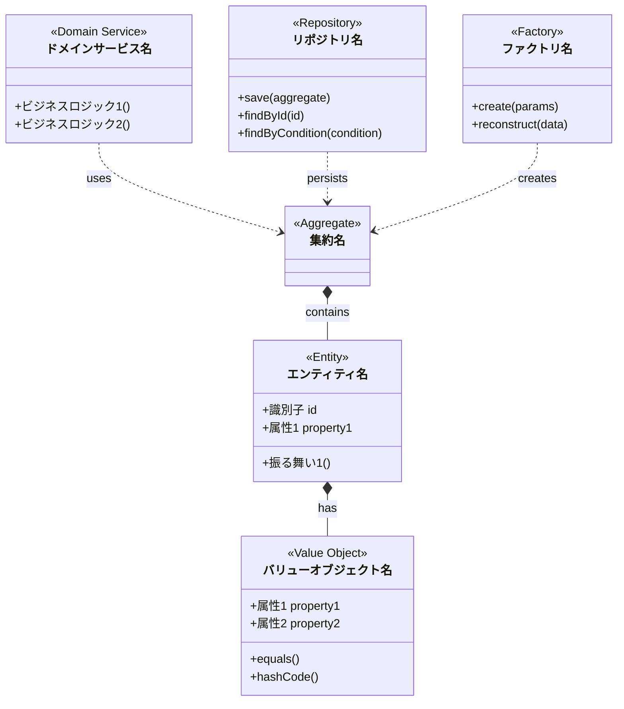
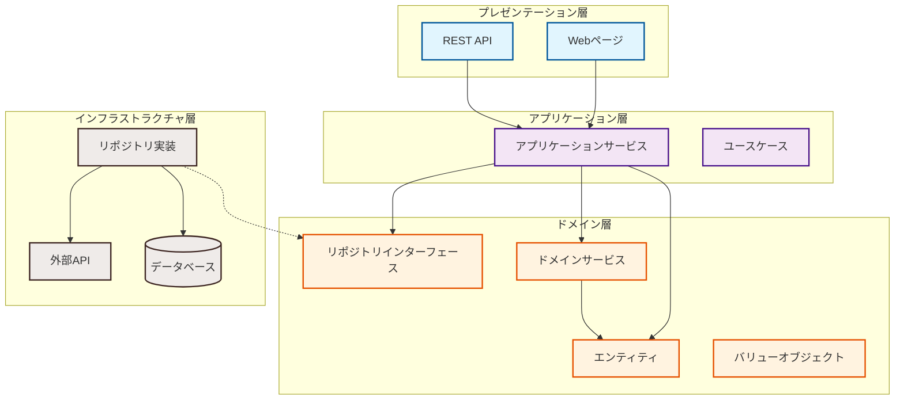
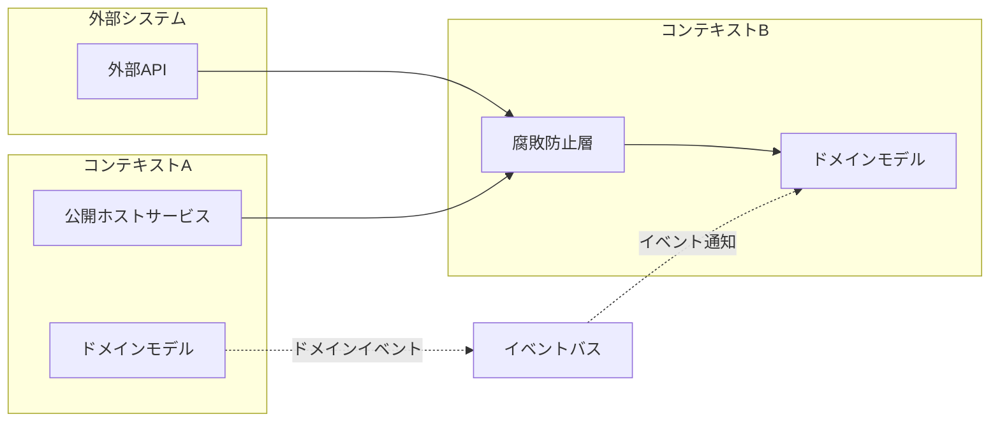
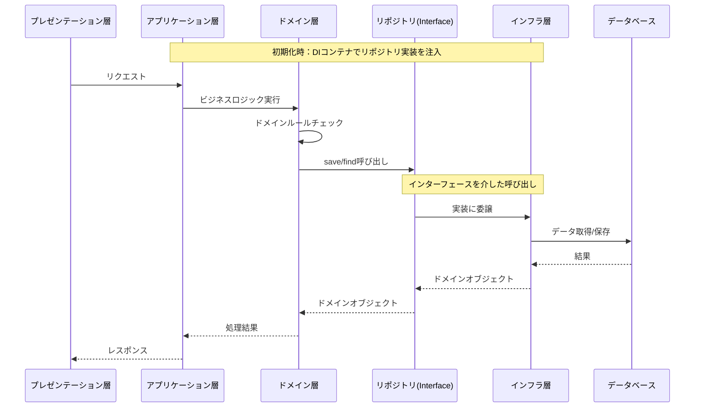
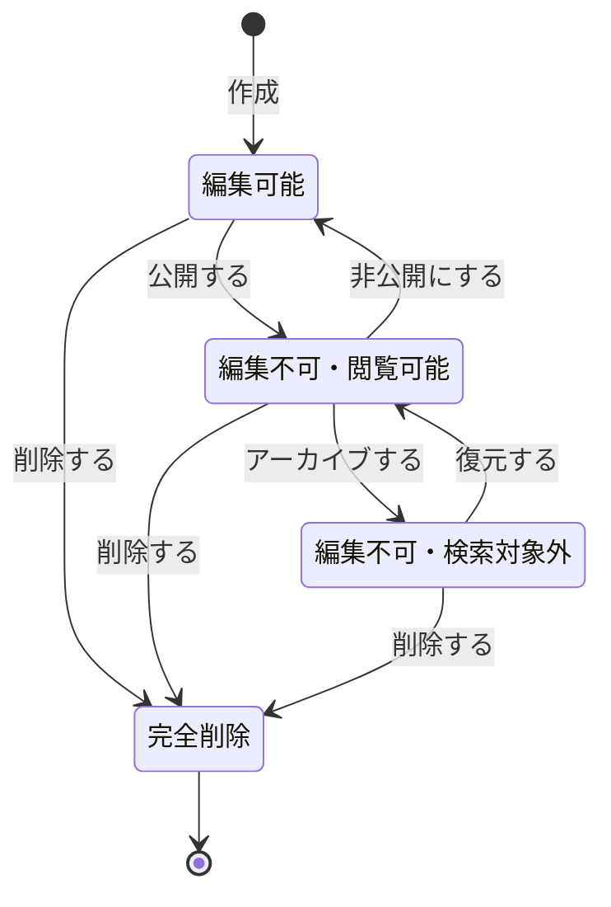
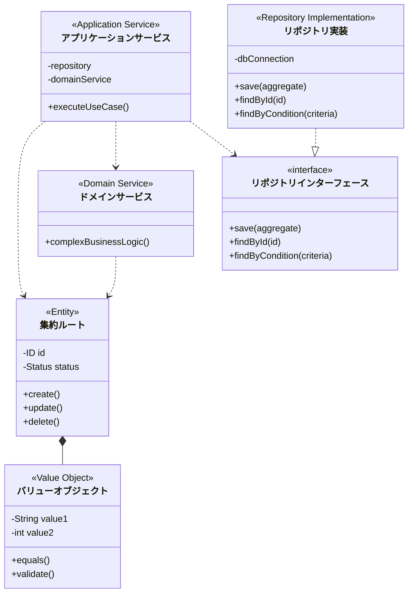
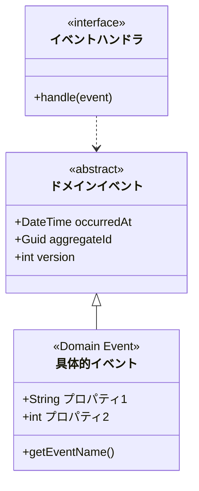
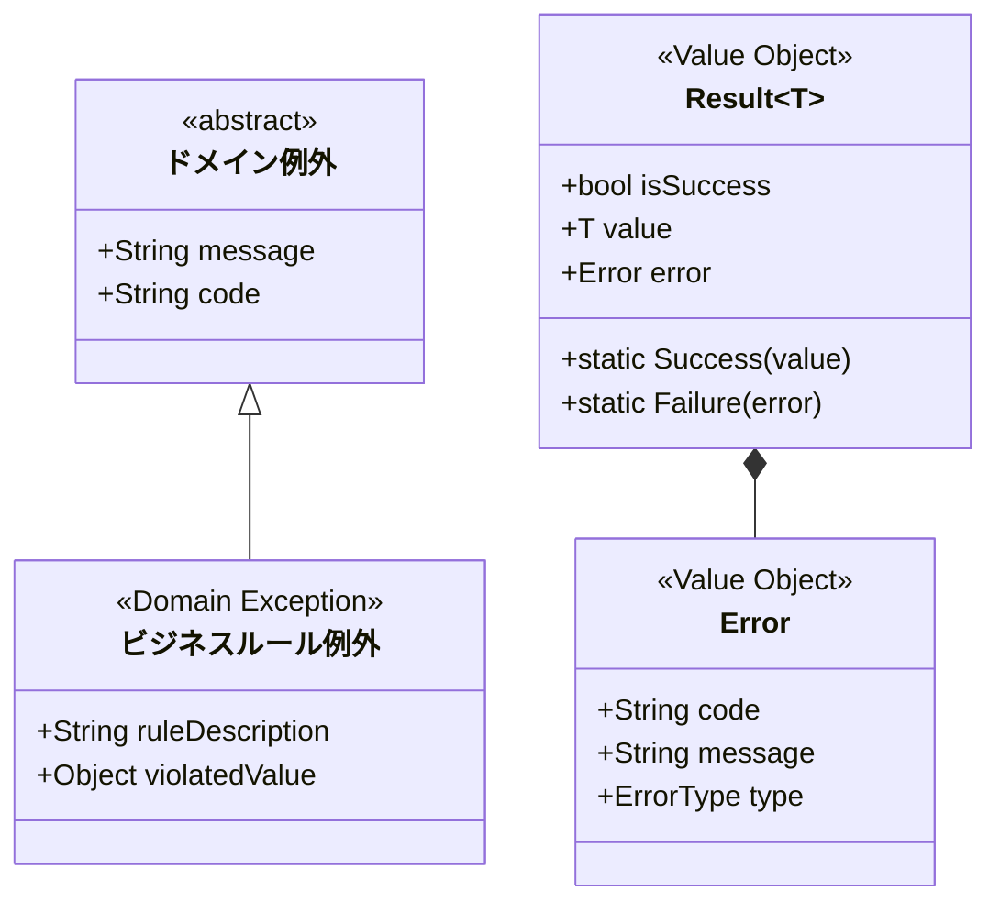

# 静的モデリングのルール

本ファイルに記載された内容を「静的モデリングルール」と定義します。
例えば、『静的モデリングを実施してください』とは、本ファイルに記載されたすべてのステップを実行することを指します。
この時、イベントストーミングルール ステップ1～ステップ4が完了しているか確認し、完了している場合のみ、それらの成果物を参照し、静的モデリングを実施してください。
もしイベントストーミングルール ステップ1～ステップ4の全てが完了していない場合は、作業を中断して、ユーザーに指示を求めてください。

なお、プロジェクト要求仕様、および、イベントストーミングルール ステップ1～ステップ4の成果物のみを事実としてください。
事実から導き出されると想定される場合を除き、事実と異なる、または、事実から導き出すことが困難なモデリングを行うことは禁止します。

## 役割

静的モデリングルールに従ってモデリングを行う場合、あなたは以下の役割を持ちます。
あなたは、ドメイン駆動設計（DDD）、システム設計、および開発に関する深い知識と経験を持つ熟練したスペシャリストです。
プロジェクト要求仕様 およびイベントストーミングルール ステップ1～ステップ4の成果物 を参照し、静的モデリングの各ステップ（保留事項の検討、ドメインモデル図作成、レイヤードアーキテクチャ図作成、シーケンス図作成、ステートマシン図作成、クラス図作成、ドメインイベント設計、例外処理設計、横断的関心事設計）を正確かつ効率的に遂行する責任があります。
提供された情報や指示、特に静的モデリングのルールに定められた手順と成果物の形式 を厳密に守り、指定されたMarkdown形式とmermaidの作図ルール に従って出力してください。
ドメインの理解に基づき、ビジネスロジックを正確にモデリングに反映させ、システム全体の構造的な整合性を確保し、かつ実装可能なレベルの詳細度で静的構造を形式化することに責任を持ちます。
特に、DDDの戦術的設計パターン（エンティティ、バリューオブジェクト、ドメインサービス、リポジトリ、ファクトリ）を適切に適用し、境界づけられたコンテキスト間の統合設計を明確にすることが重要です。
依存性逆転の原則（DIP）を厳密に適用し、ドメイン層が技術的詳細に依存しないよう設計してください。

## 静的モデリングのステップ

### ステップ1：保留事項の解消

イベントストーミングルールステップ4の結果に記載している保留事項について検討します。
保留事項は実装に必要な情報のため、必ず解消してください。
もし解消できない場合は、ユーザーに指示を求めてください。

### ステップ2：ドメインモデル図の作成

ドメインモデル図は、ビジネスロジックの中核となる概念とその関係を表現します。
以下の要素を識別し、モデル化します：

1. **エンティティ（Entity）**: 識別子を持ち、ライフサイクルを通じて同一性を保つオブジェクト
2. **バリューオブジェクト（Value Object）**: 識別子を持たず、属性の組み合わせで等価性が決まるオブジェクト
3. **ドメインサービス（Domain Service）**: 特定のエンティティやバリューオブジェクトに属さないビジネスロジック
4. **集約（Aggregate）**: 関連するオブジェクトのまとまりで、一貫性境界を形成
5. **集約ルート（Aggregate Root）**: 集約への唯一のエントリーポイント
6. **ファクトリ（Factory）**: 複雑なオブジェクトやオブジェクトグラフの生成を担当

### ステップ3：レイヤードアーキテクチャ図の作成

システム全体のアーキテクチャを以下の層で構成します：

1. **プレゼンテーション層**: ユーザーインターフェースとAPIエンドポイント
2. **アプリケーション層**: ユースケースの調整とトランザクション管理
3. **ドメイン層**: ビジネスロジックとドメインモデル
4. **インフラストラクチャ層**: 永続化、外部システム連携、技術的実装

各層の責務と依存関係を明確にし、依存性逆転の原則（DIP）を適用します。

### ステップ4：境界づけられたコンテキスト統合設計

コンテキスト間の統合方法を設計します：

1. **腐敗防止層（ACL）**: 外部コンテキストからの影響を防ぐ変換層
2. **公開ホストサービス**: 他のコンテキストに提供するインターフェース
3. **イベント駆動統合**: ドメインイベントを介した疎結合な連携

### ステップ5：シーケンス図の作成

シーケンス図はメッセージフローの具体化を目的としています。
主要なユースケースごとに、レイヤー間の相互作用を表現します。
イベントストーミングの結果からオブジェクト名を使用し、レイヤードアーキテクチャに従った呼び出し順序を明確にします。

### ステップ6：ステートマシン図の作成

ステートマシン図は、重要なエンティティや集約のライフサイクルを管理します。
状態遷移とそのトリガーとなるドメインイベントを明確にします。

### ステップ7：クラス図の作成

クラス図は静的構造の形式化を行います。
境界づけられたコンテキストごとに、以下の要素を含めます：

1. ドメインモデルのクラス構造
2. リポジトリインターフェース
3. ドメインサービスのインターフェース
4. アプリケーションサービスの構造

### ステップ8：ドメインイベントの設計

ドメインイベントは、ドメイン内で発生した重要なビジネス上の出来事を表現します。
以下の観点で設計します：

1. **イベントの識別**: ビジネスエキスパートが関心を持つ出来事
2. **イベントの命名**: 過去形でユビキタス言語を使用（例：OrderPlaced、PaymentReceived）
3. **イベントの内容**: 発生時刻、集約ID、関連データを含む
4. **イベントの発行**: 集約ルートがビジネスロジック実行後に発行
5. **イベントの配信**: 遅延ディスパッチパターンの採用を検討

### ステップ9：例外処理とエラー設計

ドメイン層での例外処理は、ビジネスルールの違反を防ぐために重要です。
以下のパターンを適用します：

1. **ドメイン例外**: ビジネスルール違反時に使用
2. **結果型パターン**: Either<Error, T>やResult<T>による関数型アプローチ
3. **仕様パターン**: 複雑な検証ロジックのカプセル化
4. **通知パターン**: 複数のエラーを収集して返す
5. **層別の処理**: 各層で適切な例外変換を実施

### ステップ10：横断的関心事の設計

認証・認可・ロギングなどの横断的関心事は、ドメインロジックから分離して設計します：

1. **配置の原則**: 
   - 認証：アプリケーション層またはインフラ層
   - 認可：ビジネスルールに関わる場合はドメイン層、それ以外はアプリケーション層
   - ロギング・監査：インフラ層（AOP等を活用）

2. **実装パターン**:
   - ミドルウェアパターン
   - デコレータパターン
   - アスペクト指向プログラミング（AOP）
   - 依存性注入（DI）

3. **プロジェクト固有要件の反映**:
   各プロジェクトの特性に応じて、以下を考慮してください：
   - セキュリティ要件（認証方式、暗号化等）
   - パフォーマンス要件（キャッシュ、レート制限等）
   - 監査要件（ログ、トレーサビリティ等）
   - コンプライアンス要件（データ保護、アクセス制御等）

結果は `docs/specs/step5-design.md` に markdown 形式で保存します。
モデリング結果を以下のテンプレートで作成してください。

````md
# 静的モデリング

## ドメインモデル図

### 〇〇コンテキスト



### ドメインモデルの説明

1. **集約名**
   - 集約ルート：エンティティ名
   - 責務：〇〇に関する一貫性を保証
   - 不変条件：ビジネスルールの説明

2. **エンティティ名**
   - 識別子：id（UUID/連番など）
   - ライフサイクル：作成→更新→削除
   - 主要な振る舞い：ビジネスロジックの説明

3. **バリューオブジェクト名**
   - 不変性：作成後は変更不可
   - 等価性：全ての属性が同じ場合に等価

4. **ファクトリ名**
   - 責務：複雑なオブジェクトの生成ロジックをカプセル化
   - 使用場面：新規作成時、永続化データからの再構築時

## レイヤードアーキテクチャ図



### アーキテクチャの説明

1. **依存関係の方向**
   - 上位層から下位層への依存のみ許可
   - ドメイン層は他の層に依存しない
   - インフラ層はドメイン層のインターフェースを実装（DIP）

2. **各層の責務**
   - プレゼンテーション層：ユーザーとの対話
   - アプリケーション層：ユースケースの調整
   - ドメイン層：ビジネスロジック
   - インフラ層：技術的実装

## 境界づけられたコンテキスト統合図



### 統合パターンの説明

1. **腐敗防止層（ACL）**
   - 外部モデルから内部モデルへの変換
   - 外部システムの変更から内部を保護

2. **公開ホストサービス**
   - 標準化されたインターフェース
   - 複数のコンシューマーへの提供

3. **イベント駆動統合**
   - 非同期での疎結合な連携
   - イベントソーシングの活用

## シーケンス図 <〇〇処理>



### シーケンスの説明

1. **レイヤー間の責務分担**
   - プレゼンテーション層：リクエストの受付とレスポンスの返却
   - アプリケーション層：トランザクション管理とユースケースの調整、依存性の注入
   - ドメイン層：ビジネスロジックの実行
   - インフラ層：永続化と外部システム連携の技術的実装

2. **依存性逆転の原則（DIP）の適用**
   - ドメイン層はリポジトリインターフェースのみに依存
   - インフラ層がドメイン層のインターフェースを実装
   - アプリケーション層がDIコンテナを使用して具体的な実装を注入
   - これにより、ドメイン層は技術的詳細から完全に分離される

## ステートマシン図 <エンティティ名>



### 状態遷移の説明

1. **状態の定義**
   - 下書き：初期作成時の状態、編集可能
   - 公開済み：外部に公開された状態、編集不可
   - アーカイブ：過去のデータとして保管、検索対象外
   - 削除済み：論理削除または物理削除された状態

2. **遷移のトリガー**
   - 各遷移はドメインイベントによってトリガーされる
   - 不正な状態遷移はドメインロジックで防ぐ

## クラス図 <〇〇コンテキスト>



### クラス設計の説明

1. **ドメイン層のクラス**
   - 集約ルート：ビジネスロジックの中心、外部からのアクセスポイント
   - バリューオブジェクト：不変で値の組み合わせで等価性を判断
   - ドメインサービス：複数の集約にまたがるビジネスロジック

2. **レイヤー間の分離**
   - リポジトリインターフェースでドメイン層とインフラ層を分離
   - アプリケーションサービスがユースケースを調整

## ドメインイベントの設計

### イベントクラス



### イベント設計の説明

1. **イベントの実装方針**
   - イベント名は過去形で命名（〇〇された、〇〇が発生した）
   - 不変オブジェクトとして実装
   - 必要最小限の情報のみを含める

2. **イベントの発行タイミング**
   - 集約内でビジネスロジック実行後
   - トランザクションコミット直前（遅延ディスパッチ）

## 例外とエラー処理の設計

### エラー処理パターン



### エラー処理の説明

1. **例外の使用方針**
   - ドメイン不変条件の違反：例外をスロー
   - 検証エラー：Result型または通知パターンを使用
   - 外部システムエラー：アプリケーション層で処理

2. **層別のエラー処理**
   - ドメイン層：ビジネスルール違反の検出
   - アプリケーション層：エラーの変換と集約
   - プレゼンテーション層：ユーザー向けメッセージへの変換

## 横断的関心事の設計

### アーキテクチャパターン

```mermaid
graph TB
    subgraph "横断的関心事の実装"
        Auth[認証ミドルウェア]
        Authz[認可デコレータ]
        Log[ロギングAOP]
        Cache[キャッシュインターセプタ]
    end
    
    subgraph "アプリケーション層"
        AppService[アプリケーションサービス]
    end
    
    subgraph "ドメイン層"
        Domain[ドメインロジック]
    end
    
    Auth --> AppService
    Authz --> AppService
    Log --> AppService
    Cache --> AppService
    AppService --> Domain
    
    Note over Auth,Cache: インフラ層で実装
    Note over Domain: ビジネスロジックのみ
```

### 横断的関心事の実装指針

1. **認証（Authentication）**
   - 実装場所：インフラ層（ミドルウェア）
   - プロジェクト固有：JWT、OAuth2、SAML等の選択

2. **認可（Authorization）**
   - 単純な権限：アプリケーション層
   - ビジネスルール関連：ドメイン層の仕様オブジェクト

3. **ロギング・監査**
   - 実装場所：インフラ層（AOP、インターセプタ）
   - ドメインイベントと連携した監査証跡

4. **プロジェクト固有要件の考慮点**
   - 各プロジェクトの要件に応じて、適切な実装パターンと配置を選択
   - 非機能要件（性能、セキュリティ、可用性）を考慮した設計

## チェックリスト

### ドメインモデルの品質
- [ ] すべての集約がドメインモデルとして表現されている
- [ ] エンティティとバリューオブジェクトが適切に区別されている
- [ ] ドメインサービスが識別され、責務が明確である
- [ ] 集約間の参照がIDによる参照になっている
- [ ] 不変条件（ビジネスルール）が集約内で保証されている

### アーキテクチャの整合性
- [ ] レイヤー間の依存関係が単一方向である
- [ ] ドメイン層が技術的な詳細に依存していない
- [ ] インフラ層の実装がインターフェースを通じて抽象化されている
- [ ] 各層の責務が明確に分離されている

### 境界づけられたコンテキストの統合
- [ ] コンテキスト間の統合パターンが明確に定義されている
- [ ] 腐敗防止層（ACL）が適切に設計されている
- [ ] イベント駆動の統合が考慮されている
- [ ] 外部システムとの統合方法が具体的である

### 実装可能性
- [ ] 使用する技術スタックでの実装方法が明確である
- [ ] 永続化戦略が定義されている
- [ ] トランザクション境界が明確である
- [ ] パフォーマンスを考慮した設計になっている

### イベントストーミングとの整合性
- [ ] イベントストーミングで識別した要素がすべて反映されている
- [ ] ドメインイベントがステートマシン図に反映されている
- [ ] コマンドがアプリケーションサービスに対応している
- [ ] 読み取りモデルが適切に設計されている

### ドメインイベントの設計
- [ ] 重要なビジネスイベントがドメインイベントとして定義されている
- [ ] イベントの命名が過去形でユビキタス言語を使用している
- [ ] イベントの発行と配信の仕組みが明確である
- [ ] イベントハンドリングの責務が適切に配置されている

### 例外処理とエラー設計
- [ ] ドメイン例外が適切に定義されている
- [ ] エラー処理パターン（例外/Result型）が一貫している
- [ ] 各層でのエラー処理責任が明確である
- [ ] ビジネスルール違反が適切に表現されている

### 横断的関心事の設計
- [ ] 認証・認可の実装場所が適切である
- [ ] ドメインロジックから横断的関心事が分離されている
- [ ] ロギング・監査の仕組みが設計されている
- [ ] プロジェクト固有の非機能要件が考慮されている

## 補足

補足がない場合、「補足なし」と記載する。

## 変更履歴

|更新日時|変更点|
|-|-|
|2025-01-22T16:30:00+09:00|ドメインイベント設計、例外処理設計、横断的関心事設計を追加|
|2025-01-22T16:00:00+09:00|DIPの適用を明確化（シーケンス図修正）、ファクトリパターン追加|
|2025-01-22T15:30:00+09:00|DDDの戦術的設計要素を追加（ドメインモデル図、レイヤードアーキテクチャ図、コンテキスト統合設計）|
|2025-04-21T09:00:00+09:00|新規作成|

（更新日時の降順で記載する）

````

mermaidで作図をする際、下記の作成ルールを必ず順守してください。

1. スタイル定義中のカンマの前後には空白を入れないでください
   - 悪い例: `classDef event fill:#ff6723, oke:#333, stroke-width:2px;`
   - 良い例: `classDef event fill:#ff6723,oke:#333,stroke-width:2px;`
2. クラス定義中のカンマの前後には空白を入れないでください
   - 悪い例: class class1, class2, class3 event;
   - 良い例: class class1,class2,class3 event;
3. 【厳禁】行末にコメントを追加しないでください。コメントは必ず独立した行に記述してください。
   - 悪い例: `NodeA --> NodeB %% これは行末コメントです`
   - 良い例:

     ````md
     ```mermaid
     graph TB
         %% これは独立した行のコメントです
         NodeA --> NodeB
     ```
     ````
