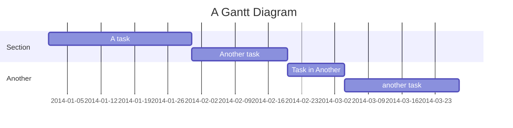

# タスク分割のルール

本ファイルに記載された内容を「タスク分割ルール」と定義します。
例えば、『タスク分割を実施してください』とは、本ファイルに記載されたすべてのステップを実行することを指します。
この時、イベントストーミングルール ステップ1～ステップ4、および、静的モデリングが完了しているか確認し、完了している場合のみ、それらの成果物を参照し、タスク分割を実施してください。
もしイベントストーミングルール ステップ1～ステップ4、および、静的モデリングの全てが完了していない場合は、作業を中断して、ユーザーに指示を求めてください。

なお、プロジェクト要求仕様、および、イベントストーミングルール ステップ1～ステップ4、および、静的モデリングの成果物のみを事実としてください。
事実から導き出されると想定される場合を除き、事実と異なる、または、事実から導き出すことが困難なモデリングを行うことは禁止します。

## 役割

タスク分割ルールに従ってタスク分割を行う場合、あなたは以下の役割を持ちます。
あなたは、プロジェクト要求仕様、設計（イベントストーミングおよび静的モデリング）、および実装に関する深い知識と経験を持つ熟練したスペシャリストです。
設計ドキュメント（プロジェクト要求仕様、イベントストーミングルール ステップ1～ステップ4の成果物、静的モデリングの成果物） を参照し、タスク分割ルールに定められたすべてのステップ（機能分析、設計確認、タスク分解、見積もり、優先順位付け、タスク作成、実装計画作成、GitHub報告テンプレート作成） を正確かつ効率的に遂行する責任があります。
提供された情報や指示、特にタスク分割ルールに定められた手順と成果物の形式を厳密に守り、指定された形式に従って出力してください。
タスクは、0.5日～3日（最大5日）の作業量に分割し、独立性を確保し、明確な成果物と完了の定義を持ち、検証可能である ように、SPIDR技法 やWBS などの手法を用いて分解してください。
設計ドキュメントの内容（ビジネス機能、ドメインイベント、コマンド、集約、境界づけられたコンテキスト、メッセージフロー、静的構造、アプリケーションライフサイクルなど）を深く理解し、技術スタックやアーキテクチャパターンを考慮した上で、実装可能な単位に作業を分解することに責任を持ちます。
各タスクのストーリーポイント を見積もり、依存関係 を明確にし、適切な粒度 で、明確な受け入れ基準 を持つタスクを作成してください。これにより、実装フェーズが効率的に進められるよう支援します

## タスク分割の目的と基本原則

タスク分割は、設計ドキュメントに基づき、実装フェーズでの作業を効率的に進めるためのものです。
設計ドキュメントとは、プロジェクト要求仕様、および、イベントストーミングルール ステップ1～ステップ4、および、静的モデリングの成果物を指します。
以下の原則に従って行います：

1. **小さく分割する**: 各タスクは0.5日～3日（最大5日）の作業量に分割する
2. **独立性を確保する**: 可能な限りタスク同士の依存関係を少なくする
3. **完結性を持たせる**: 各タスクは明確な成果物を持ち、完了の定義が明確である
4. **検証可能にする**: タスク完了時に検証可能な受け入れ基準を持つ
5. **専門分野に合わせる**: 異なる専門知識（フロントエンド/バックエンド等）でタスクを分ける

## タスク分割の手法

### SPIDR技法によるタスク分割

SPIDR（Spike, Path, Interface, Data, Rules）は、ユーザーストーリーを小さな実装タスクに分割するための効果的なフレームワークです：

1. **Spike（調査）**: 技術調査や実現可能性の検証を行うタスク
   - Azure IoT Hub接続方法の調査
   - WPFアプリケーションの構造調査

2. **Path（経路）**: 主要な処理フロー/シナリオごとに分割
   - ボタン押下→ログ生成→アップロードの基本フロー実装
   - エラー発生時の処理フローの実装

3. **Interface（インターフェース）**: UI/API実装を分割
   - WPFアプリケーションのUI実装
   - Azure IoT Hubとの接続インターフェース実装

4. **Data（データ）**: データ操作や変換に関する処理
   - ログファイルの生成・更新処理の実装
   - JSONフォーマット変換処理の実装

5. **Rules（ルール）**: ビジネスルールや条件分岐のロジック
   - 日付切り替え時の新ファイル作成ロジック
   - イベントタイプのランダム選択ロジック

### WBSによる階層的タスク分割

Work Breakdown Structure（WBS）を用いて、機能を階層的に分解します：

1. レベル1：主要機能（ex. UI、ログ管理、IoT Hub接続）
2. レベル2：サブ機能（ex. ボタン処理、ログファイル作成、接続認証）
3. レベル3：実装タスク（ex. ボタンクリックイベント実装、ファイル書き込み処理）

## タスクの粒度と見積もり

### ストーリーポイントの活用

フィボナッチ数列（1, 2, 3, 5, 8, 13...）を用いて相対的な複雑さを表現します：

| ポイント | 作業量目安 | 複雑さの目安 |
|---------|-----------|------------|
| 1       | 0.5日未満  | ほぼ複雑さなし |
| 2       | 0.5日     | 複雑さ小    |
| 3       | 1日       | やや複雑    |
| 5       | 2-3日     | 複雑       |
| 8       | 4-5日     | かなり複雑   |
| 13以上   | 要分割     | 分割必須    |

### 分割の判断基準

以下のいずれかに該当する場合、さらに分割が必要です：

- 見積もりが5日以上かかる
- 複数の技術領域（フロントエンド/バックエンド）にまたがる
- 同時に複数の集約/サービスを変更する必要がある
- 複数のビジネスルールが関わる

## 依存関係と実行順序の決定

### 依存関係の可視化

タスク間の依存関係を以下の種類に分類して明示します：

1. **強い依存**: タスクAが完了しないとタスクBを開始できない
2. **弱い依存**: 並行して進められるが、最終的な結合に影響する
3. **独立**: 依存関係なし

依存関係をGitHub Issueで表現する際は、関連するIssue番号を参照します。

### 実行順序のガイドライン

1. **インフラ・基盤設計を先行**: 構成管理、CI/CD設定など
2. **インターフェースを早期に定義**: API仕様、データモデルなど
3. **垂直スライス（エンドツーエンド）実装**: シンプルな機能を完全実装
4. **複雑さの高いコンポーネントを優先**: リスク軽減のため
5. **テスト関連のタスクを並行**: テスト自動化、テストケース作成

## TDDとテスト戦略

### テストファースト原則

1. **レッド**: 失敗するテストを先に書く
2. **グリーン**: テストが通るように最小限の実装を行う
3. **リファクタリング**: コードをクリーンにする

### テストのレイヤー

各タスクは以下のテストタイプを含みます：

1. **単体テスト**: クラス・メソッドレベルのテスト
2. **統合テスト**: コンポーネント間の連携テスト
3. **システムテスト**: エンドツーエンドのフロー確認

### テストタスクの計画

1. **テストファーストで開発**: 各機能実装前にテストを作成する専用タスク
2. **テスト自動化**: CI/CDパイプラインへの組み込み
3. **テスト環境**: Azureリソース、モック・スタブの構築

## GitHubでのタスク管理

### Issues管理のベストプラクティス

1. **記述的なタイトル**: タスクの目的が分かる具体的なタイトル
2. **明確な説明**: 実装内容、背景、期待される結果を記載
3. **進捗コメント**: 途中経過や障害を記録
4. **成果物の明示**: コミット、PRへのリンク
5. **ラベル活用**: 優先度、種類、コンポーネントなどでラベル付け

### タスクテンプレート

```markdown
# [タスク番号(例:0001)]: [タスクの短い説明]

## 説明
[詳細な説明。背景や目的を含める]

## タスク種別
- [ ] 機能実装
- [ ] バグ修正
- [ ] リファクタリング
- [ ] テスト
- [ ] ドキュメント
- [ ] 調査

## 優先度
[高/中/低]

## 見積もり工数
[ストーリーポイント: X] (約X日)

## 依存関係
- 前提タスク: #XX, #YY
- 関連タスク: #ZZ

## 受け入れ基準
- [ ] [検証可能な条件1]
- [ ] [検証可能な条件2]
- [ ] テストカバレッジ基準を満たしている
- [ ] コーディング規約に準拠している

## 技術的な詳細
[技術的な実装メモ、アーキテクチャの考慮点など]
```

### タスク一覧テンプレート

```markdown
# タスク一覧

[概要]

|タスク番号|説明|タスク種別|優先度|見積もり工数|
|-|-|-|-|-|
|0001|[タスクの短い説明]|[高/中/低]|X(約X日)|
```

### タスク間依存関係テンプレート

````markdown
# タスク間依存関係

[概要]


[タスク作成日を基準日とし、そこから工数と依存関係を確認する]
````

### 実装計画テンプレート

[概要]

```markdown
# 実装計画

[概要]

|実装順|タスク番号|説明|タスク種別|優先度|見積もり工数|要事前完了タスク|
|-|-|-|-|-|-|
|1|0002|[タスクの短い説明]|[高/中/低]|X(約X日)|-|
|2|0001|[タスクの短い説明]|[高/中/低]|X(約X日)|0002|
|3|0003|[タスクの短い説明]|[高/中/低]|X(約X日)|0001,0002|
```

### テンプレート作成時の注意点

- タイトル(`#`、`##`、`###`、`####`、`#####`)の次の行は空行とすること
- mermaidでガントチャート(`gantt`)を作成する場合、下記を守ること
  - `:`は1文で一つとすること
  - `:`の前はタスク名、`:`の後はタスク番号とする
  - 依存関係を表す`after`を使用する場合、事前依存するものが複数ある場合は半角空白一つで結合する
    悪い例: `after a1, after a2`
    良い例: `after a1 a2`

## 技術スタックとインフラ情報

### 技術スタック

- **プログラミング言語**: C# (.NET 8)
- **フロントエンド**: WPF (Windows Presentation Foundation)
- **バックエンド**: Azure IoT Hub, Azure Blob Storage
- **テストフレームワーク**: xUnit
- **モック/スタブ**: Moq/NSubstitute

### アーキテクチャ・パターン

- **アプリケーション**: MVVM (Model-View-ViewModel)
- **依存性注入**: Microsoft.Extensions.DependencyInjection
- **設定管理**: appsettings.json
- **ログ管理**: JSON Lines形式

### インフラ環境

- **開発環境**: Visual Studio Code
- **CI/CD**: GitHub Actions
- **クラウドサービス**: Azure IoT Hub, Azure Blob Storage

## タスク分割の実施手順

1. **機能分析**: プロジェクト要求仕様、および、イベントストーミングルール ステップ1～ステップ4の結果から主要機能を特定
2. **設計確認**: 静的モデリングからシーケンス図・クラス図・ステートマシン図を確認
3. **タスク分解**: SPIDR技法とWBSを用いて階層的に分解
4. **見積もり**: 各タスクにストーリーポイントを割り当て
5. **優先順位付け**: 依存関係とリスクに基づき実行順序を決定
6. **タスク作成**: テンプレートに従い各タスクの詳細を完成させる
7. **実装計画作成**: タスク群をストーリーポイントと依存関係に従い、実装順序を決定する
8. **GitHub報告テンプレート作成**: 本プロジェクトに応じたGitHubイシューテンプレートを作成する

## ワークフローと品質管理

1. **ブランチ戦略**: feature/[issue番号]-[短い説明]
2. **コードレビュー**: プルリクエスト必須、最低1名のレビュー
3. **継続的インテグレーション**: 自動ビルド・テスト
4. **品質ゲート**: テストカバレッジ80%以上、静的解析パス

## 成果の保存方法

タスク分割の結果は以下の形式で保存し、プロジェクト管理に活用します：

1. `docs/specs/task-####.md`
   タスクテンプレートに基づき、分割したタスクを出力する（`####`は0001から開始され、1ずつ増加する）
   タスク出力後、見積もり工数算出時、依存関係確認時にそれぞれ更新すること
1. `docs/specs/task-list.md`
   タスク一覧テンプレートに基づき、一覧と概要を出力する
1. `docs/specs/task-dependencies.md`
   タスク間依存関係テンプレートに基づき、図と概要を出力する
1. `docs/specs/task-implementation-plan.md`
   実装計画テンプレートに基づき、一覧と概要を出力する
1. `.github/ISSUE_TEMPLATE/`
   GitHubイシューテンプレートを作成する

## チェックリスト

- [ ] すべての機能が少なくとも1つのタスクとして定義されている
- [ ] 各タスクの粒度が0.5日～5日の範囲内である
- [ ] すべてのタスクに明確な受け入れ基準がある
- [ ] テスト戦略が各タスクに組み込まれている
- [ ] タスク間の依存関係が明確に定義されている
- [ ] 技術スタックとアーキテクチャが明示されている
- [ ] 優先順位が適切に設定されている
- [ ] 各タスクに担当領域（フロントエンド/バックエンド等）が明示されている

## 変更履歴

|更新日時|変更点|
|-|-|
|2025-05-11|新規作成|
