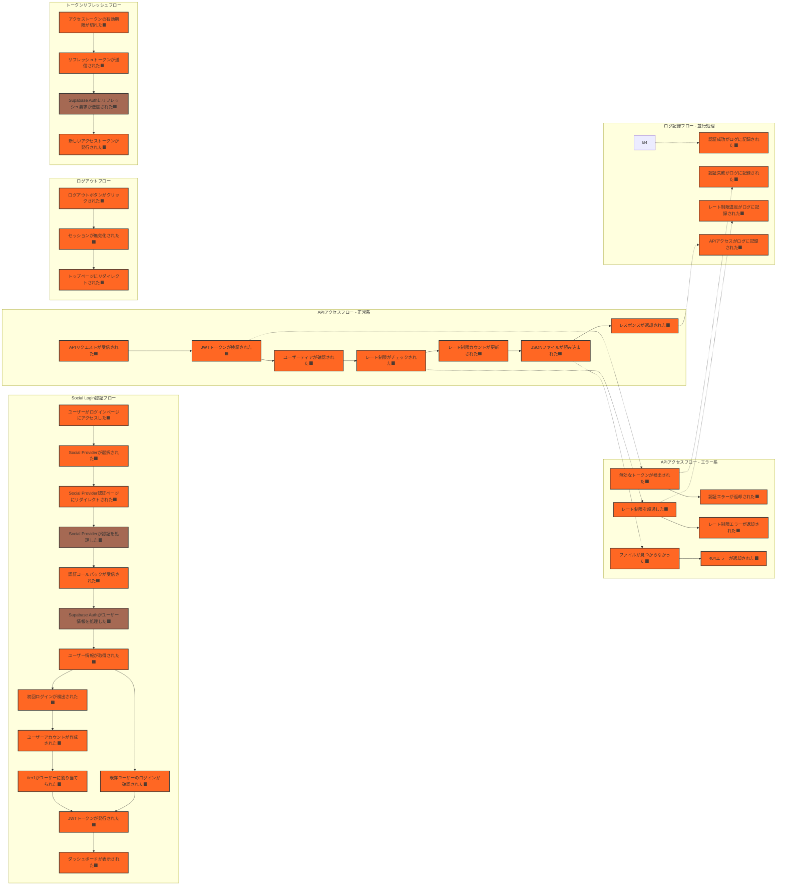

# ステップ1：ドメインイベントと外部システムの抽出

## タイムライン表現方法

### 方法2: Flowchart図（並行処理を表現する場合）

## タイムラインの説明

### 表現方法の選択ガイド

このプロジェクトでは**方法2: Flowchart図**を選択しました。理由：
- 複数の並行処理が存在（ログ記録、エラー処理など）
- 条件分岐による異なるフローが多数存在
- 各フロー間の関連性を明確に表現する必要がある

## タイムラインの説明

- ユーザーがログインページにアクセスした（ドメインイベント🟧）
  ユーザーが認証プロセスを開始する最初のイベント（新規・既存問わず）
  
- Social Providerが選択された（ドメインイベント🟧）
  ユーザーがGoogle、GitHub等の認証プロバイダーを選択したイベント
  
- Social Provider認証ページにリダイレクトされた（ドメインイベント🟧）
  外部認証プロバイダーのログイン画面への遷移が実行されたイベント
  
- Social Providerが認証を処理した（外部システム🟫）
  Google、GitHub等の外部認証プロバイダーがユーザー認証を実行
  
- 認証コールバックが受信された（ドメインイベント🟧）
  外部認証プロバイダーから認証結果がコールバックで返されたイベント
  
- Supabase Authがユーザー情報を処理した（外部システム🟫）
  Supabase Authが外部プロバイダーからの情報を検証・処理
  
- ユーザー情報が取得された（ドメインイベント🟧）
  プロバイダーからのユーザー情報（メール、名前等）が取得されたイベント
  
- 初回ログインが検出された（ドメインイベント🟧）
  システムに存在しない新規ユーザーであることが判明したイベント
  
- ユーザーアカウントが作成された（ドメインイベント🟧）
  システム内でユーザーエンティティが生成されたイベント
  
- tier1がユーザーに割り当てられた（ドメインイベント🟧）
  新規ユーザーに初期ティア（tier1）が自動的に設定されたイベント
  
- 既存ユーザーのログインが確認された（ドメインイベント🟧）
  既にシステムに存在するユーザーであることが確認されたイベント
  
- JWTトークンが発行された（ドメインイベント🟧）
  APIアクセス用のアクセストークンとリフレッシュトークンが生成されたイベント
  
- ダッシュボードが表示された（ドメインイベント🟧）
  認証後のユーザー画面が表示されたイベント
  
- APIリクエストが受信された（ドメインイベント🟧）
  クライアントからAPIエンドポイントへのリクエストが到着したイベント
  
- JWTトークンが検証された（ドメインイベント🟧）
  Authorizationヘッダーのトークンが有効性を確認されたイベント
  
- ユーザーティアが確認された（ドメインイベント🟧）
  トークンからユーザーのティア情報（tier1/tier2/tier3）が取得されたイベント
  
- レート制限がチェックされた（ドメインイベント🟧）
  現在の時間枠でのAPIアクセス回数が確認されたイベント
  
- レート制限カウントが更新された（ドメインイベント🟧）
  Supabaseデータベースでアクセス回数が増加されたイベント
  
- JSONファイルが読み込まれた（ドメインイベント🟧）
  要求されたオープンデータのJSONファイルがファイルシステムから取得されたイベント
  
- レスポンスが返却された（ドメインイベント🟧）
  クライアントにJSONデータが正常に送信されたイベント
  
- 無効なトークンが検出された（ドメインイベント🟧）
  JWTトークンの検証に失敗したイベント
  
- 認証エラーが返却された（ドメインイベント🟧）
  HTTP 401 Unauthorizedエラーがクライアントに返されたイベント
  
- レート制限を超過した（ドメインイベント🟧）
  ユーザーのAPIアクセス回数が設定された制限を超えたイベント
  
- レート制限エラーが返却された（ドメインイベント🟧）
  HTTP 429 Too Many Requestsエラーと次回アクセス可能時刻が返されたイベント
  
- ファイルが見つからなかった（ドメインイベント🟧）
  要求されたJSONファイルがファイルシステムに存在しなかったイベント
  
- 404エラーが返却された（ドメインイベント🟧）
  RFC 7807形式のHTTP 404エラーレスポンスが返されたイベント
  
- ログアウトボタンがクリックされた（ドメインイベント🟧）
  ユーザーがダッシュボードからログアウトを実行したイベント
  
- セッションが無効化された（ドメインイベント🟧）
  ユーザーのセッション情報がクリアされたイベント
  
- トップページにリダイレクトされた（ドメインイベント🟧）
  ログアウト後にトップページへの遷移が実行されたイベント
  
- アクセストークンの有効期限が切れた（ドメインイベント🟧）
  1時間の有効期限を過ぎたアクセストークンが検出されたイベント
  
- リフレッシュトークンが送信された（ドメインイベント🟧）
  新しいアクセストークン取得のためリフレッシュトークンが使用されたイベント
  
- Supabase Authにリフレッシュ要求が送信された（外部システム🟫）
  外部認証システムへのトークンリフレッシュリクエスト
  
- 新しいアクセストークンが発行された（ドメインイベント🟧）
  リフレッシュ成功により新たなアクセストークンが生成されたイベント
  
- 認証成功がログに記録された（ドメインイベント🟧）
  監査用に認証成功情報がログファイルに出力されたイベント
  
- 認証失敗がログに記録された（ドメインイベント🟧）
  セキュリティ監視用に認証失敗情報がログに記録されたイベント
  
- レート制限違反がログに記録された（ドメインイベント🟧）
  不正アクセス検知用にレート制限超過がログに記録されたイベント
  
- APIアクセスがログに記録された（ドメインイベント🟧）
  アクセス履歴としてAPI呼び出し情報がログに保存されたイベント

## 保留事項 (Future Placement Board)

|タイプ|内容|検討ステップ|
|-|-|-|
|コマンド🟦|ユーザーがSocial Loginを要求する|ステップ2|
|コマンド🟦|クライアントがAPIを呼び出す|ステップ2|
|懸念事項🟪|複数のSocial Provider（Google、GitHub等）の選択UI|ステップ2|
|懸念事項🟪|ティアのアップグレード/ダウングレードのフローが未定義|ステップ2|
|懸念事項🟪|リフレッシュトークンの有効期限切れ時の処理|ステップ2|
|懸念事項🟪|APIドキュメント（Scalar）の表示フロー|ステップ2|
|懸念事項🟪|CORS設定の具体的な実装方法|ステップ3|
|懸念事項🟪|セキュリティヘッダーの設定タイミング|ステップ3|

## ユビキタス言語辞書

|項番|日本語|英語|コード変数|意味|使用コンテキスト|最終更新|
|-|-|-|-|-|-|-|
|1|ユーザー|User|user|システムを利用する人|全体|2025-01-06|
|2|認証|Authentication|auth|ユーザーの身元を確認するプロセス|認証|2025-01-06|
|3|認可|Authorization|authz|ユーザーのアクセス権限を確認するプロセス|アクセス制御|2025-01-06|
|4|ティア|Tier|tier|ユーザーのアクセスレベル（tier1/tier2/tier3）|アクセス制御|2025-01-06|
|5|レート制限|Rate Limit|rateLimit|1分間あたりのAPIアクセス回数制限|アクセス制御|2025-01-06|
|6|アクセストークン|Access Token|accessToken|API認証用の短期有効トークン（1時間）|認証|2025-01-06|
|7|リフレッシュトークン|Refresh Token|refreshToken|アクセストークン更新用の長期有効トークン（30日）|認証|2025-01-06|
|8|オープンデータ|Open Data|openData|奈良県が公開している公共データ|データ提供|2025-01-06|
|9|ダッシュボード|Dashboard|dashboard|認証後のユーザー画面|UI|2025-01-06|
|10|セッション|Session|session|ユーザーのログイン状態を管理する仕組み|認証|2025-01-06|
|11|エラーレスポンス|Error Response|errorResponse|RFC 7807形式のエラー情報|エラー処理|2025-01-06|
|12|監査ログ|Audit Log|auditLog|セキュリティ監視用の記録|セキュリティ|2025-01-06|
|13|Social Provider|Social Provider|socialProvider|外部認証プロバイダー（Google、GitHub等）|認証|2025-01-06|
|14|認証コールバック|Auth Callback|authCallback|外部認証プロバイダーからの認証結果通知|認証|2025-01-06|
|15|初回ログイン|First Login|firstLogin|システムへの初めてのログイン|認証|2025-01-06|

## チェックリスト

完了基準(21項目)の確認結果

### ドメインイベントの質と量

- [x] すべてのドメインイベントが過去形の動詞で表現されている
- [x] ドメインイベントがオレンジ色の付箋に1つずつ記載されている
- [x] 十分な量のドメインイベントが出されている（質より量を重視）
- [x] 重複や類似するイベントが許容されている（この段階での整理は不要）
- [x] すべての主要なビジネスプロセスがイベントとして表現されている
- [x] ドメインイベントがビジネス上の「重要な出来事」を表している

### 外部システムの識別

- [x] システムに関連する外部システムやサービスが識別されている
- [x] 外部システム起因のイベントが茶色で記録されている
- [x] 外部システムとの連携点・インターフェースが明示されている

### ユビキタス言語品質基準

- [x] 技術用語とビジネス用語の整合性
- [x] コード変数名の命名規則準拠
- [x] コンテキスト依存性の明示
- [x] 過去形動詞との矛盾なし

### シナリオ整合性

- [x] 各フロー間のイベント競合なし
- [x] 共有リソースの状態の整合性

### 見直し

- [x] ビジネスドメイン上で発生するすべての重要なイベントを挙げられたか？
- [x] 見落としている重要なビジネスプロセスはないか？
- [x] 現在のイベント群は、ドメインの全体像を十分に表しているか？

- [x] イベントの表現は全て過去形になっているか？
- [x] イベントの粒度は適切か？（細かすぎたり、大きすぎたりしていないか？）
- [x] 類似するイベントが多数ある領域は、さらに詳細化が必要ではないか？

- [x] すべての外部システムとの連携点を特定できたか？
- [x] 外部システム起因のイベントは明確に区別されているか？
- [x] 外部システムとの連携において、見落としている重要なイベントはないか？

- [x] 疑問点や懸念事項は全て紫色付箋に記録されているか？
- [x] ホットスポット（優先的に議論が必要なエリア）が識別されているか？
- [x] ピボットイベント（ビジネスの転換点）が明確に識別されているか？
- [x] 次のステップ（イベントとシステム間のギャップを埋める）に進む準備ができているか？
- [x] 現状の時系列の流れに矛盾や不自然な点はないか？

### 進化的アプローチの確認

- [x] このステップの内容は十分に熟考されているか？
- [x] 後のステップで大幅な修正が必要になりそうな箇所はないか？
- [x] 不確実な部分は保留事項として明確に記録されているか？

- [x] 変更履歴を記載したか？

## 補足

本プロジェクトでは、並行処理が多く発生するため、Flowchart図（LR方向）を採用しました。特に、ログ記録フローは他のフローと並行して実行される非同期処理として表現しています。

Social Loginの採用により、ユーザー登録とログインのフローが統合されました。初回ログイン時にユーザーアカウントの作成とtier1の割り当てが自動的に行われ、既存ユーザーは直接認証プロセスに進みます。

また、エラー処理フローは正常系フローからの分岐として表現し、各エラーケースが独立したイベントとして扱われることを明確にしています。

## 変更履歴

|更新日時|変更点|
|-|-|
|2025-01-06T14:00:00+09:00|Social Loginを採用し、ユーザー登録・ログインフローを統合|
|2025-01-06T11:00:00+09:00|Supabase認証への完全委任を反映し、認証関連の詳細イベントを削除|
|2025-01-06T10:00:00+09:00|新規作成|