# ステップ2：イベントとシステム間のギャップを埋める

## タイムライン

### 複雑なフローの例（すべての要素を含む）

```mermaid
graph LR
    %% Social Login認証フロー
    subgraph "Social Login認証フロー"
        %% アクターとコマンド
        User1[ユーザー⬜] -->|invokes| Cmd1[Social Loginを要求する🟦]
        
        %% コマンドと集約/外部システム
        Cmd1 -->|invoked on| AuthAgg[認証集約🟨]
        
        %% イベント生成とプロバイダー選択
        AuthAgg -->|generates| A1[ユーザーがログインページにアクセスした🟧]
        
        %% プロバイダー選択
        A1 -->|triggers| Policy1[プロバイダー選択表示方針🟩]
        Policy1 -->|invokes| Cmd2[プロバイダー選択画面を表示する🟦]
        Cmd2 -->|invoked on| UISystem1[UIシステム🟫]
        UISystem1 -->|generates| A2[Social Providerが選択された🟧]
        
        %% 外部認証へのリダイレクト
        A2 -->|triggers| Policy2[外部認証リダイレクト方針🟩]
        Policy2 -->|invokes| Cmd3[外部認証ページにリダイレクトする🟦]
        Cmd3 -->|invoked on| AuthAgg
        AuthAgg -->|generates| A3[Social Provider認証ページにリダイレクトされた🟧]
        
        %% 外部認証とコールバック
        A3 -.->|external| SocialProvider[Social Provider🟫]
        SocialProvider -->|generates| A4[Social Providerが認証を処理した🟧]
        A4 -.-> A5[認証コールバックが受信された🟧]
        
        %% Supabase Auth処理
        A5 -->|triggers| Policy3[認証情報処理方針🟩]
        Policy3 -->|invokes| Cmd4[認証情報を検証する🟦]
        Cmd4 -->|invoked on| SupaAuth[Supabase Auth🟫]
        SupaAuth -->|generates| A6[Supabase Authがユーザー情報を処理した🟧]
        SupaAuth -->|generates| A7[ユーザー情報が取得された🟧]
        
        %% 初回/既存ユーザーの分岐
        A7 -->|triggers| Policy4[ユーザー確認方針🟩]
        Policy4 -->|invokes| Cmd5[ユーザー存在を確認する🟦]
        Cmd5 -->|invoked on| UserAgg[ユーザー集約🟨]
        
        %% 初回ログイン時の処理
        UserAgg -->|generates| A8[初回ログインが検出された🟧]
        A8 -->|triggers| Policy5[新規ユーザー作成方針🟩]
        Policy5 -->|invokes| Cmd6[ユーザーアカウントを作成する🟦]
        Cmd6 -->|invoked on| UserAgg
        UserAgg -->|generates| A9[ユーザーアカウントが作成された🟧]
        
        A9 -->|triggers| Policy6[初期ティア設定方針🟩]
        Policy6 -->|invokes| Cmd7[tier1を割り当てる🟦]
        Cmd7 -->|invoked on| UserAgg
        UserAgg -->|generates| A10[tier1がユーザーに割り当てられた🟧]
        
        %% 既存ユーザーの処理
        UserAgg -->|generates| A11[既存ユーザーのログインが確認された🟧]
        
        %% 共通のJWT発行処理
        A10 -->|triggers| Policy7[JWT発行方針🟩]
        A11 -->|triggers| Policy7
        Policy7 -->|invokes| Cmd8[JWTを生成する🟦]
        Cmd8 -->|invoked on| AuthAgg
        AuthAgg -->|generates| A12[JWTトークンが発行された🟧]
        
        %% ダッシュボード表示
        A12 -->|triggers| Policy8[ダッシュボード表示方針🟩]
        Policy8 -->|invokes| Cmd9[ダッシュボードを表示する🟦]
        Cmd9 -->|invoked on| UISystem2[UIシステム🟫]
        UISystem2 -->|generates| A13[ダッシュボードが表示された🟧]
        
        %% 読み取りモデル
        A10 -->|translated into| ReadModel1[ユーザープロファイル⬛]
        A12 -->|translated into| ReadModel2[認証情報⬛]
        A13 -->|translated into| ReadModel3[ダッシュボード情報⬛]
    end
    
    %% APIアクセスフロー（正常系）
    subgraph "APIアクセスフロー - 正常系"
        %% アクターとコマンド
        APIClient[APIクライアント⬜] -->|invokes| Cmd6[APIを呼び出す🟦]
        
        %% コマンドと集約/外部システム
        Cmd6 -->|invoked on| APIAgg[API集約🟨]
        
        %% イベント生成
        APIAgg -->|generates| C1[APIリクエストが受信された🟧]
        APIAgg -->|generates| C2[JWTトークンが検証された🟧]
        APIAgg -->|generates| C3[ユーザーティアが確認された🟧]
        
        %% レート制限チェック
        C3 -->|triggers| Policy4[レート制限チェック方針🟩]
        Policy4 -->|invokes| Cmd7[レート制限をチェックする🟦]
        Cmd7 -->|invoked on| RateLimitAgg[レート制限集約🟨]
        RateLimitAgg -->|generates| C4[レート制限がチェックされた🟧]
        
        %% レート制限更新
        C4 -->|triggers| Policy5[レート制限更新方針🟩]
        Policy5 -->|invokes| Cmd8[レート制限カウントを更新する🟦]
        Cmd8 -->|invoked on| RateLimitAgg
        RateLimitAgg -->|generates| C5[レート制限カウントが更新された🟧]
        
        %% データ取得
        C5 -->|triggers| Policy6[データ取得方針🟩]
        Policy6 -->|invokes| Cmd9[JSONファイルを読み込む🟦]
        Cmd9 -->|invoked on| DataAgg[データ集約🟨]
        DataAgg -->|generates| C6[JSONファイルが読み込まれた🟧]
        
        %% レスポンス返却
        C6 -->|triggers| Policy7[レスポンス返却方針🟩]
        Policy7 -->|invokes| Cmd10[レスポンスを返却する🟦]
        Cmd10 -->|invoked on| APIAgg
        APIAgg -->|generates| C7[レスポンスが返却された🟧]
        
        %% 読み取りモデル
        C3 -->|translated into| ReadModel4[ユーザーティア情報⬛]
        C4 -->|translated into| ReadModel5[レート制限状態⬛]
        C6 -->|translated into| ReadModel6[JSONデータ⬛]
    end
    
    %% APIアクセスフロー（エラー系）
    subgraph "APIアクセスフロー - エラー系"
        %% 認証エラー
        C2 -.-> D1[無効なトークンが検出された🟧]
        D1 -->|triggers| Policy8[認証エラー処理方針🟩]
        Policy8 -->|invokes| Cmd11[認証エラーを返却する🟦]
        Cmd11 -->|invoked on| APIAgg
        APIAgg -->|generates| D2[認証エラーが返却された🟧]
        
        %% レート制限エラー
        C4 -.-> D3[レート制限を超過した🟧]
        D3 -->|triggers| Policy9[レート制限エラー処理方針🟩]
        Policy9 -->|invokes| Cmd12[レート制限エラーを返却する🟦]
        Cmd12 -->|invoked on| APIAgg
        APIAgg -->|generates| D4[レート制限エラーが返却された🟧]
        
        %% ファイルエラー
        C6 -.-> D5[ファイルが見つからなかった🟧]
        D5 -->|triggers| Policy10[404エラー処理方針🟩]
        Policy10 -->|invokes| Cmd13[404エラーを返却する🟦]
        Cmd13 -->|invoked on| APIAgg
        APIAgg -->|generates| D6[404エラーが返却された🟧]
        
        %% エラー読み取りモデル
        D2 -->|translated into| ReadModel7[認証エラー情報⬛]
        D4 -->|translated into| ReadModel8[レート制限エラー情報⬛]
        D6 -->|translated into| ReadModel9[404エラー情報⬛]
    end
    
    %% ログアウトフロー
    subgraph "ログアウトフロー"
        %% アクターとコマンド
        User3[ログインユーザー⬜] -->|invokes| Cmd14[ログアウトする🟦]
        
        %% コマンドと集約/外部システム
        Cmd14 -->|invoked on| AuthAgg2[認証集約🟨]
        
        %% イベント生成
        AuthAgg2 -->|generates| E1[ログアウトボタンがクリックされた🟧]
        AuthAgg2 -->|generates| E2[セッションが無効化された🟧]
        
        %% 方針
        E2 -->|triggers| Policy11[リダイレクト方針🟩]
        Policy11 -->|invokes| Cmd15[トップページにリダイレクトする🟦]
        Cmd15 -->|invoked on| UISystem2[UIシステム🟫]
        UISystem2 -->|generates| E3[トップページにリダイレクトされた🟧]
    end
    
    %% トークンリフレッシュフロー
    subgraph "トークンリフレッシュフロー"
        %% アクターとコマンド（システム自動実行）
        System1[システム⬜] -->|invokes| Cmd16[トークンをリフレッシュする🟦]
        
        %% コマンドと集約
        Cmd16 -->|invoked on| AuthAgg3[認証集約🟨]
        
        %% イベント生成（トークンチェック）
        AuthAgg3 -->|generates| F1[アクセストークンの有効期限が近い（5分以内）🟧]
        AuthAgg3 -->|generates| F2[リフレッシュトークンが有効である🟧]
        
        %% 正常系：両条件を満たす場合のみリフレッシュ実行
        F1 -->|triggers| Policy16[トークンリフレッシュ実行方針🟩]
        F2 -->|triggers| Policy16
        Policy16 -->|invokes| Cmd22[Supabaseでトークンをリフレッシュする🟦]
        Cmd22 -->|invoked on| SupaAuth3[Supabase Auth🟫]
        SupaAuth3 -->|generates| F4[新しいアクセストークンが発行された🟧]
        
        %% 読み取りモデル（正常系）
        F4 -->|translated into| ReadModel10[更新された認証情報⬛]
        
        %% エラー系：リフレッシュトークンが期限切れ
        F2 -.-> F5[リフレッシュトークンが期限切れだった🟧]
        
        %% リクエスト元による分岐
        F5 -->|triggers| Policy18[再認証要求方針（Web）🟩]
        F5 -->|triggers| Policy19[API認証エラー方針🟩]
        
        %% Webブラウザからの場合
        Policy18 -->|invokes| Cmd23[再ログインを要求する🟦]
        Cmd23 -->|invoked on| UISystem3[UIシステム🟫]
        UISystem3 -->|generates| F6[ログインページにリダイレクトされた🟧]
        
        %% APIクライアントからの場合
        Policy19 -->|invokes| Cmd24[認証エラーを返却する🟦]
        Cmd24 -->|invoked on| APIAgg2[API集約🟨]
        APIAgg2 -->|generates| F7[認証エラー（トークン期限切れ）が返却された🟧]
        
        %% エラー読み取りモデル
        F7 -->|translated into| ReadModel13[トークン期限切れエラー情報⬛]
    end
    
    %% ログ記録フロー（並行処理）
    subgraph "ログ記録フロー - 並行処理"
        %% 方針トリガー
        A12 -.->|triggers| Policy12[認証成功ログ方針🟩]
        D1 -.->|triggers| Policy13[認証失敗ログ方針🟩]
        D3 -.->|triggers| Policy14[レート制限違反ログ方針🟩]
        C7 -.->|triggers| Policy15[APIアクセスログ方針🟩]
        
        %% コマンド実行
        Policy12 -->|invokes| Cmd17[認証成功をログに記録する🟦]
        Policy13 -->|invokes| Cmd18[認証失敗をログに記録する🟦]
        Policy14 -->|invokes| Cmd19[レート制限違反をログに記録する🟦]
        Policy15 -->|invokes| Cmd20[APIアクセスをログに記録する🟦]
        
        %% 集約への実行
        Cmd17 -->|invoked on| LogAgg[ログ集約🟨]
        Cmd18 -->|invoked on| LogAgg
        Cmd19 -->|invoked on| LogAgg
        Cmd20 -->|invoked on| LogAgg
        
        %% イベント生成
        LogAgg -->|generates| G1[認証成功がログに記録された🟧]
        LogAgg -->|generates| G2[認証失敗がログに記録された🟧]
        LogAgg -->|generates| G3[レート制限違反がログに記録された🟧]
        LogAgg -->|generates| G4[APIアクセスがログに記録された🟧]
        
        %% 読み取りモデル
        G1 -->|translated into| ReadModel11[監査ログ⬛]
        G2 -->|translated into| ReadModel11
        G3 -->|translated into| ReadModel11
        G4 -->|translated into| ReadModel11
    end
    
    %% APIドキュメント表示フロー（保留事項から追加）
    subgraph "APIドキュメント表示フロー"
        %% アクターとコマンド
        Visitor[訪問者⬜] -->|invokes| Cmd21[トップページにアクセスする🟦]
        
        %% コマンドと集約/外部システム
        Cmd21 -->|invoked on| DocAgg[ドキュメント集約🟨]
        
        %% イベント生成
        DocAgg -->|generates| H1[APIドキュメントが表示された🟧]
        
        %% 読み取りモデル
        H1 -->|translated into| ReadModel12[APIドキュメント情報⬛]
    end
    
    %% スタイル定義
    classDef event fill:#ff6723,stroke:#333,stroke-width:2px;
    classDef command fill:#00a6ed,stroke:#333,stroke-width:2px;
    classDef user fill:#ffffff,stroke:#333,stroke-width:2px;
    classDef externalSystem fill:#a56953,stroke:#333,stroke-width:2px;
    classDef aggregate fill:#ffb02e,stroke:#333,stroke-width:2px;
    classDef policy fill:#00d26a,stroke:#333,stroke-width:2px;
    classDef readModel fill:#000000,color:#fff,stroke:#333,stroke-width:2px;
    
    class A1,A2,A3,A4,A5,A6,A7,A8,A9,A10,A11,A12,A13,C1,C2,C3,C4,C5,C6,C7,D1,D2,D3,D4,D5,D6,E1,E2,E3,F1,F2,F4,F5,F6,F7,G1,G2,G3,G4,H1 event;
    class Cmd1,Cmd2,Cmd3,Cmd4,Cmd5,Cmd6,Cmd7,Cmd8,Cmd9,Cmd10,Cmd11,Cmd12,Cmd13,Cmd14,Cmd15,Cmd16,Cmd17,Cmd18,Cmd19,Cmd20,Cmd21,Cmd22,Cmd23,Cmd24 command;
    class User1,User3,APIClient,System1,Visitor user;
    class SocialProvider,SupaAuth,SupaAuth3,UISystem1,UISystem2,UISystem3 externalSystem;
    class UserAgg,AuthAgg,AuthAgg2,AuthAgg3,APIAgg,APIAgg2,RateLimitAgg,DataAgg,LogAgg,DocAgg aggregate;
    class Policy1,Policy2,Policy3,Policy4,Policy5,Policy6,Policy7,Policy8,Policy9,Policy10,Policy11,Policy12,Policy13,Policy14,Policy15,Policy16,Policy17,Policy18,Policy19 policy;
    class ReadModel1,ReadModel2,ReadModel3,ReadModel4,ReadModel5,ReadModel6,ReadModel7,ReadModel8,ReadModel9,ReadModel10,ReadModel11,ReadModel12,ReadModel13 readModel;
```

## フローの説明

### アクター（ユーザーの役割 ⬜）
- ユーザー
  Social Loginで認証を行うユーザー（新規・既存問わず）
- APIクライアント
  認証されたクライアントアプリケーション
- ログインユーザー
  ダッシュボードにアクセス中のユーザー
- システム
  自動的にトークンリフレッシュを実行するシステム
- 訪問者
  未認証でトップページにアクセスするユーザー

### コマンド 🟦
- Social Loginを要求する
  Social Provider経由での認証プロセスを開始する
- プロバイダー選択画面を表示する
  利用可能な認証プロバイダーの選択UIを表示する
- 外部認証ページにリダイレクトする
  選択されたプロバイダーの認証ページへ遷移する
- 認証情報を検証する
  プロバイダーから受信した認証情報の妥当性を確認する
- ユーザー存在を確認する
  システム内での既存ユーザーかどうかを判定する
- ユーザーアカウントを作成する
  初回ログイン時に新規ユーザーエンティティを生成する
- tier1を割り当てる
  新規ユーザーに初期ティアを設定する
- JWTを生成する
  API認証用のトークンを生成する
- ダッシュボードを表示する
  認証済みユーザーの画面を表示する
- APIを呼び出す
  オープンデータAPIへのリクエストを実行する
- レート制限をチェックする
  現在のアクセス回数を確認する
- レート制限カウントを更新する
  Supabaseデータベースでカウントを増加させる
- JSONファイルを読み込む
  要求されたデータファイルを取得する
- レスポンスを返却する
  クライアントにデータを送信する
- 認証エラーを返却する
  HTTP 401エラーレスポンスを生成する
- レート制限エラーを返却する
  HTTP 429エラーレスポンスを生成する
- 404エラーを返却する
  RFC 7807形式のエラーレスポンスを生成する
- ログアウトする
  セッションを終了する
- トップページにリダイレクトする
  ブラウザをトップページに遷移させる
- トークンをリフレッシュする
  認証集約がアクセストークンの残り有効期限（5分以内）とリフレッシュトークンの有効性を確認する
- Supabaseでトークンをリフレッシュする
  Supabase Authに対してリフレッシュトークンを使用して新しいアクセストークンを要求する
- 再ログインを要求する
  Webブラウザからのリクエストで、リフレッシュトークンが期限切れの場合、ログインページへリダイレクトする
- 認証エラーを返却する
  APIクライアントからのリクエストで、リフレッシュトークンが期限切れの場合、HTTP 401 Unauthorized（トークン期限切れ）を返却する
- 認証成功をログに記録する
  監査用に認証成功情報を保存する
- 認証失敗をログに記録する
  セキュリティ監視用に失敗情報を保存する
- レート制限違反をログに記録する
  不正アクセス検知用に違反情報を保存する
- APIアクセスをログに記録する
  アクセス履歴を保存する
- トップページにアクセスする
  APIドキュメントを表示する

### 集約と外部システム 🟨🟫
- ユーザー集約 🟨
  ユーザー情報とティア管理、初回ログイン判定を担当
- 認証集約 🟨
  Social Login認証プロセスとJWT発行を担当
- API集約 🟨
  APIリクエスト処理とレスポンス生成を担当
- レート制限集約 🟨
  アクセス回数管理とティア別制限を担当
- データ集約 🟨
  JSONファイルの読み込みとデータ提供を担当
- ログ集約 🟨
  各種イベントのログ記録を担当
- ドキュメント集約 🟨
  APIドキュメントの表示を担当
- Social Provider 🟫
  外部認証プロバイダー（Google、GitHub等）
- Supabase Auth 🟫
  外部認証サービス（プロバイダー統合、トークン管理）
- UIシステム 🟫
  ブラウザUIの表示とリダイレクトを担当

### ドメインイベント 🟧
（ステップ1から引き継ぎ）

#### ステップ2で追加されたイベント
- リフレッシュトークンの有効期限を確認した
  認証集約がリフレッシュトークンの有効期限をチェックしたイベント
- セッションが更新された
  新しいアクセストークンでセッション情報が更新されたイベント
- リフレッシュトークンが期限切れだった
  リフレッシュトークンの有効期限（30日）が切れていたことが検出されたイベント
- ログインページにリダイレクトされた
  リフレッシュトークン期限切れにより再認証画面への遷移が実行されたイベント

### 方針 🟩
- プロバイダー選択表示方針: ログインページアクセス時はプロバイダー選択画面を表示する
- 外部認証リダイレクト方針: プロバイダー選択後は外部認証ページにリダイレクトする
- 認証情報処理方針: 認証コールバック受信時は認証情報を検証する
- ユーザー確認方針: ユーザー情報取得後は既存ユーザーかどうかを確認する
- 新規ユーザー作成方針: 初回ログイン検出時はユーザーアカウントを作成する
- 初期ティア設定方針: ユーザーアカウント作成後はtier1を割り当てる
- JWT発行方針: ユーザー確認完了後はJWTトークンを生成する
- ダッシュボード表示方針: JWTトークン発行後はダッシュボードを表示する
- レート制限チェック方針: ユーザーティア確認後はレート制限をチェックする
- レート制限更新方針: レート制限チェック後はカウントを更新する
- データ取得方針: レート制限カウント更新後はJSONファイルを読み込む
- レスポンス返却方針: JSONファイル読み込み後はレスポンスを返却する
- 認証エラー処理方針: 無効なトークン検出時は認証エラーを返却する
- レート制限エラー処理方針: レート制限超過時はレート制限エラーを返却する
- 404エラー処理方針: ファイルが見つからない時は404エラーを返却する
- リダイレクト方針: セッション無効化後はトップページにリダイレクトする
- 認証成功ログ方針: 認証成功時はログに記録する
- 認証失敗ログ方針: 無効なトークン検出時はログに記録する
- レート制限違反ログ方針: レート制限超過時はログに記録する
- APIアクセスログ方針: レスポンス返却後はログに記録する
- トークンリフレッシュ実行方針: リフレッシュトークンが有効な場合はSupabaseでトークンをリフレッシュする
- トークン更新方針: 新しいアクセストークン発行後はセッションのトークンを更新する
- 再認証要求方針: リフレッシュトークンが期限切れの場合は再ログインを要求する

### 読み取りモデル ⬛
- ユーザープロファイル
  ユーザー情報とティアレベルを表示
- 認証情報
  JWTトークンとユーザーIDを保持
- ダッシュボード情報
  ログアウトボタンのみを表示
- ユーザーティア情報
  tier1/tier2/tier3の区分を表示
- レート制限状態
  現在のアクセス回数と残り回数を表示
- JSONデータ
  要求されたオープンデータの内容
- 認証エラー情報
  HTTP 401エラーの詳細
- レート制限エラー情報
  HTTP 429エラーと次回アクセス可能時刻
- 404エラー情報
  RFC 7807形式のエラー詳細
- 更新された認証情報
  新しいアクセストークン
- 監査ログ
  セキュリティ監視用の記録データ
- APIドキュメント情報
  Scalarで表示されるAPI仕様
- トークン期限切れエラー情報
  HTTP 401 Unauthorized（リフレッシュトークン期限切れ）の詳細

## 保留事項 (Future Placement Board)
|タイプ|内容|検討ステップ|
|-|-|-|
|懸念事項🟪|複数のSocial Provider間でのアカウント統合方法|ステップ3|
|懸念事項🟪|Social Provider認証失敗時のエラーハンドリング|ステップ3|
|懸念事項🟪|ティアのアップグレード/ダウングレードのフローが未定義|ステップ3|
|懸念事項🟪|CORS設定の具体的な実装方法|ステップ3|
|懸念事項🟪|セキュリティヘッダーの設定タイミング|ステップ3|

## ユビキタス言語辞書

ステップ1とステップ2の追加差分のみ記載する。

|項番|日本語|英語|コード変数|意味|使用コンテキスト|最終更新|
|-|-|-|-|-|-|-|
|16|コマンド|Command|command|システムに対する操作要求|全体|2025-01-06|
|17|方針|Policy|policy|イベント発生時の自動処理ルール|全体|2025-01-06|
|18|集約|Aggregate|aggregate|関連するデータと振る舞いのまとまり|全体|2025-01-06|
|19|読み取りモデル|Read Model|readModel|ユーザーに表示する情報|全体|2025-01-06|
|20|プロバイダー統合|Provider Integration|providerIntegration|複数の認証プロバイダーをSupabaseで統一管理|認証|2025-01-06|

## チェックリスト

完了基準の確認結果

### コマンドの質と量
- [x] すべてのドメインイベントに対して、それを引き起こすコマンドが特定されている
- [x] コマンドが命令形の動詞で明確に表現されている
- [x] コマンドが青色の付箋に一つずつ記載されている
- [x] 複合的なコマンドが適切に分解されている

### アクターの識別
- [x] すべてのコマンドに対して、それを実行するアクターが特定されている
- [x] アクターが白色の付箋に記載されている
- [x] アクターの権限や役割が明確に定義されている
- [x] システムによる自動アクションも明示されている

### 方針の定義
- [x] イベント間の自動的な連鎖が方針として特定されている
- [x] 方針が緑色の付箋に条件付きルールとして記載されている
- [x] 方針からトリガーされる新たなコマンドが明確になっている
- [x] 複雑なビジネスルールが適切に方針として表現されている

### 読み取りモデルの特定
- [x] ユーザーの意思決定に必要な情報が読み取りモデルとして特定されている
- [x] 読み取りモデルが黒色の付箋に記載されている
- [x] 情報の表示タイミングと目的が明確になっている
- [x] UIとの関連性が考慮されている

### リレーションの明確さ
- [x] 要素間の関係が矢印などで明確に表現されている
- [x] フローの流れが視覚的に理解できる
- [x] 複雑な条件分岐が適切に表現されている
- [x] フィードバックループが識別されている

### フローの一貫性
- [x] 開始から終了までの一連のフローが完成している
- [x] 時系列が論理的に矛盾なく表現されている
- [x] 例外ケースやエラー処理も考慮されている
- [x] 並行して進むプロセスが適切に表現されている

### 懸念事項の管理
- [x] 議論の過程で浮かび上がった疑問点や課題が紫色の付箋に記録されている
- [x] 懸念事項に対するフォローアップの方法が決まっている
- [x] 解決できない懸念事項が次のステップへの課題として明確になっている

### 進化的アプローチの確認
- [x] このステップで追加した要素は、ステップ1と整合性が取れているか？
- [x] ステップ1に戻って修正が必要な箇所はないか？
- [x] 次のステップ（集約の抽出）で問題になりそうな曖昧な点はないか？

## 補足

Social Loginの採用により、認証フローが大幅に簡素化されました。ユーザー登録とログインが統一され、初回ログイン時に自動的にユーザーアカウントが作成される仕組みになっています。

UIシステムを外部システムとして扱うことで、プロバイダー選択画面の表示、ダッシュボード表示、リダイレクトなどのUI操作を、モデリングの表記法に準拠した形で表現しています。これにより、コマンドが直接イベントを生成する違反を回避し、自然なイベント駆動のフローを実現しています。

Social Providerも外部システムとして明確に定義し、OAuth認証フローの外部依存性を適切に表現しています。

また、ログ記録フローは完全に非同期の並行処理として設計され、各種イベントからの方針トリガーによって独立して実行されます。

トークンリフレッシュフローでは、認証集約が中心的な役割を果たし、トークンの有効期限チェックからSupabase Authへの呼び出しまでを責任を持って管理します。これにより、アーキテクチャの一貫性が保たれ、リフレッシュトークン期限切れ時の再認証フローも明確に定義されています。

## 変更履歴

|更新日時|変更点|
|-|-|
|2025-01-06T19:30:00+09:00|リフレッシュトークン期限切れ時のエラー名称を修正（HTTP 401 Unauthorized（トークン期限切れ）が業界標準）|
|2025-01-06T18:00:00+09:00|トークンリフレッシュフローを修正（認証集約の責務明確化、エラーパス追加、リフレッシュトークン期限切れ処理を実装）|
|2025-01-06T14:30:00+09:00|Social Login対応により認証フローを統合、ユーザー登録・ログインフローを一本化|
|2025-01-06T12:00:00+09:00|ステップ1の内容を基に、コマンド、アクター、方針、読み取りモデル、集約を追加|

（更新日時の降順で記載する）