# ステップ3：集約の抽出

## タイムライン

```mermaid
graph LR
    %% 認証集約の境界
    subgraph AuthAggregateContext["認証集約🟨"]
        %% Social Login認証フロー
        subgraph "Social Login認証フロー"
            %% アクターとコマンド
            User1[ユーザー⬜] -->|invokes| Cmd1[ログイン/サインアップする🟦]
            
            %% コマンドと集約/外部システム
            Cmd1 -->|invoked on| UISystem1[UIシステム🟫]
            
            %% イベント生成とリダイレクト
            UISystem1 -->|generates| A1[ログイン/サインアップボタンがクリックされた🟧]
            
            %% Supabase Authへのリダイレクト
            A1 -->|triggers| Policy1[Supabase Auth リダイレクト方針🟩]
            Policy1 -->|invokes| Cmd2[Supabase Authへリダイレクトする🟦]
            Cmd2 -->|invoked on| UISystem1
            UISystem1 -->|generates| A2[Supabase Authへリダイレクトされた🟧]
            
            %% Supabase Auth UIコンポーネントが自動的に処理
            A2 -->|triggers| Policy2[認証開始方針🟩]
            Policy2 -->|invokes| Cmd3[Supabase Authで認証を開始する🟦]
            Cmd3 -->|invoked on| SupaAuth[Supabase Auth🟫]
            SupaAuth -->|generates| A4[Social Provider認証ページにリダイレクトされた🟧]
            
            %% 外部認証へのリダイレクト
            A4 -->|triggers| Policy3[Social Provider認証方針🟩]
            Policy3 -->|invokes| Cmd4[Social Providerで認証する🟦]
            Cmd4 -->|invoked on| SocialProvider[Social Provider🟫]
            
            %% 認証成功時
            SocialProvider -->|generates| A6[認証成功コールバックが受信された🟧]
            
            %% 認証失敗時
            SocialProvider -->|generates| A7[認証失敗コールバックが受信された🟧]
            A7 -->|triggers| Policy25[認証失敗リダイレクト方針🟩]
            Policy25 -->|invokes| Cmd30[トップページにリダイレクトする🟦]
            Cmd30 -->|invoked on| UISystem1
            UISystem1 -->|generates| A16[トップページにリダイレクトされた🟧]
            
            %% ダッシュボード表示
            A6 -->|triggers| Policy9[ダッシュボード表示方針🟩]
            Policy9 -->|invokes| Cmd10[ダッシュボードを表示する🟦]
            Cmd10 -->|invoked on| UISystem2[UIシステム🟫]
            UISystem2 -->|generates| A14[ダッシュボードが表示された🟧]
            
            %% 読み取りモデル
            A6 -->|translated into| ReadModel1[認証情報⬛]
            A14 -->|translated into| ReadModel2[ダッシュボード情報⬛]
        end
        
        %% ログアウトフロー
        subgraph "ログアウトフロー"
            %% アクターとコマンド
            User3[ログインユーザー⬜] -->|invokes| Cmd19[ログアウトする🟦]
            
            %% コマンドと集約/外部システム
            Cmd19 -->|invoked on| AuthAgg2[認証集約🟨]
            
            %% イベント生成
            AuthAgg2 -->|generates| E2[セッションが無効化された🟧]
            
            %% 方針
            E2 -->|triggers| Policy17[リダイレクト方針🟩]
            Policy17 -->|invokes| Cmd20[トップページにリダイレクトする🟦]
            Cmd20 -->|invoked on| UISystem2[UIシステム🟫]
            UISystem2 -->|generates| E3[トップページにリダイレクトされた🟧]
        end
        
        %% トークンリフレッシュフロー
        subgraph "トークンリフレッシュフロー"
            %% アクターとコマンド（システム自動実行）
            System1[システム⬜] -->|invokes| Cmd21[トークンをリフレッシュする🟦]
            
            %% コマンドと集約
            Cmd21 -->|invoked on| AuthAgg3[認証集約🟨]
            
            %% イベント生成（トークンチェック）
            AuthAgg3 -->|generates| F1[アクセストークンの有効期限が近い（5分以内）🟧]
            AuthAgg3 -->|generates| F2[リフレッシュトークンが有効である🟧]
            
            %% 正常系：両条件を満たす場合のみリフレッシュ実行
            F1 -->|triggers| Policy18[トークンリフレッシュ実行方針🟩]
            F2 -->|triggers| Policy18
            Policy18 -->|invokes| Cmd22[Supabaseでトークンをリフレッシュする🟦]
            Cmd22 -->|invoked on| SupaAuth3[Supabase Auth🟫]
            
            %% 新しいアクセストークン発行
            SupaAuth3 -->|generates| F4[新しいアクセストークンが発行された🟧]
            
            %% 読み取りモデル（正常系）
            F4 -->|translated into| ReadModel10[更新された認証情報⬛]
            
            %% エラー系：リフレッシュトークンが期限切れ
            F2 -.-> F5[リフレッシュトークンが期限切れだった🟧]
            
            %% リクエスト元による分岐
            F5 -->|triggers| Policy19[再認証要求方針（Web）🟩]
            F5 -->|triggers| Policy20[API認証エラー方針🟩]
            
            %% Webブラウザからの場合
            Policy19 -->|invokes| Cmd23[再ログインを要求する🟦]
            Cmd23 -->|invoked on| UISystem3[UIシステム🟫]
            UISystem3 -->|generates| F6[Supabase Authへリダイレクトされた🟧]
            
            %% APIクライアントからの場合
            Policy20 -->|invokes| Cmd24[認証エラーを返却する🟦]
            Cmd24 -->|invoked on| APIAgg2[API集約🟨]
            APIAgg2 -->|generates| F7[認証エラー（トークン期限切れ）が返却された🟧]
            
            %% エラー読み取りモデル
            F7 -->|translated into| ReadModel13[トークン期限切れエラー情報⬛]
        end
    end
    
    %% API集約の境界
    subgraph APIAggregateContext["API集約🟨"]
        %% APIアクセスフロー（正常系）
        subgraph "APIアクセスフロー - 正常系"
            %% アクターとコマンド
            APIClient[APIクライアント⬜] -->|invokes| Cmd11[APIを呼び出す🟦]
            
            %% コマンドと集約/外部システム
            Cmd11 -->|invoked on| APIAgg[API集約🟨]
            
            %% イベント生成
            APIAgg -->|generates| C2[JWTトークンが検証された🟧]
            APIAgg -->|generates| C3[ユーザーティアが確認された🟧]
            
            %% レート制限チェック
            C3 -->|triggers| Policy10[レート制限チェック方針🟩]
            Policy10 -->|invokes| Cmd12[レート制限をチェックする🟦]
            
            %% データ取得
            C5[レート制限カウントが更新された🟧] -->|triggers| Policy12[データ取得方針🟩]
            Policy12 -->|invokes| Cmd14[JSONファイルを読み込む🟦]
            
            %% 正常系：レスポンス返却
            C6[JSONファイルが読み込まれた🟧] -->|triggers| Policy13[レスポンス返却方針🟩]
            Policy13 -->|invokes| Cmd15[レスポンスを返却する🟦]
            Cmd15 -->|invoked on| APIAgg
            APIAgg -->|generates| C7[レスポンスが返却された🟧]
            
            %% エラー系：404エラー処理
            D5[ファイルが見つからなかった🟧] -->|triggers| Policy16[404エラー処理方針🟩]
            Policy16 -->|invokes| Cmd16[404エラーを返却する🟦]
            Cmd16 -->|invoked on| APIAgg
            
            %% 読み取りモデル
            C3 -->|translated into| ReadModel4[ユーザーティア情報⬛]
        end
        
        %% APIアクセスフロー（エラー系）
        subgraph "APIアクセスフロー - エラー系"
            %% 認証エラー（API集約から直接生成）
            APIAgg -->|generates| D2[認証エラーが返却された🟧]
            
            %% ファイルエラー（API集約から生成）
            APIAgg -->|generates| D6[404エラーが返却された🟧]
            
            %% エラー読み取りモデル
            D2 -->|translated into| ReadModel7[認証エラー情報⬛]
            D6 -->|translated into| ReadModel9[404エラー情報⬛]
        end
    end
    
    %% レート制限集約の境界
    subgraph RateLimitAggregateContext["レート制限集約🟨"]
        Cmd12 -->|invoked on| RateLimitAgg[レート制限集約🟨]
        
        %% チェック結果により分岐
        RateLimitAgg -->|generates| C4a[レート制限内であることが確認された🟧]
        RateLimitAgg -->|generates| C4b[レート制限を超過した🟧]
        
        %% 制限内の場合：カウント更新して処理継続
        C4a -->|triggers| Policy11[レート制限更新方針🟩]
        Policy11 -->|invokes| Cmd13[レート制限カウントを更新する🟦]
        Cmd13 -->|invoked on| RateLimitAgg
        RateLimitAgg -->|generates| C5
        
        %% レート制限エラー（レート制限集約から直接生成）
        RateLimitAgg -->|generates| D4[レート制限エラーが返却された🟧]
        
        %% 読み取りモデル
        C4a -->|translated into| ReadModel5[レート制限状態⬛]
        D4 -->|translated into| ReadModel8[レート制限エラー情報⬛]
    end
    
    %% データ集約の境界
    subgraph DataAggregateContext["データ集約🟨"]
        Cmd14 -->|invoked on| DataAgg[データ集約🟨]
        
        %% データ集約から正常系/エラー系に分岐
        DataAgg -->|generates| C6
        DataAgg -->|generates| D5
        
        %% 読み取りモデル
        C6 -->|translated into| ReadModel6[JSONデータ⬛]
    end
    
    %% 認証ログ集約の境界
    subgraph AuthLogAggregateContext["認証ログ集約🟨"]
        %% ログ記録フロー（並行処理）
        %% 認証イベントからの方針トリガー
        A6 -.->|triggers| Policy21[認証ログ方針🟩]
        A7 -.->|triggers| Policy21
        E2 -.->|triggers| Policy21
        
        %% 認証ログコマンド実行
        Policy21 -->|invokes| Cmd25[認証結果をログに記録する🟦]
        
        %% 認証ログ集約への実行
        Cmd25 -->|invoked on| AuthLogAgg[認証ログ集約🟨]
        
        %% 認証ログイベント生成
        AuthLogAgg -->|generates| G1[認証結果がログに記録された🟧]
        
        %% 読み取りモデル
        G1 -->|translated into| ReadModel11[監査ログ⬛]
    end
    
    %% APIログ集約の境界
    subgraph APILogAggregateContext["APIログ集約🟨"]
        %% APIアクセスイベントからの方針トリガー
        C7 -.->|triggers| Policy24[APIアクセスログ方針🟩]
        D2 -.->|triggers| Policy24
        D4 -.->|triggers| Policy24
        D6 -.->|triggers| Policy24
        
        %% APIアクセスログコマンド実行
        Policy24 -->|invokes| Cmd28[APIアクセスをログに記録する🟦]
        
        %% APIログ集約への実行
        Cmd28 -->|invoked on| APILogAgg[APIログ集約🟨]
        
        %% APIアクセスログイベント生成
        APILogAgg -->|generates| G4[APIアクセスがログに記録された🟧]
        
        %% 読み取りモデル
        G4 -->|translated into| ReadModel14[APIアクセスログ⬛]
    end
    
    %% ドキュメント集約の境界
    subgraph DocAggregateContext["ドキュメント集約🟨"]
        %% APIドキュメント表示フロー
        %% アクターとコマンド
        Visitor[訪問者⬜] -->|invokes| Cmd29[トップページにアクセスする🟦]
        
        %% コマンドと集約/外部システム
        Cmd29 -->|invoked on| DocAgg[ドキュメント集約🟨]
        
        %% イベント生成
        DocAgg -->|generates| H1[APIドキュメントが表示された🟧]
        
        %% 読み取りモデル
        H1 -->|translated into| ReadModel12[APIドキュメント情報⬛]
    end
    
    %% スタイル定義
    classDef event fill:#ff6723,stroke:#333,stroke-width:2px;
    classDef command fill:#00a6ed,stroke:#333,stroke-width:2px;
    classDef user fill:#ffffff,stroke:#333,stroke-width:2px;
    classDef externalSystem fill:#a56953,stroke:#333,stroke-width:2px;
    classDef aggregate fill:#ffb02e,stroke:#333,stroke-width:2px;
    classDef policy fill:#00d26a,stroke:#333,stroke-width:2px;
    classDef readModel fill:#000000,color:#fff,stroke:#333,stroke-width:2px;
    
    class A1,A2,A4,A6,A7,A14,A16,C2,C3,C4a,C4b,C5,C6,C7,D2,D4,D5,D6,E2,E3,F1,F2,F4,F5,F6,F7,G1,G4,H1 event;
    class Cmd1,Cmd2,Cmd3,Cmd4,Cmd10,Cmd11,Cmd12,Cmd13,Cmd14,Cmd15,Cmd16,Cmd19,Cmd20,Cmd21,Cmd22,Cmd23,Cmd24,Cmd25,Cmd28,Cmd29,Cmd30 command;
    class User1,User3,APIClient,System1,Visitor user;
    class SocialProvider,SupaAuth,SupaAuth3,UISystem1,UISystem2,UISystem3 externalSystem;
    class AuthAgg,AuthAgg2,AuthAgg3,APIAgg,APIAgg2,RateLimitAgg,DataAgg,AuthLogAgg,APILogAgg,DocAgg aggregate;
    class Policy1,Policy2,Policy3,Policy9,Policy10,Policy11,Policy12,Policy13,Policy16,Policy17,Policy18,Policy19,Policy20,Policy21,Policy24,Policy25 policy;
    class ReadModel1,ReadModel2,ReadModel4,ReadModel5,ReadModel6,ReadModel7,ReadModel8,ReadModel9,ReadModel10,ReadModel11,ReadModel12,ReadModel13,ReadModel14 readModel;
```

## 集約の説明

### 認証集約 🟨
- **説明**：認証後のセッション状態とトークン管理に関連するデータの集合体。セッション管理、セッション無効化、トークンリフレッシュの必要性判断を処理し、関連イベントを生成する責務を持つ。
- **集約ルート**：認証セッション（AuthSession）
- **含まれるエンティティ**：認証セッション、アクセストークン、リフレッシュトークン
- **不変条件**：
  - 「アクティブなセッションは必ず有効なトークンペアを持つ」
  - 「トークンリフレッシュは有効なリフレッシュトークンでのみ実行可能」
  - 「セッション無効化後はいかなる操作も受け付けない」

### API集約 🟨
- **説明**：APIリクエスト処理に関連するデータの集合体。JWTトークン検証、ユーザーティア確認、レスポンス生成を処理し、API応答イベントを生成する責務を持つ。
- **集約ルート**：APIリクエスト（APIRequest）
- **含まれるエンティティ**：APIリクエスト、レスポンス、エラー詳細
- **不変条件**：
  - 「認証されていないリクエストはデータにアクセスできない」
  - 「レスポンスは必ずHTTPステータスコードを持つ」
  - 「エラーレスポンスはRFC 7807形式に準拠する」

### レート制限集約 🟨
- **説明**：レート制限に関連するデータの集合体。アクセス回数の管理、ティア別制限の確認、カウント更新を処理し、制限状態イベントを生成する責務を持つ。
- **集約ルート**：レート制限カウンター（RateLimitCounter）
- **含まれるエンティティ**：レート制限カウンター、アクセス履歴、ティア設定
- **不変条件**：
  - 「ユーザーは自身のティアに設定された制限を超えてAPIを利用できない」
  - 「レート制限のカウントは指定された時間窓内でのみ有効」
  - 「同時実行時でもカウントの一貫性が保証される」

### データ集約 🟨
- **説明**：データファイル管理に関連するデータの集合体。JSONファイルの読み込み、データ提供を処理し、データ取得結果イベントを生成する責務を持つ。
- **集約ルート**：データファイル（DataFile）
- **含まれるエンティティ**：データファイル、ファイルパス、メタデータ
- **不変条件**：
  - 「要求されたファイルが存在しない場合は404エラーを返す」
  - 「ファイルパスはパストラバーサル攻撃を防ぐため検証される」

### 認証ログ集約 🟨
- **説明**：認証イベントのログ記録に関連するデータの集合体。認証成功・失敗・ログアウトのログ記録を処理し、監査ログイベントを生成する責務を持つ。
- **集約ルート**：認証ログエントリ（AuthLogEntry）
- **含まれるエンティティ**：認証ログエントリ、ユーザー情報、タイムスタンプ
- **不変条件**：
  - 「ログエントリは作成後変更されない（イミュータブル）」

### APIログ集約 🟨
- **説明**：APIアクセスのログ記録に関連するデータの集合体。すべてのAPIアクセス（正常・エラー含む）のログ記録を処理し、アクセスログイベントを生成する責務を持つ。
- **集約ルート**：APIログエントリ（APILogEntry）
- **含まれるエンティティ**：APIログエントリ、リクエスト詳細、レスポンス詳細
- **不変条件**：
  - 「ログエントリは作成後変更されない（イミュータブル）」

### ドキュメント集約 🟨
- **説明**：APIドキュメント表示に関連するデータの集合体。OpenAPI仕様の管理、Scalar UIでの表示を処理し、ドキュメント表示イベントを生成する責務を持つ。
- **集約ルート**：APIドキュメント（APIDocument）
- **含まれるエンティティ**：APIドキュメント、OpenAPI仕様、バージョン情報
- **不変条件**：
  - 「APIドキュメントは常に最新のAPI仕様を反映する」
  - 「ドキュメントは認証なしでアクセス可能である」
  - 「OpenAPI 3.0仕様に準拠する」

## 保留事項 (Future Placement Board)
|タイプ|内容|検討ステップ|
|-|-|-|
|集約🟨|認証集約とSupabase Authとの責務分離の詳細化|ステップ4|
|集約🟨|レート制限集約のデータ永続化方法（Supabaseデータベース）の詳細設計|ステップ4|
|集約🟨|データ集約とファイルシステムとの統合方法|ステップ4|
|懸念事項🟪|集約間の非同期通信（特にログ集約）の実装方法|ステップ4|
|懸念事項🟪|トランザクション境界を超えた整合性の保証方法|ステップ4|

## ユビキタス言語辞書

ステップ2までのユビキタス言語辞書に加えて、集約関連の用語を追加します。

|項番|日本語|英語|コード変数|意味|使用コンテキスト|最終更新|
|-|-|-|-|-|-|-|
|23|認証セッション|Auth Session|authSession|ユーザーの認証状態とトークンを管理する集約ルート|認証|2025-01-12|
|24|レート制限カウンター|Rate Limit Counter|rateLimitCounter|API呼び出し回数を管理する集約ルート|API|2025-01-12|
|25|データファイル|Data File|dataFile|JSONデータファイルを表す集約ルート|データ|2025-01-12|
|26|認証ログエントリ|Auth Log Entry|authLogEntry|認証イベントのログレコード|ログ|2025-01-12|
|27|APIログエントリ|API Log Entry|apiLogEntry|APIアクセスのログレコード|ログ|2025-01-12|
|28|APIドキュメント|API Document|apiDocument|OpenAPI仕様を管理する集約ルート|ドキュメント|2025-01-12|
|29|不変条件|Invariant|invariant|集約内で常に満たされるべきビジネスルール|全体|2025-01-12|
|30|集約ルート|Aggregate Root|aggregateRoot|集約内の主要エンティティで、集約へのアクセスポイントとなる|全体|2025-01-12|

## チェックリスト

完了基準の確認結果

### 集約の識別と定義
- [x] すべてのコマンドに対応する集約が特定されている
- [x] 集約が黄色の付箋に明確に名詞で表現されている
- [x] 集約の名前が適切で、その役割を反映している
- [x] 集約の境界が明確に定義されている

### 集約の粒度とまとまり
- [x] 集約の粒度が適切である（大きすぎず、小さすぎない）
- [x] 強い関連性を持つエンティティが同じ集約内にまとめられている
- [x] 集約が単一の責務を持ち、凝集度が高い
- [x] トランザクションの境界として機能するのに適した大きさになっている

### 集約ルートの特定
- [x] 各集約のルートエンティティが明確に特定されている
- [x] 集約ルートが集約内の他のエンティティへのアクセスを制御する設計になっている
- [x] 外部からのアクセスが集約ルートを通してのみ行われるようになっている

### 集約間の関係
- [x] 集約間の参照関係が適切に表現されている
- [x] 集約間の依存関係が最小限に抑えられている
- [x] 循環参照が避けられている
- [x] 必要に応じて集約間の整合性を保つ方針が考慮されている

### 不変条件の定義
- [x] 各集約の不変条件（ビジネスルール）が明確に記述されている
- [x] 不変条件が集約の境界と整合している
- [x] 不変条件が集約の一貫性を保証する上で適切である

### ユースケースの網羅性
- [x] すべての主要なユースケースが集約によってカバーされている
- [x] 複数のユースケースにまたがる集約の責務が明確になっている
- [x] エッジケースやエラーケースも考慮されている

### 進化的アプローチの確認
- [x] 集約の定義はステップ1、2の内容と整合性が取れているか？
- [x] 前のステップに戻って大幅な修正が必要になる箇所はないか？
- [x] 次のステップ（境界づけられたコンテキスト）で問題になりそうな点はないか？

## 補足

### 集約設計の原則

本ステップでは、DDDのベストプラクティスに従い、以下の原則に基づいて集約を設計しました：

1. **トランザクション境界の明確化**
   - 各集約は独立したトランザクション境界として機能
   - 例：レート制限のチェックと更新は同一トランザクション内で実行

2. **小さく凝集度の高い集約**
   - 認証とAPIアクセスを別々の集約として分離
   - ログ記録を認証ログとAPIログの2つの集約に分離し、それぞれの目的に特化

3. **ビジネスルールによる設計**
   - 各集約の不変条件がビジネスルールを直接反映
   - 例：「ティアごとの制限値を超えることはできない」という不変条件

4. **集約間の疎結合**
   - 集約間は非同期のイベント駆動で連携（特にログ集約）
   - 直接的な参照は避け、IDによる参照のみ許可

### TypeScriptでの実装考慮事項

言語固有の条件に縛られずに設計していますが、TypeScriptでの実装時には以下を考慮します：

- 型安全性を活用した不変条件の実装
- インターフェースによる集約境界の明確化
- 非同期処理（Promise/async-await）による集約間連携

### 外部システムとの明確な分離

Supabase Auth、Social Provider、UIシステムは外部システムとして扱い、集約には含めていません。これにより：

- 集約の責務が明確になる
- 外部システムの変更による影響を最小化
- テスタビリティの向上（モック化が容易）

## 変更履歴

|更新日時|変更点|
|-|-|
|2025-01-12T20:00:00+09:00|新規作成。ステップ2の内容を基に7つの集約を抽出し、各集約の責務、集約ルート、不変条件を定義|

（更新日時の降順で記載する）