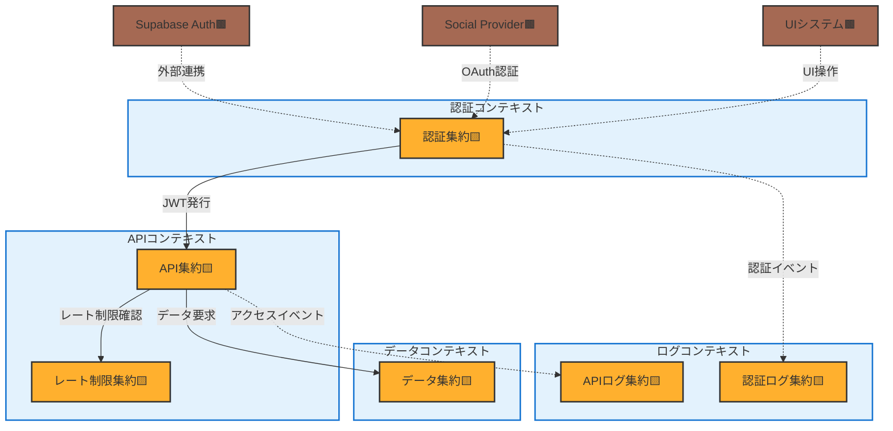
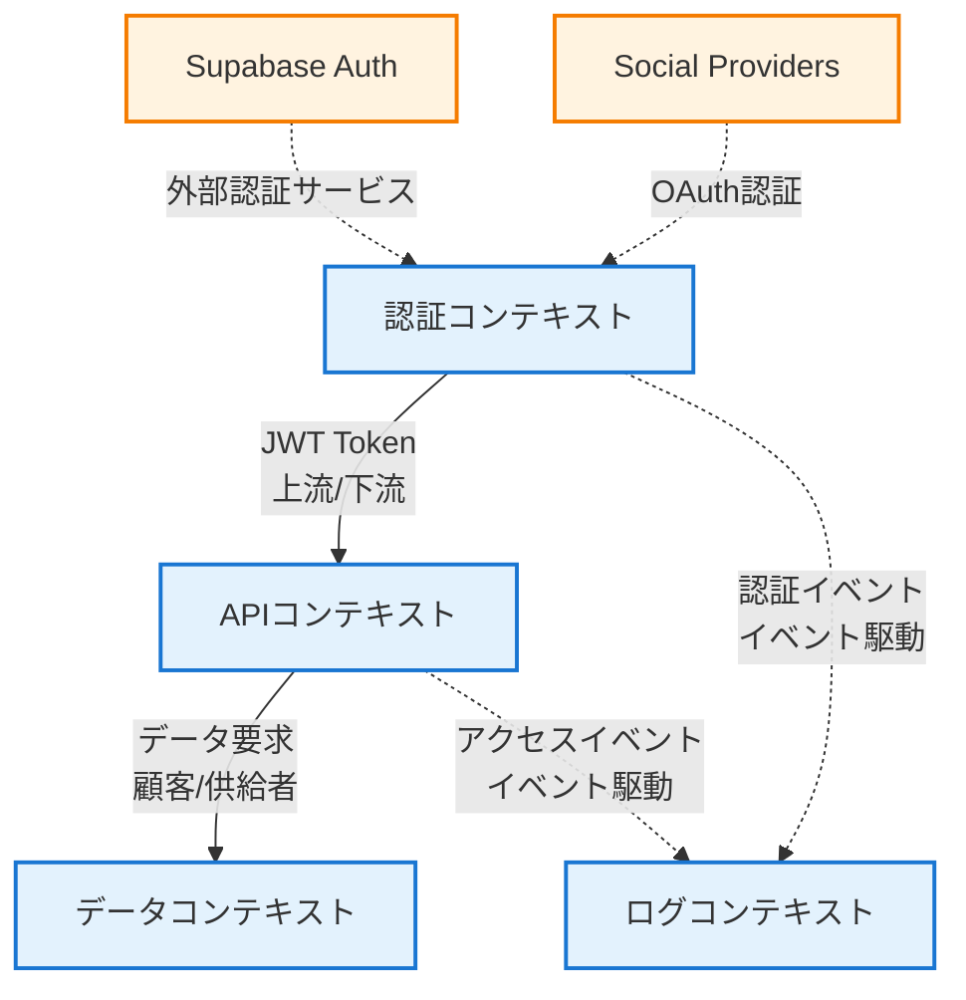

# ステップ4：境界づけられたコンテキストの定義

## 境界づけられたコンテキストと集約の概観

### 境界と集約の関係（簡潔版）

## タイムライン

### 詳細なイベントフロー（全要素を含む）

```mermaid
graph LR
    %% 認証コンテキスト
    subgraph AuthContext["認証コンテキスト"]
        %% 認証集約の境界
        subgraph AuthAggregateContext["認証集約🟨"]
            %% Social Login認証フロー
            subgraph "Social Login認証フロー"
                %% アクターとコマンド
                User1[ユーザー⬜] -->|invokes| Cmd1[ログイン/サインアップする🟦]

                %% コマンドと集約/外部システム
                Cmd1 -->|invoked on| UISystem1[UIシステム🟫]

                %% イベント生成とリダイレクト
                UISystem1 -->|generates| A1[ログイン/サインアップボタンがクリックされた🟧]

                %% Supabase Authへのリダイレクト
                A1 -->|triggers| Policy1[Supabase Auth リダイレクト方針🟩]
                Policy1 -->|invokes| Cmd2[Supabase Authへリダイレクトする🟦]
                Cmd2 -->|invoked on| UISystem1
                UISystem1 -->|generates| A2[Supabase Authへリダイレクトされた🟧]

                %% Supabase Auth UIコンポーネントが自動的に処理
                A2 -->|triggers| Policy2[認証開始方針🟩]
                Policy2 -->|invokes| Cmd3[Supabase Authで認証を開始する🟦]
                Cmd3 -->|invoked on| SupaAuth[Supabase Auth🟫]
                SupaAuth -->|generates| A4[Social Provider認証ページにリダイレクトされた🟧]

                %% 外部認証へのリダイレクト
                A4 -->|triggers| Policy3[Social Provider認証方針🟩]
                Policy3 -->|invokes| Cmd4[Social Providerで認証する🟦]
                Cmd4 -->|invoked on| SocialProvider[Social Provider🟫]

                %% 認証成功時
                SocialProvider -->|generates| A6[認証成功コールバックが受信された🟧]

                %% 認証失敗時
                SocialProvider -->|generates| A7[認証失敗コールバックが受信された🟧]
                A7 -->|triggers| Policy25[認証失敗リダイレクト方針🟩]
                Policy25 -->|invokes| Cmd30[トップページにリダイレクトする🟦]
                Cmd30 -->|invoked on| UISystem1
                UISystem1 -->|generates| A16[トップページにリダイレクトされた🟧]

                %% ダッシュボード表示
                A6 -->|triggers| Policy9[ダッシュボード表示方針🟩]
                Policy9 -->|invokes| Cmd10[ダッシュボードを表示する🟦]
                Cmd10 -->|invoked on| UISystem2[UIシステム🟫]
                UISystem2 -->|generates| A14[ダッシュボードが表示された🟧]

                %% 読み取りモデル
                A6 -->|translated into| ReadModel1[認証情報⬛]
                A14 -->|translated into| ReadModel2[ダッシュボード情報⬛]
            end

            %% ログアウトフロー
            subgraph "ログアウトフロー"
                %% アクターとコマンド
                User3[ログインユーザー⬜] -->|invokes| Cmd19[ログアウトする🟦]

                %% コマンドと集約/外部システム
                Cmd19 -->|invoked on| AuthAgg2[認証集約🟨]

                %% イベント生成
                AuthAgg2 -->|generates| E2[セッションが無効化された🟧]

                %% 方針
                E2 -->|triggers| Policy17[リダイレクト方針🟩]
                Policy17 -->|invokes| Cmd20[トップページにリダイレクトする🟦]
                Cmd20 -->|invoked on| UISystem2[UIシステム🟫]
                UISystem2 -->|generates| E3[トップページにリダイレクトされた🟧]
            end

            %% トークンリフレッシュフロー
            subgraph "トークンリフレッシュフロー"
                %% アクターとコマンド（システム自動実行）
                System1[システム⬜] -->|invokes| Cmd21[トークンをリフレッシュする🟦]

                %% コマンドと集約
                Cmd21 -->|invoked on| AuthAgg3[認証集約🟨]

                %% イベント生成（トークンチェック）
                AuthAgg3 -->|generates| F1[アクセストークンの有効期限が近い（5分以内）🟧]
                AuthAgg3 -->|generates| F2[リフレッシュトークンが有効である🟧]

                %% 正常系：両条件を満たす場合のみリフレッシュ実行
                F1 -->|triggers| Policy18[トークンリフレッシュ実行方針🟩]
                F2 -->|triggers| Policy18
                Policy18 -->|invokes| Cmd22[Supabaseでトークンをリフレッシュする🟦]
                Cmd22 -->|invoked on| SupaAuth3[Supabase Auth🟫]

                %% 新しいアクセストークン発行
                SupaAuth3 -->|generates| F4[新しいアクセストークンが発行された🟧]

                %% 読み取りモデル（正常系）
                F4 -->|translated into| ReadModel10[更新された認証情報⬛]

                %% エラー系：リフレッシュトークンが期限切れ
                F2 -.-> F5[リフレッシュトークンが期限切れだった🟧]

                %% リクエスト元による分岐
                F5 -->|triggers| Policy19[再認証要求方針（Web）🟩]
                F5 -->|triggers| Policy20[API認証エラー方針🟩]

                %% Webブラウザからの場合
                Policy19 -->|invokes| Cmd23[再ログインを要求する🟦]
                Cmd23 -->|invoked on| UISystem3[UIシステム🟫]
                UISystem3 -->|generates| F6[Supabase Authへリダイレクトされた🟧]

                %% APIクライアントからの場合
                Policy20 -->|invokes| Cmd24[認証エラーを返却する🟦]
                Cmd24 -->|invoked on| APIAgg2[API集約🟨]
                APIAgg2 -->|generates| F7[認証エラー（トークン期限切れ）が返却された🟧]

                %% エラー読み取りモデル
                F7 -->|translated into| ReadModel13[トークン期限切れエラー情報⬛]
            end
        end
    end

    %% APIコンテキスト
    subgraph APIContext["APIコンテキスト"]
        %% API集約の境界
        subgraph APIAggregateContext["API集約🟨"]
            %% APIアクセスフロー（正常系）
            subgraph "APIアクセスフロー - 正常系"
                %% アクターとコマンド
                APIClient[APIクライアント⬜] -->|invokes| Cmd11[APIを呼び出す🟦]

                %% コマンドと集約/外部システム
                Cmd11 -->|invoked on| APIAgg[API集約🟨]

                %% イベント生成
                APIAgg -->|generates| C2[JWTトークンが検証された🟧]
                APIAgg -->|generates| C3[ユーザーティアが確認された🟧]

                %% レート制限チェック
                C3 -->|triggers| Policy10[レート制限チェック方針🟩]
                Policy10 -->|invokes| Cmd12[レート制限をチェックする🟦]

                %% データ取得
                C5[レート制限カウントが更新された🟧] -->|triggers| Policy12[データ取得方針🟩]
                Policy12 -->|invokes| Cmd14[JSONファイルを読み込む🟦]

                %% 正常系：レスポンス返却
                C6[JSONファイルが読み込まれた🟧] -->|triggers| Policy13[レスポンス返却方針🟩]
                Policy13 -->|invokes| Cmd15[レスポンスを返却する🟦]
                Cmd15 -->|invoked on| APIAgg
                APIAgg -->|generates| C7[レスポンスが返却された🟧]

                %% エラー系：404エラー処理
                D5[ファイルが見つからなかった🟧] -->|triggers| Policy16[404エラー処理方針🟩]
                Policy16 -->|invokes| Cmd16[404エラーを返却する🟦]
                Cmd16 -->|invoked on| APIAgg

                %% 読み取りモデル
                C3 -->|translated into| ReadModel4[ユーザーティア情報⬛]
            end

            %% APIアクセスフロー（エラー系）
            subgraph "APIアクセスフロー - エラー系"
                %% 認証エラー（API集約から直接生成）
                APIAgg -->|generates| D2[認証エラーが返却された🟧]

                %% ファイルエラー（API集約から生成）
                APIAgg -->|generates| D6[404エラーが返却された🟧]

                %% エラー読み取りモデル
                D2 -->|translated into| ReadModel7[認証エラー情報⬛]
                D6 -->|translated into| ReadModel9[404エラー情報⬛]
            end
        end

        %% レート制限集約の境界
        subgraph RateLimitAggregateContext["レート制限集約🟨"]
            Cmd12 -->|invoked on| RateLimitAgg[レート制限集約🟨]

            %% チェック結果により分岐
            RateLimitAgg -->|generates| C4a[レート制限内であることが確認された🟧]
            RateLimitAgg -->|generates| C4b[レート制限を超過した🟧]

            %% 制限内の場合：カウント更新して処理継続
            C4a -->|triggers| Policy11[レート制限更新方針🟩]
            Policy11 -->|invokes| Cmd13[レート制限カウントを更新する🟦]
            Cmd13 -->|invoked on| RateLimitAgg
            RateLimitAgg -->|generates| C5

            %% レート制限エラー（レート制限集約から直接生成）
            RateLimitAgg -->|generates| D4[レート制限エラーが返却された🟧]

            %% 読み取りモデル
            C4a -->|translated into| ReadModel5[レート制限状態⬛]
            D4 -->|translated into| ReadModel8[レート制限エラー情報⬛]
        end
    end

    %% データコンテキスト
    subgraph DataContext["データコンテキスト"]
        %% データ集約の境界
        subgraph DataAggregateContext["データ集約🟨"]
            Cmd14 -->|invoked on| DataAgg[データ集約🟨]

            %% データ集約から正常系/エラー系に分岐
            DataAgg -->|generates| C6
            DataAgg -->|generates| D5

            %% 読み取りモデル
            C6 -->|translated into| ReadModel6[JSONデータ⬛]
        end
    end

    %% ログコンテキスト
    subgraph LogContext["ログコンテキスト"]
        %% 認証ログ集約の境界
        subgraph AuthLogAggregateContext["認証ログ集約🟨"]
            %% ログ記録フロー（並行処理）
            %% 認証イベントからの方針トリガー
            A6 -.->|triggers| Policy21[認証ログ方針🟩]
            A7 -.->|triggers| Policy21
            E2 -.->|triggers| Policy21

            %% 認証ログコマンド実行
            Policy21 -->|invokes| Cmd25[認証結果をログに記録する🟦]

            %% 認証ログ集約への実行
            Cmd25 -->|invoked on| AuthLogAgg[認証ログ集約🟨]

            %% 認証ログイベント生成
            AuthLogAgg -->|generates| G1[認証結果がログに記録された🟧]

            %% 読み取りモデル
            G1 -->|translated into| ReadModel11[監査ログ⬛]
        end

        %% APIログ集約の境界
        subgraph APILogAggregateContext["APIログ集約🟨"]
            %% APIアクセスイベントからの方針トリガー
            C7 -.->|triggers| Policy24[APIアクセスログ方針🟩]
            D2 -.->|triggers| Policy24
            D4 -.->|triggers| Policy24
            D6 -.->|triggers| Policy24

            %% APIアクセスログコマンド実行
            Policy24 -->|invokes| Cmd28[APIアクセスをログに記録する🟦]

            %% APIログ集約への実行
            Cmd28 -->|invoked on| APILogAgg[APIログ集約🟨]

            %% APIアクセスログイベント生成
            APILogAgg -->|generates| G4[APIアクセスがログに記録された🟧]

            %% 読み取りモデル
            G4 -->|translated into| ReadModel14[APIアクセスログ⬛]
        end
    end


    %% スタイル定義
    classDef event fill:#ff6723,stroke:#333,stroke-width:2px;
    classDef command fill:#00a6ed,stroke:#333,stroke-width:2px;
    classDef user fill:#ffffff,stroke:#333,stroke-width:2px;
    classDef externalSystem fill:#a56953,stroke:#333,stroke-width:2px;
    classDef aggregate fill:#ffb02e,stroke:#333,stroke-width:2px;
    classDef policy fill:#00d26a,stroke:#333,stroke-width:2px;
    classDef readModel fill:#000000,color:#fff,stroke:#333,stroke-width:2px;

    class A1,A2,A4,A6,A7,A14,A16,C2,C3,C4a,C4b,C5,C6,C7,D2,D4,D5,D6,E2,E3,F1,F2,F4,F5,F6,F7,G1,G4 event;
    class Cmd1,Cmd2,Cmd3,Cmd4,Cmd10,Cmd11,Cmd12,Cmd13,Cmd14,Cmd15,Cmd16,Cmd19,Cmd20,Cmd21,Cmd22,Cmd23,Cmd24,Cmd25,Cmd28,Cmd30 command;
    class User1,User3,APIClient,System1 user;
    class SocialProvider,SupaAuth,SupaAuth3,UISystem1,UISystem2,UISystem3 externalSystem;
    class AuthAgg,AuthAgg2,AuthAgg3,APIAgg,APIAgg2,RateLimitAgg,DataAgg,AuthLogAgg,APILogAgg aggregate;
    class Policy1,Policy2,Policy3,Policy9,Policy10,Policy11,Policy12,Policy13,Policy16,Policy17,Policy18,Policy19,Policy20,Policy21,Policy24,Policy25 policy;
    class ReadModel1,ReadModel2,ReadModel4,ReadModel5,ReadModel6,ReadModel7,ReadModel8,ReadModel9,ReadModel10,ReadModel11,ReadModel13,ReadModel14 readModel;
```

## 境界づけられたコンテキストの説明

### 認証コンテキスト（Authentication Context）

- **説明**: ユーザーの認証・認可に関するすべての機能を含む。Social Login、セッション管理、トークンリフレッシュの責務を持つ。
- **含まれる集約**: 認証集約
- **責務**:
  - ユーザー認証の処理
  - セッション管理
  - トークンのライフサイクル管理
  - 認証状態の維持
- **他コンテキストとの関係**:
  - APIコンテキストの上流として振る舞い、認証情報を提供
  - ログコンテキストに認証イベントを通知（イベント駆動）

### APIコンテキスト（API Context）

- **説明**: オープンデータAPIの提供に関する中核機能を含む。リクエスト処理、レート制限、レスポンス生成の責務を持つ。
- **含まれる集約**: API集約、レート制限集約
- **責務**:
  - APIリクエストの受付と検証
  - レート制限の管理と適用
  - レスポンスの生成とエラーハンドリング
  - ティア別アクセス制御
- **他コンテキストとの関係**:
  - 認証コンテキストの下流（JWTトークンを使用）
  - データコンテキストのコンシューマー（データ取得要求）
  - ログコンテキストにAPIアクセスイベントを通知

### データコンテキスト（Data Context）

- **説明**: オープンデータの管理とアクセスに関する機能を含む。JSONファイルの読み込みとデータ提供の責務を持つ。
- **含まれる集約**: データ集約
- **責務**:
  - JSONファイルの管理
  - データの読み込みと提供
  - ファイルパスの検証（セキュリティ）
  - 404エラーの生成
- **他コンテキストとの関係**:
  - APIコンテキストに対してデータサービスを提供（上流）
  - 他のコンテキストとは疎結合

### ログコンテキスト（Logging Context）

- **説明**: システム全体のログ記録と監査に関する機能を含む。認証ログとAPIアクセスログを分離して管理する。
- **含まれる集約**: 認証ログ集約、APIログ集約
- **責務**:
  - 認証イベントのログ記録（成功・失敗・ログアウト）
  - APIアクセスのログ記録（正常・エラー含む）
  - 監査証跡の保存
  - ログの永続化とクエリ対応
- **他コンテキストとの関係**:
  - すべてのコンテキストからイベント駆動で通知を受ける（別途調達パターン）
  - 非同期処理により他コンテキストへの影響を最小化

## コンテキストマップ

## 統合パターンの詳細

### 1. 認証コンテキスト → APIコンテキスト（上流/下流）

- **統合方式**: JWTトークンによる認証情報の伝達
- **パターン**: 上流/下流関係
- **実装方針**:
  - 認証コンテキストがJWTトークンを発行
  - APIコンテキストはトークンを検証してティア情報を取得
  - トークンの形式は認証コンテキストが決定（上流の権限）

### 2. APIコンテキスト → データコンテキスト（顧客/供給者）

- **統合方式**: 同期的なデータ要求/応答
- **パターン**: 顧客/供給者関係
- **実装方針**:
  - APIコンテキストがデータ要求を送信
  - データコンテキストが要求に応じてJSONデータを返却
  - インターフェースは両者の協議により決定

### 3. 各コンテキスト → ログコンテキスト（別途調達）

- **統合方式**: イベント駆動の非同期通信
- **パターン**: 別途調達（Separate Ways）
- **実装方針**:
  - 各コンテキストは独立してイベントを発行
  - ログコンテキストは非同期でイベントを受信
  - 疎結合により各コンテキストの自律性を保証

## 保留事項 (Future Placement Board)

| タイプ                     | 内容                                                                           | 今後の対応                 |
| -------------------------- | ------------------------------------------------------------------------------ | -------------------------- |
| 境界づけられたコンテキスト | コンテキスト間のイベント駆動通信の実装詳細（イベントバス、メッセージキュー等） | 実装フェーズで技術選定     |
| 境界づけられたコンテキスト | 各コンテキストのデプロイメント単位（マイクロサービス vs モジュラーモノリス）   | アーキテクチャ設計で検討   |
| 境界づけられたコンテキスト | ログコンテキストの永続化戦略（Supabaseデータベース、ファイル等）               | インフラ設計で検討         |
| 懸念事項🟪                 | 認証コンテキストとSupabase Authの責務境界の詳細                                | 実装時に詳細化             |
| 懸念事項🟪                 | データコンテキストのスケーラビリティ（ファイルシステムの限界）                 | パフォーマンステストで検証 |

## ユビキタス言語辞書（ステップ4での追加・更新）

| 項番 | 日本語                     | 英語                | コード変数          | 意味                                               | 使用コンテキスト | 最終更新   |
| ---- | -------------------------- | ------------------- | ------------------- | -------------------------------------------------- | ---------------- | ---------- |
| 31   | 境界づけられたコンテキスト | Bounded Context     | boundedContext      | 特定のドメインモデルが一貫性を持って適用される範囲 | 全体             | 2025-01-12 |
| 32   | コンテキストマップ         | Context Map         | contextMap          | 境界づけられたコンテキスト間の関係を表現した図     | 全体             | 2025-01-12 |
| 33   | 上流/下流                  | Upstream/Downstream | upstream/downstream | 一方のコンテキストが他方に影響を与える関係         | 統合             | 2025-01-12 |
| 34   | 顧客/供給者                | Customer/Supplier   | customer/supplier   | 協調的な依存関係                                   | 統合             | 2025-01-12 |
| 35   | 別途調達                   | Separate Ways       | separateWays        | 統合せず独立して実装するパターン                   | 統合             | 2025-01-12 |
| 36   | 公開ホストサービス         | Open Host Service   | openHostService     | 標準化されたインターフェースでサービスを提供       | 統合             | 2025-01-12 |
| 37   | イベント駆動               | Event Driven        | eventDriven         | イベントを介した疎結合な連携方式                   | 統合             | 2025-01-12 |

## チェックリスト

完了基準の確認結果

### 境界づけられたコンテキストの識別

- [x] 関連する集約が適切にグループ化されている
- [x] 各コンテキストが明確な責務を持っている
- [x] コンテキスト間の境界が明確に定義されている
- [x] 各コンテキスト内のユビキタス言語が一貫している

### コンテキストマップの作成

- [x] すべてのコンテキスト間の関係が定義されている
- [x] 上流/下流関係が明確に示されている
- [x] 適切な統合パターン（別途調達、公開ホスト等）が特定されている
- [x] コンテキスト間のデータ交換パターンが検討されている

### システム構造への影響

- [x] 各コンテキストがマイクロサービスの候補として評価されている
- [x] コンテキスト間の連携方法（同期API、イベント等）が検討されている
- [x] データの一貫性と整合性の戦略が検討されている
- [x] システム全体のスケーラビリティが考慮されている

### ビジネス要件の充足

- [x] 定義されたコンテキストがビジネス要件を満たしている
- [x] 組織構造との整合性が取れている
- [x] 将来の変化に適応できる柔軟な構造になっている
- [x] ビジネスの自律性や成長戦略と整合している

### 進化的アプローチの確認

- [x] このステップまでの全体の整合性が確保されているか？
- [x] 静的モデリングへ進む前に、解決すべき重要な問題はないか？
- [x] 各ステップでの決定事項が十分に熟考されているか？

## 補足

### コンテキスト分割の根拠

本プロジェクトでは、以下の観点から4つの境界づけられたコンテキストを定義しました：

1. **責務の明確性**

   - 各コンテキストが単一の明確な責務を持つ
   - 例：認証は認証コンテキスト、API処理はAPIコンテキスト

2. **変更の独立性**

   - 各コンテキストが独立して変更可能
   - 例：ログ形式の変更が他のコンテキストに影響しない

3. **技術的な凝集性**

   - 同じ技術的関心事を持つ集約をグループ化
   - 例：認証ログとAPIログは同じログコンテキストに配置

4. **スケーラビリティ**
   - 各コンテキストが独立してスケール可能
   - 例：APIコンテキストのみを水平スケール

### TypeScriptでの実装に向けた考慮事項

1. **モジュール構成**

   - 各コンテキストを独立したTypeScriptモジュールとして実装
   - インターフェースによる依存関係の管理

2. **イベント駆動の実装**

   - TypeScriptの型安全なイベントエミッターの活用
   - 非同期処理（Promise/async-await）による疎結合

3. **デプロイメント戦略**
   - Vercelへのデプロイを考慮したモジュラーモノリス
   - 将来的なマイクロサービス化への移行パスを確保

### ログコンテキストの設計根拠

ログコンテキストでは、認証ログ集約とAPIログ集約を意図的に分離しています。この設計の根拠は以下の通りです：

1. **異なる関心事の分離**

   - 認証ログ：セキュリティ監査、不正アクセス検知、コンプライアンス要件
   - APIログ：パフォーマンス分析、利用統計、エラー分析

2. **独立したライフサイクル**

   - 認証ログ：長期保存が必要（監査要件により数年間）
   - APIログ：短期保存で十分（統計処理後は集約データのみ保持）

3. **異なるアクセスパターン**

   - 認証ログ：セキュリティチームによる調査時のアクセス
   - APIログ：運用チームによる日常的なモニタリング

4. **将来の拡張性**
   - 認証ログ：SIEM（Security Information and Event Management）との連携
   - APIログ：APM（Application Performance Monitoring）ツールとの統合

この分離により、それぞれの用途に最適化された実装が可能となり、将来的な要件変更にも柔軟に対応できます。

### 外部システムとの統合

外部システム（Supabase Auth、Social Provider、UIシステム）は境界づけられたコンテキストの外部に配置し、明確なインターフェースを通じて連携します。これにより：

- 外部システムの変更による影響を最小化
- テスト時のモック化が容易
- 将来的な外部システムの置き換えが可能

## 変更履歴

| 更新日時                  | 変更点                                                                                                                  |
| ------------------------- | ----------------------------------------------------------------------------------------------------------------------- |
| 2025-01-14T15:35:00+09:00 | ドキュメントコンテキストを削除（APIドキュメントは静的生成に変更されたため）。5つから4つのコンテキストに変更             |
| 2025-01-13T10:00:00+09:00 | 境界づけられたコンテキストと集約の概観図を追加。ログコンテキストの設計根拠（認証ログとAPIログの分離理由）を補足に追加   |
| 2025-01-12T21:00:00+09:00 | 新規作成。ステップ3の7つの集約を5つの境界づけられたコンテキストにグループ化し、コンテキスト間の関係と統合パターンを定義 |

（更新日時の降順で記載する）
