# 静的モデリング

## ドメインモデル図

### 認証コンテキスト

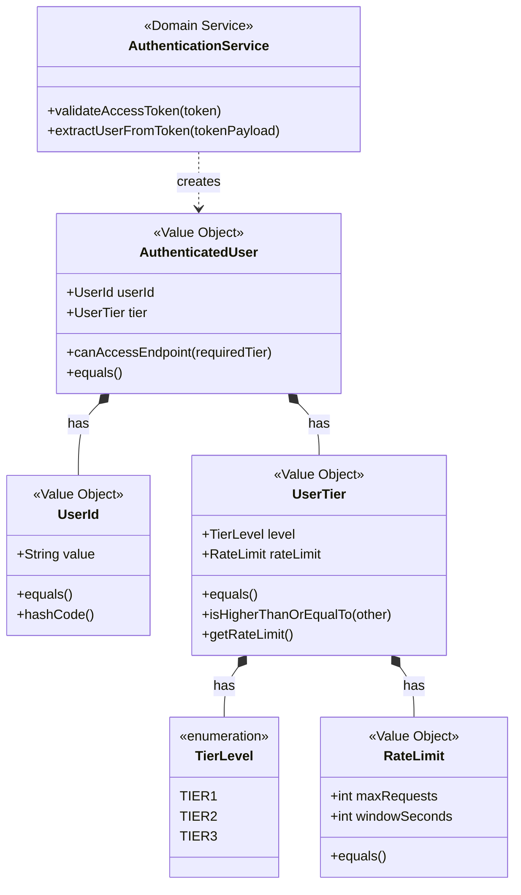

### APIコンテキスト

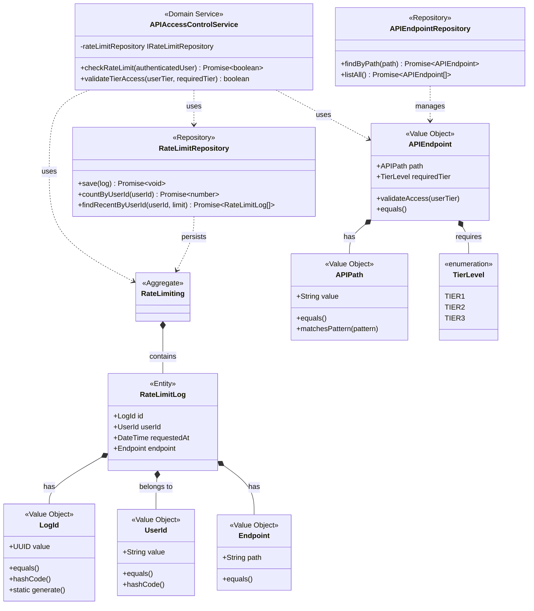

### データコンテキスト

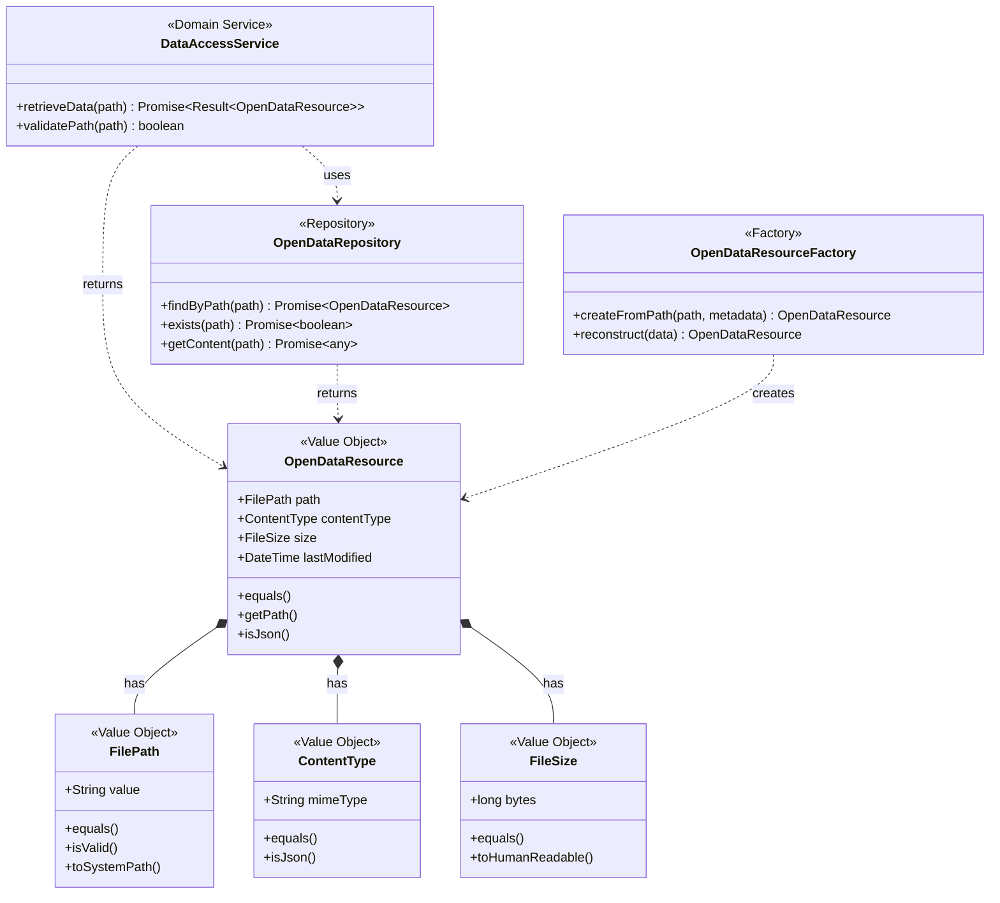

### ログコンテキスト

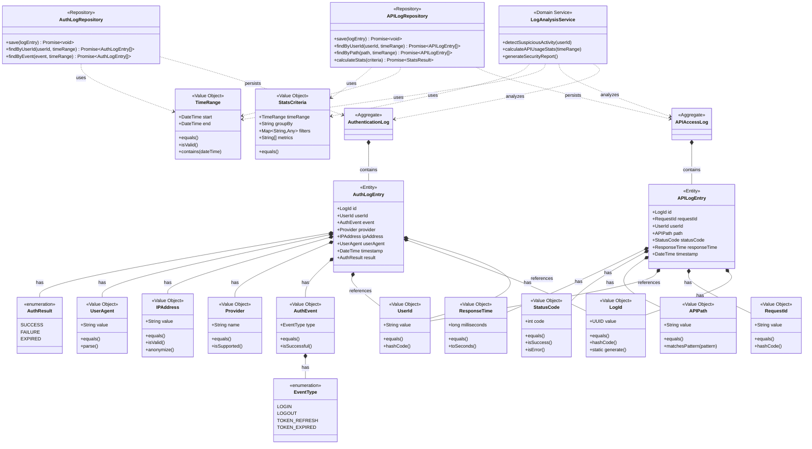

### ドメインモデルの説明

1. **認証コンテキスト**
   - 主要なバリューオブジェクト：AuthenticatedUser
   - 責務：JWTトークンの検証結果を表現し、アクセス権限を判定
   - 不変条件：認証済みユーザーは必ずUserIdとUserTierを持つ

2. **APIコンテキスト**
   - 主要な集約：RateLimiting（レート制限集約）
   - 責務：APIアクセス制御とレート制限の管理
   - 不変条件：ユーザーは設定された制限を超えてAPIを利用できない

3. **レート制限集約（RateLimiting）**
   - 集約ルート：RateLimitLog
   - 責務：ユーザーごとのAPIアクセス履歴の記録と制限管理
   - 不変条件：リクエスト数は指定された時間枠内で制限値を超えることができない

4. **OpenDataResource（バリューオブジェクト）**
   - 責務：オープンデータファイルのメタデータを表現
   - 特徴：不変オブジェクトとして実装、ファイルパスで一意性を判定
   - 注：永続化されないため、エンティティではなくバリューオブジェクトとして設計

5. **認証ログ集約（AuthenticationLog）**
   - 集約ルート：AuthLogEntry
   - 責務：認証イベントの記録と監査証跡の保持
   - 不変条件：ログエントリは不変（作成後の変更不可）

6. **APIログ集約（APIAccessLog）**
   - 集約ルート：APILogEntry
   - 責務：APIアクセスの記録とパフォーマンス分析
   - 不変条件：ログエントリは不変（作成後の変更不可）

## レイヤードアーキテクチャ図

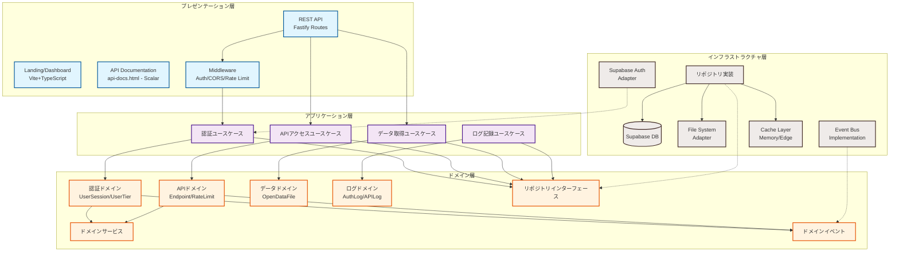

### アーキテクチャの説明

1. **依存関係の方向**
   - 上位層から下位層への依存のみ許可
   - ドメイン層は他の層に依存しない
   - インフラ層はドメイン層のインターフェースを実装（DIP）

2. **各層の責務**
   - プレゼンテーション層：HTTPリクエスト/レスポンスの処理、認証の検証、ランディングページとダッシュボード（Vite+TypeScript）、APIドキュメント（Scalar静的生成）
   - アプリケーション層：ユースケースの調整、トランザクション管理
   - ドメイン層：ビジネスロジック、ドメインイベントの発行
   - インフラ層：外部システム連携、永続化、キャッシュ

3. **TypeScript/Fastify/Viteでの実装**
   - Fastifyプラグインアーキテクチャを活用
   - Vite+TypeScriptでSPAフロントエンド構築
   - 依存性注入にTSyringeまたはInversifyJSを使用
   - 型安全性を最大限に活用

## 境界づけられたコンテキスト統合図

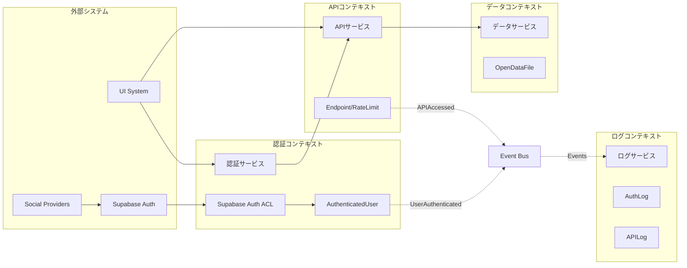

### 統合パターンの説明

1. **腐敗防止層（ACL）**
   - Supabase Authとの統合にACLを使用
   - 外部システムの変更から内部ドメインを保護

2. **上流/下流関係**
   - 認証コンテキスト → APIコンテキスト（認証情報の提供）
   - APIコンテキスト → データコンテキスト（データアクセス）

3. **イベント駆動統合**
   - 認証イベント、APIアクセスイベントを非同期で配信
   - ログコンテキストがイベントを購読して記録

## シーケンス図 <API認証とデータ取得処理>

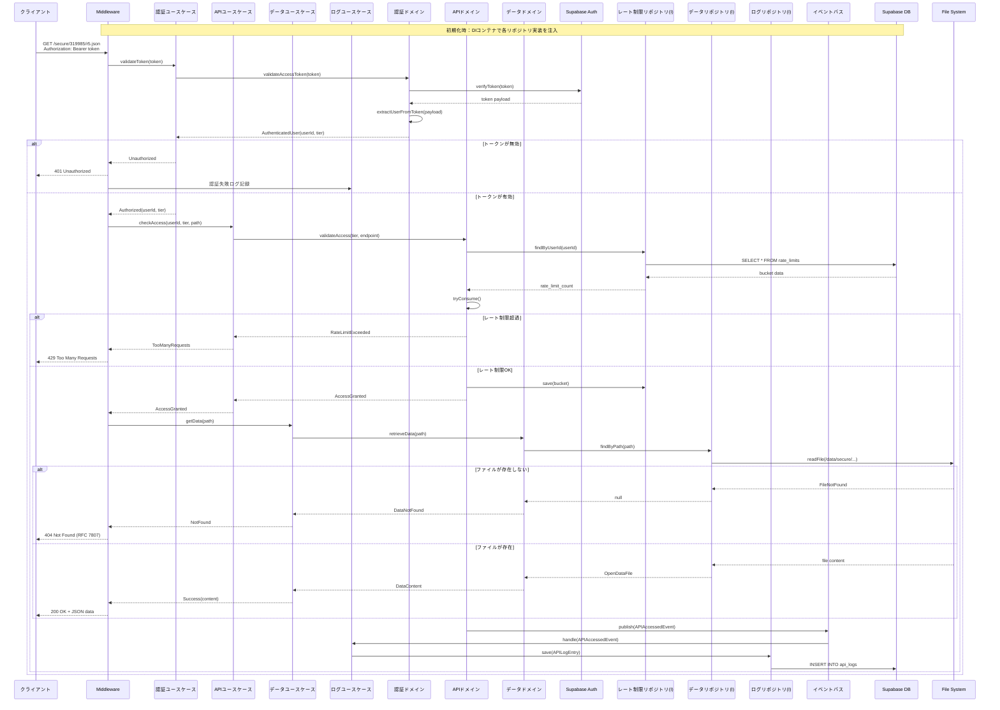

### シーケンスの説明

1. **レイヤー間の責務分担**
   - Middleware：認証トークンの抽出、HTTPレスポンスの生成
   - アプリケーション層：ユースケースの調整、エラーハンドリング
   - ドメイン層：ビジネスロジック（認証、レート制限、データアクセス）
   - インフラ層：永続化、ファイルシステムアクセス

2. **依存性逆転の原則（DIP）の適用**
   - ドメイン層はリポジトリインターフェースのみに依存
   - インフラ層がドメイン層のインターフェースを実装
   - DIコンテナ（TSyringe/InversifyJS）で実装を注入
   - これにより、テスト時にモック実装への差し替えが容易

3. **エラー処理とレスポンス**
   - 認証エラー：401 Unauthorized
   - レート制限：429 Too Many Requests
   - データ不在：404 Not Found（RFC 7807形式）

4. **非同期イベント処理**
   - ドメインイベントをEventBus経由で非同期配信
   - ログ記録は本処理と独立して実行

## ステートマシン図 <RateLimitLog>

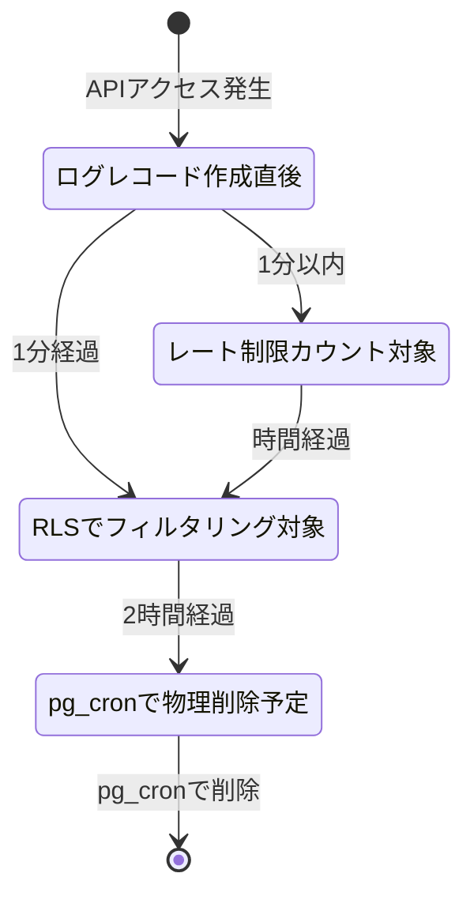

### 状態遷移の説明

**RateLimitLogの状態遷移（ログベース方式のため個別の状態遷移は不要）**

スライディングウィンドウ（ログベース）方式では、個々のログレコードは以下のシンプルなライフサイクルを持ちます：
   - 作成：APIアクセス時に記録
   - 有効期間：1分間（設定された時間窓）
   - 削除：pg_cronによる自動削除（2時間後）
   - 新規作成：ユーザーの初回APIアクセス時
   - 使用中：制限値未満のリクエスト数
   - 制限到達：制限値に到達（新規リクエスト拒否）
   - リセット済み：時間窓経過後のリセット
   - 削除：長期間未使用時のメモリ解放

## クラス図 <認証コンテキスト>

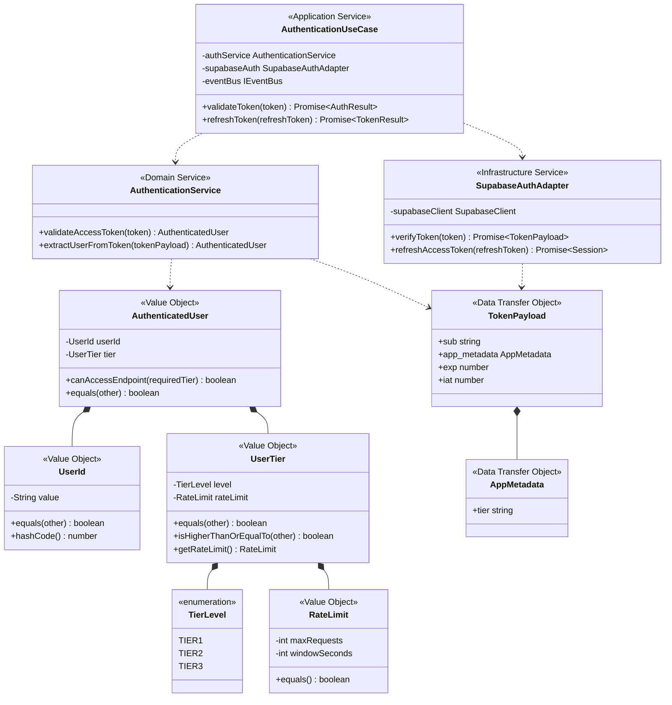

## クラス図 <APIコンテキスト>

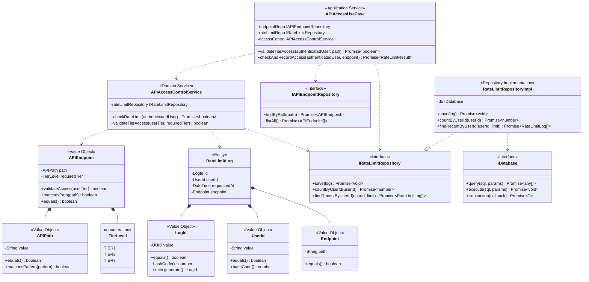

### クラス設計の説明

1. **ドメイン層のクラス**
   - エンティティ：識別子を持ち、ライフサイクルを管理
   - バリューオブジェクト：不変で値による等価性判定
   - ドメインサービス：複数の集約にまたがるビジネスロジック
   - リポジトリインターフェース：永続化の抽象化

2. **レイヤー間の分離**
   - インターフェースによる依存性逆転
   - アプリケーションサービスがユースケースを調整
   - インフラ層が技術的詳細を実装

3. **TypeScript固有の実装**
   - Promiseによる非同期処理
   - ジェネリクスによる型安全性
   - インターフェースによる契約の定義

## ドメインイベントの設計

### イベントクラス

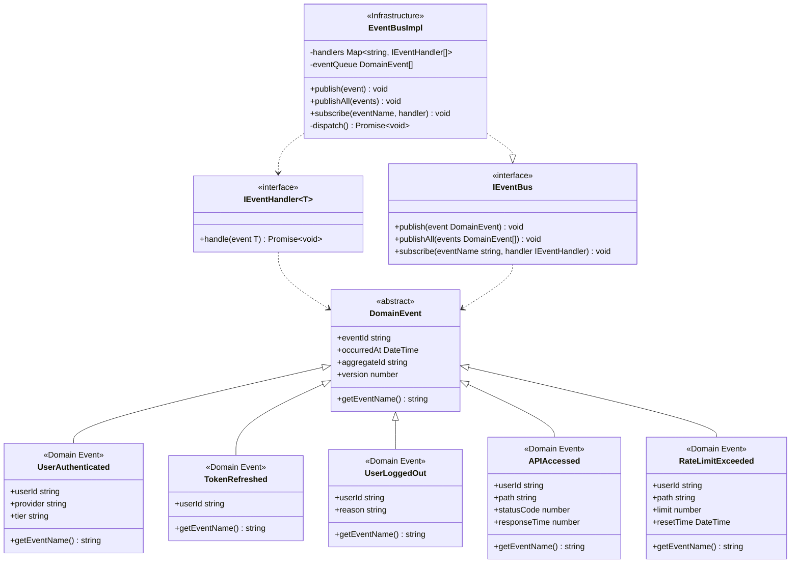

### イベント設計の説明

1. **イベントの実装方針**
   - イベント名は過去形で命名（UserAuthenticated、TokenRefreshed等）
   - 不変オブジェクトとして実装（readonlyプロパティ）
   - 必要最小限の情報のみを含める（集約ID、関連データ）

2. **イベントの発行タイミング**
   - 集約内でビジネスロジック実行後に発行
   - トランザクションコミット後に配信（遅延ディスパッチ）
   - エラー時はイベント発行をスキップ

3. **TypeScriptでの実装**
   ```typescript
   // ドメインイベントの基底クラス
   abstract class DomainEvent {
     readonly eventId: string = uuid();
     readonly occurredAt: DateTime = DateTime.now();
     
     constructor(
       readonly aggregateId: string,
       readonly version: number
     ) {}
     
     abstract getEventName(): string;
   }
   
   // 具体的なイベント
   class UserAuthenticated extends DomainEvent {
     constructor(
       aggregateId: string,
       version: number,
       readonly userId: string,
       readonly provider: string,
       readonly tier: string
     ) {
       super(aggregateId, version);
     }
     
     getEventName(): string {
       return 'UserAuthenticated';
     }
   }
   ```

## 例外とエラー処理の設計

### エラー処理パターン

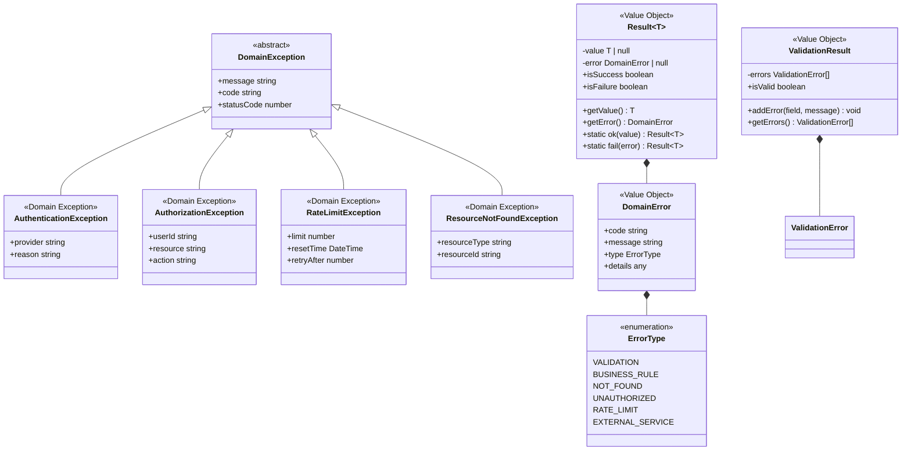

### エラー処理の説明

1. **例外の使用方針**
   - ドメイン不変条件の違反：DomainExceptionをスロー
   - 検証エラー：Result型で処理
   - 外部システムエラー：アプリケーション層でラップ

2. **層別のエラー処理**
   - ドメイン層：ビジネスルール違反の検出とResult型での返却
   - アプリケーション層：エラーの変換とHTTPステータスへのマッピング
   - プレゼンテーション層：RFC 7807形式でのエラーレスポンス生成

3. **TypeScriptでの実装例**
   ```typescript
   // Result型の使用例
   class UserSession {
     static create(
       userId: UserId,
       tier: UserTier
     ): Result<UserSession> {
       if (!userId.isValid()) {
         return Result.fail(
           new DomainError(
             'INVALID_USER_ID',
             'User ID is invalid',
             ErrorType.VALIDATION
           )
         );
       }
       
       const session = new UserSession(userId, tier);
       return Result.ok(session);
     }
   }
   
   // エラーレスポンスの生成（RFC 7807）
   function toProblemDetails(error: DomainError): ProblemDetails {
     return {
       type: `https://api.example.com/errors/${error.code}`,
       title: error.message,
       status: mapErrorToStatus(error.type),
       detail: error.details,
       instance: request.url
     };
   }
   ```

## 横断的関心事の設計

### アーキテクチャパターン

```mermaid
graph TB
    subgraph "横断的関心事の実装"
        AuthMW[認証ミドルウェア<br/>JWT検証]
        AuthzDecorator[認可デコレータ<br/>ティアチェック]
        LogInterceptor[ロギングインターセプタ<br/>リクエスト/レスポンス]
        RateLimitMW[レート制限ミドルウェア]
        CacheInterceptor[キャッシュインターセプタ<br/>Edge Cache]
        ErrorHandler[エラーハンドラー<br/>RFC 7807]
    end
    
    subgraph "アプリケーション層"
        AppService[アプリケーションサービス]
        EventHandlers[イベントハンドラー]
    end
    
    subgraph "ドメイン層"
        Domain[ドメインロジック]
        DomainEvents[ドメインイベント]
    end
    
    subgraph "インフラ層"
        Logger[Pino Logger]
        Cache[Cache Manager]
        Monitoring[Metrics Collector]
    end
    
    AuthMW --> AppService
    AuthzDecorator --> AppService
    RateLimitMW --> AppService
    LogInterceptor --> Logger
    CacheInterceptor --> Cache
    ErrorHandler --> AppService
    
    AppService --> Domain
    Domain --> DomainEvents
    DomainEvents --> EventHandlers
    EventHandlers --> Logger
    
    Note over AuthMW,ErrorHandler: Fastifyプラグインとして実装
    Note over Domain: ビジネスロジックのみ
    Note over Logger,Monitoring: 監視・分析基盤
```

### 横断的関心事の実装指針

1. **認証（Authentication）**
   - 実装場所：Fastifyミドルウェア（preHandler hook）
   - JWT検証とセッション確認
   - Supabase Authとの連携

2. **認可（Authorization）**
   - 単純な権限：ルートレベルのpreHandlerフック
   - ティアベースのアクセス制御：デコレータパターン
   - ビジネスルール：ドメイン層の仕様オブジェクト

3. **ロギング・監査**
   - 実装場所：Fastifyフック（onRequest/onResponse）
   - Pinoロガー（Fastifyデフォルト）の活用
   - 構造化ログ（JSON形式）で出力

4. **レート制限**
   - 実装場所：Fastifyプラグイン
   - ユーザーティアに基づく動的制限
   - Redis互換のメモリキャッシュ使用

5. **キャッシュ**
   - 実装場所：インターセプタパターン
   - Vercel Edge Cacheの活用
   - キャッシュキー生成戦略

6. **エラーハンドリング**
   - グローバルエラーハンドラー
   - RFC 7807準拠のレスポンス
   - 環境別のエラー詳細度制御

### Fastifyでの実装例

```typescript
// 認証ミドルウェア
const authPlugin: FastifyPluginAsync = async (fastify) => {
  fastify.addHook('preHandler', async (request, reply) => {
    const token = extractToken(request.headers.authorization);
    
    if (!token) {
      throw new UnauthorizedException('Missing token');
    }
    
    const validation = await authUseCase.validateToken(token);
    if (!validation.isValid) {
      throw new UnauthorizedException('Invalid token');
    }
    
    request.user = validation.user;
  });
};

// レート制限デコレータ
function RateLimit(tier: UserTier) {
  return function (
    target: any,
    propertyKey: string,
    descriptor: PropertyDescriptor
  ) {
    const originalMethod = descriptor.value;
    
    descriptor.value = async function (...args: any[]) {
      const userId = args[0].userId;
      const canProceed = await rateLimitService.tryConsume(
        userId,
        tier
      );
      
      if (!canProceed) {
        throw new RateLimitException(
          tier.rateLimit,
          calculateResetTime()
        );
      }
      
      return originalMethod.apply(this, args);
    };
  };
}

// 構造化ロギング
const loggerConfig = {
  level: process.env.LOG_LEVEL || 'info',
  formatters: {
    level: (label: string) => ({ level: label }),
    bindings: (bindings: any) => ({
      pid: bindings.pid,
      hostname: bindings.hostname,
      node_version: process.version,
    }),
  },
  serializers: {
    req: (request: FastifyRequest) => ({
      method: request.method,
      url: request.url,
      userId: request.user?.id,
      ip: request.ip,
    }),
    res: (reply: FastifyReply) => ({
      statusCode: reply.statusCode,
      responseTime: reply.getResponseTime(),
    }),
  },
};
```

## チェックリスト

### ドメインモデルの品質
- [x] すべての集約がドメインモデルとして表現されている
- [x] エンティティとバリューオブジェクトが適切に区別されている
- [x] ドメインサービスが識別され、責務が明確である
- [x] 集約間の参照がIDによる参照になっている
- [x] 不変条件（ビジネスルール）が集約内で保証されている

### アーキテクチャの整合性
- [x] レイヤー間の依存関係が単一方向である
- [x] ドメイン層が技術的な詳細に依存していない
- [x] インフラ層の実装がインターフェースを通じて抽象化されている
- [x] 各層の責務が明確に分離されている

### 境界づけられたコンテキストの統合
- [x] コンテキスト間の統合パターンが明確に定義されている
- [x] 腐敗防止層（ACL）が適切に設計されている
- [x] イベント駆動の統合が考慮されている
- [x] 外部システムとの統合方法が具体的である

### 実装可能性
- [x] 使用する技術スタックでの実装方法が明確である
- [x] 永続化戦略が定義されている
- [x] トランザクション境界が明確である
- [x] パフォーマンスを考慮した設計になっている

### イベントストーミングとの整合性
- [x] イベントストーミングで識別した要素がすべて反映されている
- [x] ドメインイベントがステートマシン図に反映されている
- [x] コマンドがアプリケーションサービスに対応している
- [x] 読み取りモデルが適切に設計されている

### ドメインイベントの設計
- [x] 重要なビジネスイベントがドメインイベントとして定義されている
- [x] イベントの命名が過去形でユビキタス言語を使用している
- [x] イベントの発行と配信の仕組みが明確である
- [x] イベントハンドリングの責務が適切に配置されている

### 例外処理とエラー設計
- [x] ドメイン例外が適切に定義されている
- [x] エラー処理パターン（例外/Result型）が一貫している
- [x] 各層でのエラー処理責任が明確である
- [x] ビジネスルール違反が適切に表現されている

### 横断的関心事の設計
- [x] 認証・認可の実装場所が適切である
- [x] ドメインロジックから横断的関心事が分離されている
- [x] ロギング・監査の仕組みが設計されている
- [x] プロジェクト固有の非機能要件が考慮されている

## 補足

### APIドキュメントの静的生成

APIドキュメントはビルド時に静的に生成され、実行時のドキュメント管理が不要になります。

#### 実装方法

1. **@fastify/swaggerでOpenAPI仕様書を生成**
   ```typescript
   // scripts/generate-openapi.ts
   import fastify from 'fastify'
   import fastifySwagger from '@fastify/swagger'
   import fs from 'fs/promises'
   
   async function generateOpenAPISpec() {
     const app = fastify({ logger: false })
     
     await app.register(fastifySwagger, {
       openapi: {
         openapi: '3.0.0',
         info: {
           title: 'オープンデータ提供API',
           version: '1.0.0',
           description: '奈良県のオープンデータを提供するAPI'
         },
         components: {
           securitySchemes: {
             bearerAuth: {
               type: 'http',
               scheme: 'bearer',
               bearerFormat: 'JWT'
             }
           }
         },
         security: [{ bearerAuth: [] }]
       }
     })
     
     // ルートを登録
     await app.register(import('../src/routes/index.js'))
     await app.ready()
     
     // OpenAPI仕様書を保存
     const spec = app.swagger()
     await fs.writeFile('dist/openapi.json', JSON.stringify(spec, null, 2))
   }
   ```

2. **Scalar UIを静的HTMLとして生成**
   ```html
   <!-- dist/api-docs.html -->
   <!doctype html>
   <html>
     <head>
       <title>オープンデータ提供API - ドキュメント</title>
       <meta charset="utf-8" />
     </head>
     <body>
       <script id="api-reference" type="application/json">
         <!-- OpenAPI仕様書を埋め込み -->
       </script>
       <script src="https://cdn.jsdelivr.net/npm/@scalar/api-reference"></script>
     </body>
   </html>
   ```

3. **ビルドスクリプトの設定**
   ```json
   // package.json
   {
     "scripts": {
       "build:openapi": "tsx scripts/generate-openapi.ts",
       "build:docs": "tsx scripts/build-docs.ts",
       "build": "npm run build:openapi && npm run build:docs"
     }
   }
   ```

4. **Vercelでの配信設定**
   ```json
   // vercel.json
   {
     "routes": [
       {
         "src": "/api-docs",
         "dest": "/dist/api-docs.html"
       },
       {
         "src": "/openapi.json",
         "dest": "/dist/openapi.json"
       }
     ]
   }
   ```

#### メリット

- **パフォーマンス**: 静的ファイルのためCDNで高速配信
- **シンプル**: データベースや状態管理が不要
- **バージョン管理**: Gitで仕様書の変更履歴を追跡
- **CI/CD統合**: ビルド時に自動生成・検証

このアプローチにより、ドキュメントコンテキストと関連するドメインモデルが不要になり、アーキテクチャが簡素化されます。

### レート制限の実装方式：スライディングウィンドウ（ログベース）

調査の結果、「1分間に60回」という要件に対して、スライディングウィンドウ方式を採用しました：

1. **公平性の確保**
   - 固定ウィンドウの境界問題（59分と01分で2倍のリクエストが可能）を回避
   - 現在時刻から正確に過去1分間をカウント

2. **実装の簡潔性**
   ```sql
   -- アクセスごとにログを記録（UUIDv8を使用）
   INSERT INTO rate_limit_logs (id, user_id, endpoint, requested_at) 
   VALUES (gen_random_uuid(), ?, ?, NOW());
   
   -- レート制限ウィンドウ内のアクセス数をカウント（ウィンドウは設定値から取得）
   SELECT COUNT(*) FROM rate_limit_logs 
   WHERE user_id = ? AND requested_at > NOW() - INTERVAL :window;
   ```

3. **SupabaseのTTL機能活用**
   - Row Level Security (RLS)：クエリ時に古いデータを自動フィルタリング
   - pg_cron：定期的な物理削除で効率的なストレージ利用

4. **パフォーマンス最適化**
   - インデックス：`(user_id, requested_at DESC)`で高速検索
   - 将来的にはRedisキャッシュ層の追加も可能

### ログコンテキストの型定義詳細

1. **TimeRange型**
   ```typescript
   interface TimeRange {
     start: DateTime;  // 開始日時
     end: DateTime;    // 終了日時
   }
   ```
   - ログ検索時の期間指定に使用
   - 両方の値が必須（明示的な期間指定）
   - isValid()メソッドで開始<終了を検証
   - contains()メソッドで特定日時が期間内かを判定

2. **StatsCriteria型**
   ```typescript
   interface StatsCriteria {
     timeRange: TimeRange;           // 集計対象期間
     groupBy?: string;               // 'endpoint' | 'user' | 'status' | 'hour' | 'day'
     filters?: Map<string, any>;     // フィルタリング条件
     metrics?: string[];             // ['count', 'avgResponseTime', 'errorRate', 'p95ResponseTime']
   }
   ```
   - API使用統計の集計条件を指定
   - groupByで集計軸を指定
   - filtersで絞り込み条件を指定（userId、path、statusCodeなど）
   - metricsで必要な統計値を指定

### TypeScript/Fastify固有の設計考慮事項

1. **型安全性の活用**
   - ドメインモデルに厳密な型定義
   - ブランド型によるプリミティブ型の区別
   - 判別共用体によるエラーハンドリング

2. **非同期処理の設計**
   - Promise/async-awaitの一貫した使用
   - エラー伝播の明確化
   - 並行処理の最適化

3. **Vercelデプロイメント最適化**
   - Edge Functionsでの実行を考慮
   - コールドスタート対策
   - バンドルサイズの最小化

4. **テスタビリティ**
   - 依存性注入によるモック化
   - 純粋関数の活用
   - 統合テストの容易性

### RateLimitLogの設計決定

1. **LogId（UUID）の採用理由**
   - **一意性の保証**: UUIDv8（または互換性のあるUUIDv4）により、分散環境でも衝突のない一意のIDを生成
   - **セキュリティ**: 推測困難なIDにより、不正なアクセスを防止
   - **実装の簡潔性**: PostgreSQLの`gen_random_uuid()`やTypeScriptの`crypto.randomUUID()`で簡単に生成可能

2. **Weightプロパティの削除**
   - 当初は異なるエンドポイントごとに重み付けを想定していたが、現在の要件では不要
   - 将来的に必要になった場合は、エンドポイントごとの重み付けテーブルを別途作成

3. **requestedAtをDateTimeに変更**
   - シンプルな`DateTime`型により、実装が簡潔に
   - `isWithinWindow`のようなメソッドは、リポジトリやサービス層で実装
   - SQLクエリでの時間比較が直接的で分かりやすい

4. **エンティティとしてのRateLimitLog**
   - 個々のアクセスログはエンティティとして扱い、識別子（LogId）を持つ
   - これにより、監査やデバッグ時に特定のリクエストを追跡可能

5. **APIコンテキストからRateLimitクラスを削除**
   - レート制限の設定（maxRequests、windowSeconds）は認証コンテキストのUserTierに含まれる
   - APIAccessControlServiceは認証コンテキストから渡されるtierパラメータを使用
   - コンテキスト境界を明確にし、責務の重複を避ける設計

6. **APIAccessControlServiceの設計**
   - `checkRateLimit(authenticatedUser)`: レート制限チェックの完全なビジネスロジック
     - authenticatedUser.userIdから現在の時間窓内のアクセス回数を取得
     - authenticatedUser.tierからレート制限設定（maxRequests）を取得
     - 両者を比較して制限内かを判定
   - `validateTierAccess(userTier, requiredTier)`: ティアベースのアクセス権限チェック
   - AuthenticatedUserを引数として受け取る理由：
     - 関連する情報（userId, userTier）が凝集している
     - 認証済みユーザーであることが型レベルで保証される
     - 将来の拡張性（AuthenticatedUserに情報を追加してもメソッドシグネチャ不変）
     - 「認証済みユーザーのレート制限をチェックする」という意図が明確
   - AuthenticatedUserを共有カーネルとして扱う：
     - 認証情報は多くのコンテキストで必要とされる共通概念
     - Value Objectは不変であり、安全に共有可能
     - コンテキスト間の適切な情報共有の例
   - ドメインサービスがリポジトリインターフェースに依存する理由：
     - レート制限チェックは重要なビジネスロジック
     - 現在のアクセス回数の取得はこのロジックの不可欠な一部
     - 単純な数値比較ではなく、時間窓の考慮やカウント取得を含む複雑なロジック
   - アプリケーション層の責務：
     - ドメインサービスへの委譲
     - アクセスログ（RateLimitLog）の記録

7. **RateLimitRepositoryのメソッド設計**
   - `countByUserId(userId)`: レート制限チェック用のカウント取得
     - 時間窓（例：1分）は設定値から取得
     - sinceパラメータを削除（任意の時間指定は不適切）
   - `findRecentByUserId(userId, limit)`: 監査・デバッグ用の詳細ログ取得
     - limitパラメータは維持（用途により必要件数が異なる）
     - データ削除までの全データ取得は非効率

## 変更履歴

|更新日時|変更点|
|-|-|
|2025-01-23T10:05:00+09:00|APIコンテキストのクラス図にIDatabaseインターフェースを追加し、RateLimitRepositoryImplからの関係線を定義 - 一貫性のための補完|
|2025-01-23T10:00:00+09:00|APIコンテキストのクラス図でAPIAccessUseCaseからIRateLimitRepositoryへの関係線を追加 - 記載漏れの修正|
|2025-01-22T18:00:00+09:00|シーケンス図にextractUserFromToken呼び出しを追加、refreshSessionをrefreshAccessTokenに変更 - より明確な処理フローと命名規則|
|2025-01-22T17:50:00+09:00|認証コンテキストのクラス図にTierLevel、RateLimit、extractUserFromTokenメソッドを追加 - ドメインモデル図との一貫性を確保|
|2025-01-12T19:00:00+09:00|レイヤードアーキテクチャ図にVite+TypeScriptのランディングページとダッシュボードを追加|
|2025-01-12T18:00:00+09:00|APIドキュメントを静的生成に変更、ドキュメントコンテキストを削除|
|2025-01-12T17:30:00+09:00|ログコンテキストに他コンテキストのクラスを明示、TimeRange・StatsCriteria型を追加|
|2025-01-12T17:00:00+09:00|データコンテキストの設計を簡素化 - OpenDataFileをバリューオブジェクトOpenDataResourceに変更、FileIdを削除、集約も削除|
|2025-01-12T16:50:00+09:00|APIAccessControlService.checkRateLimitをAuthenticatedUserを受け取る設計に変更 - 凝集性・型安全性・拡張性を向上、共有カーネルパターンを適用|
|2025-01-12T16:45:00+09:00|APIAccessControlService.checkRateLimitを再々設計 - userId,userTierを受け取りレート制限の完全なビジネスロジックを実装、リポジトリインターフェースへの依存を追加|
|2025-01-12T16:40:00+09:00|APIAccessControlServiceのメソッドを再設計 - checkRateLimitを純粋な判定ロジックに変更、エンドポイント・ティアパラメータを削除、責務を明確化|
|2025-01-12T16:35:00+09:00|APIコンテキストからRateLimitクラスを削除 - レート制限設定は認証コンテキストのUserTierから取得、責務の重複を排除|
|2025-01-12T16:30:00+09:00|RateLimitLogの設計を改善 - LogIdをUUID型に変更、Weightプロパティを削除、RequestedAtをDateTimeに簡素化、関係性を修正|
|2025-01-12T16:20:00+09:00|RateLimitBucketをRateLimitLogに変更 - スライディングウィンドウ方式（ログベース）を採用、より公平で正確なレート制限を実現|
|2025-01-12T16:10:00+09:00|RateLimitBucket.BucketIdを削除し、バリューオブジェクトに変更 - UserIdとWindowStartで自然に識別可能|
|2025-01-12T16:05:00+09:00|RateLimitRepository.removeExpired()を削除 - SupabaseのRLS + pg_cronでTTLを自動管理|
|2025-01-12T16:00:00+09:00|APIRequest集約を削除 - ステートレスなリクエスト処理に集約は不要、RateLimiting集約のみで十分|
|2025-01-12T15:55:00+09:00|APIEndpoint.requiredTierをUserTierからTierLevel（enum）に変更 - シンプルな型で十分なため|
|2025-01-12T15:50:00+09:00|APIEndpointをValue Objectに変更、EndpointIdとHttpMethodを削除 - GETのみのAPIのため不要な設計を簡素化|
|2025-01-12T15:45:00+09:00|APIAccessControlService.checkRateLimitからendpoint引数を削除 - レート制限はユーザー単位のため不要|
|2025-01-12T15:40:00+09:00|RateLimitのDuration型をwindowSeconds（秒単位のnumber型）に変更 - TypeScriptに標準Duration型がないため|
|2025-01-12T15:35:00+09:00|AuthenticatedUserFactoryを削除 - 単純な変換ロジックのためAuthenticationServiceに統合|
|2025-01-12T15:30:00+09:00|認証コンテキストの設計を簡素化 - SessionIdを削除し、JWTトークンベースのステートレス設計に変更|
|2025-01-12T14:00:00+09:00|新規作成 - TypeScript/Fastify/Vercel環境に特化した静的モデリング|