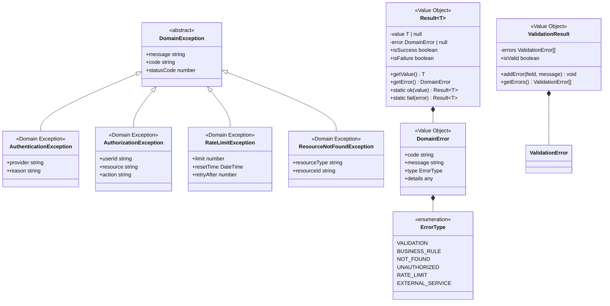

# 静的モデリング

## ドメインモデル図

### 認証コンテキスト


### APIコンテキスト


### データコンテキスト


### ログコンテキスト


### ドキュメントコンテキスト


### ドメインモデルの説明

1. **認証集約（Authentication）**
   - 集約ルート：UserSession
   - 責務：ユーザーセッションとトークンの管理、ティア情報の保持
   - 不変条件：有効なセッションは必ず有効なアクセストークンを持つ

2. **API集約（APIRequest）**
   - 集約ルート：APIEndpoint
   - 責務：APIエンドポイントの定義とアクセス制御
   - 不変条件：各エンドポイントは必要なティアレベルを定義する

3. **レート制限集約（RateLimiting）**
   - 集約ルート：RateLimitBucket
   - 責務：ユーザーごとのAPI利用回数の管理
   - 不変条件：リクエスト数は制限値を超えることができない

4. **データ集約（DataResource）**
   - 集約ルート：OpenDataFile
   - 責務：オープンデータファイルの管理とアクセス
   - 不変条件：存在しないファイルへのアクセスは許可されない

5. **認証ログ集約（AuthenticationLog）**
   - 集約ルート：AuthLogEntry
   - 責務：認証イベントの記録と監査証跡の保持
   - 不変条件：ログエントリは不変（作成後の変更不可）

6. **APIログ集約（APIAccessLog）**
   - 集約ルート：APILogEntry
   - 責務：APIアクセスの記録とパフォーマンス分析
   - 不変条件：ログエントリは不変（作成後の変更不可）

7. **ドキュメント集約（APIDocumentation）**
   - 集約ルート：APISpecification
   - 責務：API仕様の管理とドキュメント生成
   - 不変条件：仕様は有効なOpenAPI形式である必要がある

## レイヤードアーキテクチャ図


### アーキテクチャの説明

1. **依存関係の方向**
   - 上位層から下位層への依存のみ許可
   - ドメイン層は他の層に依存しない
   - インフラ層はドメイン層のインターフェースを実装（DIP）

2. **各層の責務**
   - プレゼンテーション層：HTTPリクエスト/レスポンスの処理、認証の検証
   - アプリケーション層：ユースケースの調整、トランザクション管理
   - ドメイン層：ビジネスロジック、ドメインイベントの発行
   - インフラ層：外部システム連携、永続化、キャッシュ

3. **TypeScript/Fastifyでの実装**
   - Fastifyプラグインアーキテクチャを活用
   - 依存性注入にTSyringeまたはInversifyJSを使用
   - 型安全性を最大限に活用

## 境界づけられたコンテキスト統合図


### 統合パターンの説明

1. **腐敗防止層（ACL）**
   - Supabase Authとの統合にACLを使用
   - 外部システムの変更から内部ドメインを保護

2. **上流/下流関係**
   - 認証コンテキスト → APIコンテキスト（認証情報の提供）
   - APIコンテキスト → データコンテキスト（データアクセス）

3. **イベント駆動統合**
   - 認証イベント、APIアクセスイベントを非同期で配信
   - ログコンテキストがイベントを購読して記録

4. **公開ホストサービス**
   - APIコンテキストがOpenAPI仕様を公開
   - ドキュメントコンテキストが仕様を読み取り

## シーケンス図 <API認証とデータ取得処理>


### シーケンスの説明

1. **レイヤー間の責務分担**
   - Middleware：認証トークンの抽出、HTTPレスポンスの生成
   - アプリケーション層：ユースケースの調整、エラーハンドリング
   - ドメイン層：ビジネスロジック（認証、レート制限、データアクセス）
   - インフラ層：永続化、ファイルシステムアクセス

2. **依存性逆転の原則（DIP）の適用**
   - ドメイン層はリポジトリインターフェースのみに依存
   - インフラ層がドメイン層のインターフェースを実装
   - DIコンテナ（TSyringe/InversifyJS）で実装を注入
   - これにより、テスト時にモック実装への差し替えが容易

3. **エラー処理とレスポンス**
   - 認証エラー：401 Unauthorized
   - レート制限：429 Too Many Requests
   - データ不在：404 Not Found（RFC 7807形式）

4. **非同期イベント処理**
   - ドメインイベントをEventBus経由で非同期配信
   - ログ記録は本処理と独立して実行

## ステートマシン図 <UserSession>


## ステートマシン図 <RateLimitBucket>


### 状態遷移の説明

1. **UserSessionの状態遷移**
   - 新規作成：ソーシャルログイン成功時
   - アクティブ：有効なアクセストークンを保持
   - 期限切れ：アクセストークンは無効だがリフレッシュ可能
   - 無効：両方のトークンが期限切れ
   - 終了：ログアウトまたはセッション削除

2. **RateLimitBucketの状態遷移**
   - 新規作成：ユーザーの初回APIアクセス時
   - 使用中：制限値未満のリクエスト数
   - 制限到達：制限値に到達（新規リクエスト拒否）
   - リセット済み：時間窓経過後のリセット
   - 削除：長期間未使用時のメモリ解放

## クラス図 <認証コンテキスト>


## クラス図 <APIコンテキスト>


### クラス設計の説明

1. **ドメイン層のクラス**
   - エンティティ：識別子を持ち、ライフサイクルを管理
   - バリューオブジェクト：不変で値による等価性判定
   - ドメインサービス：複数の集約にまたがるビジネスロジック
   - リポジトリインターフェース：永続化の抽象化

2. **レイヤー間の分離**
   - インターフェースによる依存性逆転
   - アプリケーションサービスがユースケースを調整
   - インフラ層が技術的詳細を実装

3. **TypeScript固有の実装**
   - Promiseによる非同期処理
   - ジェネリクスによる型安全性
   - インターフェースによる契約の定義

## ドメインイベントの設計

### イベントクラス


### イベント設計の説明

1. **イベントの実装方針**
   - イベント名は過去形で命名（UserAuthenticated、TokenRefreshed等）
   - 不変オブジェクトとして実装（readonlyプロパティ）
   - 必要最小限の情報のみを含める（集約ID、関連データ）

2. **イベントの発行タイミング**
   - 集約内でビジネスロジック実行後に発行
   - トランザクションコミット後に配信（遅延ディスパッチ）
   - エラー時はイベント発行をスキップ

3. **TypeScriptでの実装**
   ```typescript
   // ドメインイベントの基底クラス
   abstract class DomainEvent {
     readonly eventId: string = uuid();
     readonly occurredAt: DateTime = DateTime.now();
     
     constructor(
       readonly aggregateId: string,
       readonly version: number
     ) {}
     
     abstract getEventName(): string;
   }
   
   // 具体的なイベント
   class UserAuthenticated extends DomainEvent {
     constructor(
       aggregateId: string,
       version: number,
       readonly userId: string,
       readonly provider: string,
       readonly tier: UserTier,
       readonly sessionId: string
     ) {
       super(aggregateId, version);
     }
     
     getEventName(): string {
       return 'UserAuthenticated';
     }
   }
   ```

## 例外とエラー処理の設計

### エラー処理パターン



### エラー処理の説明

1. **例外の使用方針**
   - ドメイン不変条件の違反：DomainExceptionをスロー
   - 検証エラー：Result型で処理
   - 外部システムエラー：アプリケーション層でラップ

2. **層別のエラー処理**
   - ドメイン層：ビジネスルール違反の検出とResult型での返却
   - アプリケーション層：エラーの変換とHTTPステータスへのマッピング
   - プレゼンテーション層：RFC 7807形式でのエラーレスポンス生成

3. **TypeScriptでの実装例**
   ```typescript
   // Result型の使用例
   class UserSession {
     static create(
       userId: UserId,
       tier: UserTier
     ): Result<UserSession> {
       if (!userId.isValid()) {
         return Result.fail(
           new DomainError(
             'INVALID_USER_ID',
             'User ID is invalid',
             ErrorType.VALIDATION
           )
         );
       }
       
       const session = new UserSession(userId, tier);
       return Result.ok(session);
     }
   }
   
   // エラーレスポンスの生成（RFC 7807）
   function toProblemDetails(error: DomainError): ProblemDetails {
     return {
       type: `https://api.example.com/errors/${error.code}`,
       title: error.message,
       status: mapErrorToStatus(error.type),
       detail: error.details,
       instance: request.url
     };
   }
   ```

## 横断的関心事の設計

### アーキテクチャパターン

```mermaid
graph TB
    subgraph "横断的関心事の実装"
        AuthMW[認証ミドルウェア<br/>JWT検証]
        AuthzDecorator[認可デコレータ<br/>ティアチェック]
        LogInterceptor[ロギングインターセプタ<br/>リクエスト/レスポンス]
        RateLimitMW[レート制限ミドルウェア]
        CacheInterceptor[キャッシュインターセプタ<br/>Edge Cache]
        ErrorHandler[エラーハンドラー<br/>RFC 7807]
    end
    
    subgraph "アプリケーション層"
        AppService[アプリケーションサービス]
        EventHandlers[イベントハンドラー]
    end
    
    subgraph "ドメイン層"
        Domain[ドメインロジック]
        DomainEvents[ドメインイベント]
    end
    
    subgraph "インフラ層"
        Logger[Pino Logger]
        Cache[Cache Manager]
        Monitoring[Metrics Collector]
    end
    
    AuthMW --> AppService
    AuthzDecorator --> AppService
    RateLimitMW --> AppService
    LogInterceptor --> Logger
    CacheInterceptor --> Cache
    ErrorHandler --> AppService
    
    AppService --> Domain
    Domain --> DomainEvents
    DomainEvents --> EventHandlers
    EventHandlers --> Logger
    
    Note over AuthMW,ErrorHandler: Fastifyプラグインとして実装
    Note over Domain: ビジネスロジックのみ
    Note over Logger,Monitoring: 監視・分析基盤
```

### 横断的関心事の実装指針

1. **認証（Authentication）**
   - 実装場所：Fastifyミドルウェア（preHandler hook）
   - JWT検証とセッション確認
   - Supabase Authとの連携

2. **認可（Authorization）**
   - 単純な権限：ルートレベルのpreHandlerフック
   - ティアベースのアクセス制御：デコレータパターン
   - ビジネスルール：ドメイン層の仕様オブジェクト

3. **ロギング・監査**
   - 実装場所：Fastifyフック（onRequest/onResponse）
   - Pinoロガー（Fastifyデフォルト）の活用
   - 構造化ログ（JSON形式）で出力

4. **レート制限**
   - 実装場所：Fastifyプラグイン
   - ユーザーティアに基づく動的制限
   - Redis互換のメモリキャッシュ使用

5. **キャッシュ**
   - 実装場所：インターセプタパターン
   - Vercel Edge Cacheの活用
   - キャッシュキー生成戦略

6. **エラーハンドリング**
   - グローバルエラーハンドラー
   - RFC 7807準拠のレスポンス
   - 環境別のエラー詳細度制御

### Fastifyでの実装例

```typescript
// 認証ミドルウェア
const authPlugin: FastifyPluginAsync = async (fastify) => {
  fastify.addHook('preHandler', async (request, reply) => {
    const token = extractToken(request.headers.authorization);
    
    if (!token) {
      throw new UnauthorizedException('Missing token');
    }
    
    const validation = await authUseCase.validateToken(token);
    if (!validation.isValid) {
      throw new UnauthorizedException('Invalid token');
    }
    
    request.user = validation.user;
  });
};

// レート制限デコレータ
function RateLimit(tier: UserTier) {
  return function (
    target: any,
    propertyKey: string,
    descriptor: PropertyDescriptor
  ) {
    const originalMethod = descriptor.value;
    
    descriptor.value = async function (...args: any[]) {
      const userId = args[0].userId;
      const canProceed = await rateLimitService.tryConsume(
        userId,
        tier
      );
      
      if (!canProceed) {
        throw new RateLimitException(
          tier.rateLimit,
          calculateResetTime()
        );
      }
      
      return originalMethod.apply(this, args);
    };
  };
}

// 構造化ロギング
const loggerConfig = {
  level: process.env.LOG_LEVEL || 'info',
  formatters: {
    level: (label: string) => ({ level: label }),
    bindings: (bindings: any) => ({
      pid: bindings.pid,
      hostname: bindings.hostname,
      node_version: process.version,
    }),
  },
  serializers: {
    req: (request: FastifyRequest) => ({
      method: request.method,
      url: request.url,
      userId: request.user?.id,
      ip: request.ip,
    }),
    res: (reply: FastifyReply) => ({
      statusCode: reply.statusCode,
      responseTime: reply.getResponseTime(),
    }),
  },
};
```

## チェックリスト

### ドメインモデルの品質
- [x] すべての集約がドメインモデルとして表現されている
- [x] エンティティとバリューオブジェクトが適切に区別されている
- [x] ドメインサービスが識別され、責務が明確である
- [x] 集約間の参照がIDによる参照になっている
- [x] 不変条件（ビジネスルール）が集約内で保証されている

### アーキテクチャの整合性
- [x] レイヤー間の依存関係が単一方向である
- [x] ドメイン層が技術的な詳細に依存していない
- [x] インフラ層の実装がインターフェースを通じて抽象化されている
- [x] 各層の責務が明確に分離されている

### 境界づけられたコンテキストの統合
- [x] コンテキスト間の統合パターンが明確に定義されている
- [x] 腐敗防止層（ACL）が適切に設計されている
- [x] イベント駆動の統合が考慮されている
- [x] 外部システムとの統合方法が具体的である

### 実装可能性
- [x] 使用する技術スタックでの実装方法が明確である
- [x] 永続化戦略が定義されている
- [x] トランザクション境界が明確である
- [x] パフォーマンスを考慮した設計になっている

### イベントストーミングとの整合性
- [x] イベントストーミングで識別した要素がすべて反映されている
- [x] ドメインイベントがステートマシン図に反映されている
- [x] コマンドがアプリケーションサービスに対応している
- [x] 読み取りモデルが適切に設計されている

### ドメインイベントの設計
- [x] 重要なビジネスイベントがドメインイベントとして定義されている
- [x] イベントの命名が過去形でユビキタス言語を使用している
- [x] イベントの発行と配信の仕組みが明確である
- [x] イベントハンドリングの責務が適切に配置されている

### 例外処理とエラー設計
- [x] ドメイン例外が適切に定義されている
- [x] エラー処理パターン（例外/Result型）が一貫している
- [x] 各層でのエラー処理責任が明確である
- [x] ビジネスルール違反が適切に表現されている

### 横断的関心事の設計
- [x] 認証・認可の実装場所が適切である
- [x] ドメインロジックから横断的関心事が分離されている
- [x] ロギング・監査の仕組みが設計されている
- [x] プロジェクト固有の非機能要件が考慮されている

## 補足

### TypeScript/Fastify固有の設計考慮事項

1. **型安全性の活用**
   - ドメインモデルに厳密な型定義
   - ブランド型によるプリミティブ型の区別
   - 判別共用体によるエラーハンドリング

2. **非同期処理の設計**
   - Promise/async-awaitの一貫した使用
   - エラー伝播の明確化
   - 並行処理の最適化

3. **Vercelデプロイメント最適化**
   - Edge Functionsでの実行を考慮
   - コールドスタート対策
   - バンドルサイズの最小化

4. **テスタビリティ**
   - 依存性注入によるモック化
   - 純粋関数の活用
   - 統合テストの容易性

## 変更履歴

|更新日時|変更点|
|-|-|
|2025-01-12T14:00:00+09:00|新規作成 - TypeScript/Fastify/Vercel環境に特化した静的モデリング|