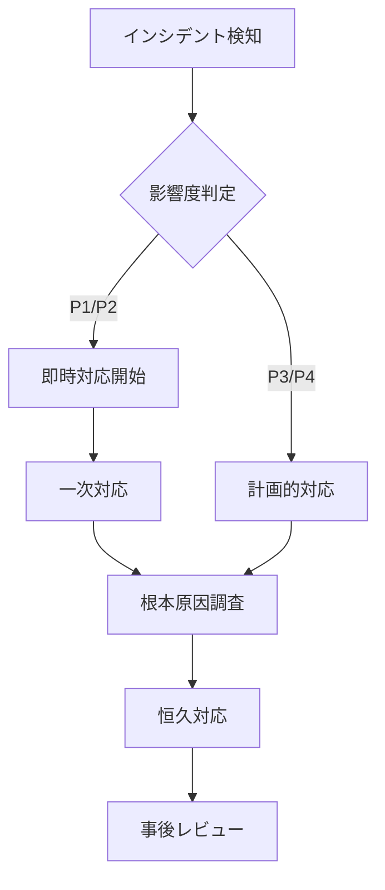

# 0066: 運用手順書の作成

## 説明

システムの日常運用に必要な手順を包括的に文書化する。監視、メンテナンス、ユーザー管理、インシデント対応、定期作業、パフォーマンスチューニング、セキュリティ対策などの運用タスクについて、具体的な手順とベストプラクティスをまとめた運用マニュアルを作成する。

## タスク種別

- [ ] 機能実装
- [ ] バグ修正
- [ ] リファクタリング
- [ ] テスト
- [x] ドキュメント
- [ ] 調査

## 優先度

中

## 見積もり工数

[ストーリーポイント: 2] (約0.5日)

## 依存関係

- 前提タスク: #0062, #0063, #0065
- 関連タスク: #0067, #0068

## 受け入れ基準

- [ ] 日常監視手順が明確に記載されている
- [ ] ユーザー管理（ティア変更等）の手順がある
- [ ] インシデント対応フローが定義されている
- [ ] 定期メンテナンス作業がチェックリスト化されている
- [ ] パフォーマンス監視と最適化手順が含まれている
- [ ] セキュリティ監視と対応手順が記載されている
- [ ] トラブルシューティングガイドが充実している
- [ ] 運用体制と責任範囲が明確である

## 技術的な詳細

### 運用手順書メインドキュメント

````markdown
# Open Data API 運用手順書

## 1. 概要

### 1.1 システム構成

- **フロントエンド**: React (Vite) - Vercel
- **バックエンド**: Fastify (Node.js) - Vercel Functions
- **データベース**: Supabase (PostgreSQL)
- **認証**: Supabase Auth
- **監視**: Prometheus + Grafana
- **ログ**: Pino + CloudWatch

### 1.2 運用体制

- **運用時間**: 24/7
- **監視レベル**:
  - 平日日中（9:00-18:00）: アクティブ監視
  - 夜間・休日: パッシブ監視（アラート対応）
- **エスカレーション**:
  - L1: 運用担当者
  - L2: 開発チーム
  - L3: インフラチーム

## 2. 日常監視

### 2.1 監視項目チェックリスト

#### システム監視（15分ごと）

- [ ] APIヘルスチェック: `https://api.example.com/health`
- [ ] レスポンスタイム: < 1秒
- [ ] エラー率: < 1%
- [ ] CPU使用率: < 80%
- [ ] メモリ使用率: < 85%

```bash
# 監視スクリプト
./scripts/monitoring/health-check.sh

# 出力例
✅ API Health: OK (response time: 245ms)
✅ Error Rate: 0.2% (threshold: 1%)
⚠️  Memory Usage: 82% (threshold: 85%)
✅ Active Users: 1,234
```
````

#### ビジネスメトリクス（1時間ごと）

- [ ] アクティブユーザー数
- [ ] API呼び出し数
- [ ] レート制限の状況
- [ ] データ転送量

### 2.2 ダッシュボード

#### Grafanaダッシュボード

- URL: `https://grafana.example.com/dashboard/opendata-api`
- 主要パネル:
  - Request Rate (req/s)
  - Response Time (P50, P95, P99)
  - Error Rate (%)
  - Rate Limit Status by Tier
  - Active Users by Tier

#### Vercelダッシュボード

- URL: `https://vercel.com/team/project/open-data-api`
- 確認項目:
  - Function実行数
  - Edge Function パフォーマンス
  - ビルド状況
  - 帯域使用量

### 2.3 アラート対応

#### アラート優先度

1. **Critical**: 即時対応（サービス停止）
2. **High**: 30分以内対応（パフォーマンス劣化）
3. **Medium**: 2時間以内対応（警告レベル）
4. **Low**: 翌営業日対応（情報レベル）

#### 対応手順

```bash
# アラート受信時の初動
1. アラート内容の確認
2. 影響範囲の特定
3. 一次対応の実施
4. エスカレーション判断

# 例: API応答なしアラート
./scripts/incident/api-down-response.sh
```

## 3. ユーザー管理

### 3.1 ユーザーティア変更

#### 管理画面からの変更

```sql
-- Supabase SQLエディタで実行
UPDATE auth.users
SET raw_app_metadata = jsonb_set(
  raw_app_metadata,
  '{tier}',
  '"TIER2"'
)
WHERE email = 'user@example.com';
```

#### APIを使用した変更

```bash
# 管理API経由
curl -X PATCH https://api.example.com/admin/users/{user_id}/tier \
  -H "Authorization: Bearer $ADMIN_TOKEN" \
  -H "Content-Type: application/json" \
  -d '{"tier": "TIER2"}'
```

### 3.2 ユーザーアクティビティ監視

```sql
-- 過去24時間のアクティブユーザー
SELECT
  u.email,
  u.raw_app_metadata->>'tier' as tier,
  COUNT(l.id) as request_count,
  MAX(l.created_at) as last_activity
FROM auth.users u
JOIN api_logs l ON u.id = l.user_id
WHERE l.created_at > NOW() - INTERVAL '24 hours'
GROUP BY u.id, u.email
ORDER BY request_count DESC
LIMIT 100;
```

### 3.3 アカウント停止・復活

```bash
# アカウント停止
./scripts/admin/suspend-user.sh user@example.com "Reason: Terms violation"

# アカウント復活
./scripts/admin/reactivate-user.sh user@example.com
```

## 4. インシデント対応

### 4.1 インシデントレベル

| レベル | 定義               | 対応時間  | 例             |
| ------ | ------------------ | --------- | -------------- |
| P1     | サービス全体停止   | 即時      | API完全停止    |
| P2     | 一部機能停止       | 30分以内  | 認証機能障害   |
| P3     | パフォーマンス劣化 | 2時間以内 | レスポンス遅延 |
| P4     | 軽微な問題         | 翌営業日  | UIの不具合     |

### 4.2 インシデント対応フロー



### 4.3 インシデント記録テンプレート

```markdown
## インシデント #YYYY-MM-DD-001

### 概要

- **発生日時**: 2025-01-23 14:30 JST
- **検知方法**: 自動アラート / ユーザー報告
- **影響レベル**: P1 / P2 / P3 / P4
- **影響範囲**: 全ユーザー / 一部ユーザー（詳細）

### タイムライン

- 14:30 - アラート受信
- 14:35 - 初動開始
- 14:45 - 原因特定
- 15:00 - 修正適用
- 15:15 - 復旧確認

### 原因

- 根本原因の説明

### 対応内容

1. 実施した対応の詳細
2. 適用した修正

### 再発防止策

- 実施予定の改善策

### 学習事項

- 今回のインシデントから得られた教訓
```

## 5. 定期メンテナンス

### 5.1 日次作業

```bash
#!/bin/bash
# scripts/maintenance/daily.sh

echo "=== Daily Maintenance Checklist ==="

# 1. ログローテーション確認
echo -n "[ ] Log rotation: "
check_log_rotation

# 2. バックアップ確認
echo -n "[ ] Backup status: "
check_backup_status

# 3. ディスク使用量確認
echo -n "[ ] Disk usage: "
df -h | grep -E '(^/dev/|^Filesystem)'

# 4. エラーログ確認
echo -n "[ ] Error logs: "
grep -c ERROR /var/log/api/error.log || echo "0 errors"

# 5. セキュリティアラート確認
echo -n "[ ] Security alerts: "
check_security_alerts
```

### 5.2 週次作業

- [ ] パフォーマンスレポートの確認
- [ ] 依存関係の更新確認
- [ ] バックアップリストアテスト
- [ ] ユーザーフィードバックの確認

```bash
# 週次レポート生成
./scripts/reports/weekly-report.sh > reports/week-$(date +%Y-%W).md
```

### 5.3 月次作業

- [ ] セキュリティパッチの適用
- [ ] 容量計画の見直し
- [ ] SLA達成状況の確認
- [ ] コスト最適化の検討

## 6. パフォーマンス管理

### 6.1 パフォーマンス監視

```sql
-- 遅いAPIエンドポイントの特定
SELECT
  endpoint,
  method,
  AVG(response_time) as avg_time,
  MAX(response_time) as max_time,
  COUNT(*) as request_count
FROM api_logs
WHERE created_at > NOW() - INTERVAL '1 hour'
GROUP BY endpoint, method
HAVING AVG(response_time) > 1000  -- 1秒以上
ORDER BY avg_time DESC;
```

### 6.2 パフォーマンスチューニング

#### データベース最適化

```sql
-- インデックスの使用状況確認
SELECT
  schemaname,
  tablename,
  indexname,
  idx_scan,
  idx_tup_read,
  idx_tup_fetch
FROM pg_stat_user_indexes
ORDER BY idx_scan;

-- スロークエリの特定
SELECT
  query,
  mean_exec_time,
  calls,
  total_exec_time
FROM pg_stat_statements
WHERE mean_exec_time > 100  -- 100ms以上
ORDER BY mean_exec_time DESC
LIMIT 10;
```

#### キャッシュ最適化

```typescript
// キャッシュヒット率の確認
const cacheStats = await redis.info('stats');
console.log(
  'Cache hit rate:',
  cacheStats.keyspace_hits / (cacheStats.keyspace_hits + cacheStats.keyspace_misses),
);
```

### 6.3 スケーリング対応

```bash
# 負荷状況に応じたスケーリング判断
./scripts/scaling/check-scaling-needs.sh

# 出力例
Current Load: 75%
Recommendation: Consider scaling up
- Current: 2 instances
- Recommended: 3-4 instances
- Estimated cost increase: $50-100/month
```

## 7. セキュリティ運用

### 7.1 セキュリティ監視

#### 日次セキュリティチェック

- [ ] 不正アクセスの兆候確認
- [ ] 異常なAPIアクセスパターン
- [ ] ブルートフォース攻撃の検知
- [ ] 脆弱性スキャン結果確認

```bash
# セキュリティ監査スクリプト
./scripts/security/daily-audit.sh

# 不審なアクセスパターンの検出
./scripts/security/detect-anomalies.sh --threshold=high
```

### 7.2 インシデント対応

#### セキュリティインシデント初動

1. 影響範囲の特定
2. 該当IPアドレス/ユーザーのブロック
3. ログの保全
4. 上位へのエスカレーション

```bash
# 緊急ブロックスクリプト
./scripts/security/emergency-block.sh --ip=1.2.3.4 --reason="Brute force attack"

# ユーザーアカウントの緊急停止
./scripts/security/suspend-account.sh --user=user@example.com --reason="Compromised account"
```

### 7.3 定期セキュリティレビュー

```markdown
## 月次セキュリティレビューチェックリスト

- [ ] アクセスログの異常パターン分析
- [ ] 権限設定の棚卸し
- [ ] APIキー・シークレットのローテーション
- [ ] 依存関係の脆弱性スキャン
- [ ] ペネトレーションテスト結果の確認
- [ ] セキュリティポリシーの見直し
```

## 8. トラブルシューティング

### 8.1 よくある問題と対処法

#### API応答が遅い

```bash
# 1. 現在の負荷確認
curl -s https://api.example.com/metrics | grep http_request_duration

# 2. データベース接続確認
psql $DATABASE_URL -c "SELECT count(*) FROM pg_stat_activity;"

# 3. キャッシュ状態確認
redis-cli info stats

# 4. Edge Functionのコールドスタート確認
vercel logs --prod | grep "Cold start"
```

#### レート制限エラーが多発

```sql
-- 影響を受けているユーザーの特定
SELECT
  user_id,
  COUNT(*) as exceeded_count,
  MAX(created_at) as last_exceeded
FROM rate_limit_logs
WHERE exceeded = true
  AND created_at > NOW() - INTERVAL '1 hour'
GROUP BY user_id
ORDER BY exceeded_count DESC;
```

### 8.2 緊急時の連絡先

| 役割             | 担当者   | 連絡先        | 対応時間   |
| ---------------- | -------- | ------------- | ---------- |
| 運用リード       | 山田太郎 | 080-XXXX-XXXX | 24/7       |
| 開発リード       | 鈴木花子 | 090-XXXX-XXXX | 平日9-18時 |
| インフラ担当     | 田中一郎 | 070-XXXX-XXXX | 24/7       |
| セキュリティ担当 | 佐藤次郎 | 080-XXXX-XXXX | 緊急時のみ |

### 8.3 エスカレーションフロー

```
L1 対応（運用チーム）
  ↓ 15分で解決しない場合
L2 対応（開発チーム）
  ↓ 30分で解決しない場合
L3 対応（専門チーム）
  ↓ 重大インシデントの場合
経営層への報告
```

## 9. 運用改善

### 9.1 KPI管理

| KPI              | 目標値        | 測定方法         |
| ---------------- | ------------- | ---------------- |
| 可用性           | 99.9%         | Uptime監視       |
| レスポンスタイム | < 500ms (P95) | APM              |
| エラー率         | < 0.1%        | ログ分析         |
| MTTR             | < 30分        | インシデント記録 |

### 9.2 継続的改善

```markdown
## 月次振り返りアジェンダ

1. KPI達成状況の確認
2. インシデントの振り返り
3. 改善提案の検討
4. 次月のアクションアイテム
```

## 10. ドキュメント管理

### 10.1 ドキュメント一覧

- 運用手順書（本書）: `/docs/operations/manual.md`
- デプロイ手順書: `/docs/operations/deployment.md`
- 災害復旧計画: `/docs/operations/disaster-recovery.md`
- セキュリティポリシー: `/docs/security/policy.md`
- API仕様書: `/docs/api/openapi.yaml`

### 10.2 更新履歴

| 日付       | 版数 | 更新内容 | 更新者     |
| ---------- | ---- | -------- | ---------- |
| 2025-01-23 | 1.0  | 初版作成 | 運用チーム |

````

### 運用自動化スクリプト
```bash
#!/bin/bash
# scripts/operations/daily-operations.sh

set -euo pipefail

LOG_FILE="/var/log/operations/daily-$(date +%Y%m%d).log"
SLACK_WEBHOOK="${SLACK_WEBHOOK_URL}"

# ログ関数
log() {
    echo "[$(date +'%Y-%m-%d %H:%M:%S')] $1" | tee -a "$LOG_FILE"
}

# Slack通知関数
notify_slack() {
    local message=$1
    local color=${2:-"good"}

    curl -X POST "$SLACK_WEBHOOK" \
        -H 'Content-Type: application/json' \
        -d "{
            \"attachments\": [{
                \"color\": \"$color\",
                \"text\": \"$message\",
                \"footer\": \"Operations Bot\",
                \"ts\": $(date +%s)
            }]
        }"
}

# メイン処理
main() {
    log "Starting daily operations..."

    # 1. システムヘルスチェック
    log "Running health checks..."
    if ./scripts/monitoring/health-check.sh; then
        log "✅ Health check passed"
    else
        log "❌ Health check failed"
        notify_slack "⚠️ Health check failed!" "danger"
    fi

    # 2. バックアップ確認
    log "Checking backup status..."
    BACKUP_STATUS=$(./scripts/backup/check-backup-status.sh)
    log "Backup status: $BACKUP_STATUS"

    # 3. ログ分析
    log "Analyzing logs..."
    ERROR_COUNT=$(grep -c ERROR /var/log/api/*.log || echo "0")
    if [ "$ERROR_COUNT" -gt 100 ]; then
        notify_slack "⚠️ High error count detected: $ERROR_COUNT errors" "warning"
    fi

    # 4. パフォーマンスチェック
    log "Checking performance metrics..."
    ./scripts/monitoring/performance-check.sh

    # 5. セキュリティスキャン
    log "Running security scan..."
    ./scripts/security/daily-scan.sh

    # 6. レポート生成
    log "Generating daily report..."
    ./scripts/reports/generate-daily-report.sh > "/var/reports/daily-$(date +%Y%m%d).html"

    # 完了通知
    log "Daily operations completed"
    notify_slack "✅ Daily operations completed successfully" "good"
}

# エラーハンドリング
trap 'log "Error occurred at line $LINENO"; notify_slack "❌ Daily operations failed" "danger"' ERR

# 実行
main "$@"
````
