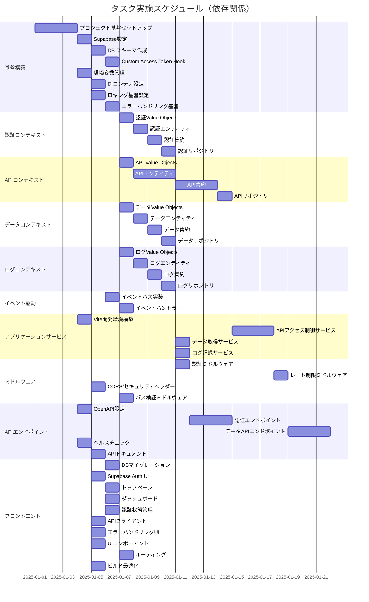

# タスク間依存関係

プロジェクトのタスク間の依存関係を可視化し、効率的な実装順序を示します。依存関係は「前提タスクが完了しないと開始できない」強い依存を基本とし、並行実行可能なタスクも明示しています。

## 主要な依存関係パターン

### 1. 基盤 → ドメイン → アプリケーション → プレゼンテーション

- 基盤構築（0001-0008）が最優先
- 各コンテキストのドメインモデル（0009-0024）が次
- アプリケーションサービス（0027-0030）がドメインモデル完了後
- エンドポイント実装（0036-0039）が最後

### 2. 並行実行可能なタスク群

- 各コンテキストのドメインモデル実装は並行可能
- フロントエンド開発はバックエンドと並行可能
- テスト実装は対象機能の完了後すぐに開始可能

### 3. クリティカルパス

1. プロジェクト基盤セットアップ（0001）
2. Supabase設定（0002）
3. 認証コンテキスト実装（0009-0012）
4. 認証ミドルウェア（0031）
5. 認証エンドポイント（0036）

### 4. ボトルネックとなりやすいタスク

- Custom Access Token Hook（0004）：多くのタスクが依存
- DIコンテナ設定（0006）：リポジトリ実装の前提
- イベントバス実装（0025）：サービス層の前提

## 実装の推奨順序

### フェーズ1：基盤構築（約1週間）

- タスク0001-0008を順次実施
- 環境構築とコア機能の確立

### フェーズ2：ドメインモデル実装（約2週間）

- 認証コンテキスト（0009-0012）を優先
- API、データ、ログコンテキストは並行実施可能

### フェーズ3：アプリケーション層実装（約1週間）

- イベントバス（0025-0026）を先行
- 各サービス（0027-0030）を実装

### フェーズ4：プレゼンテーション層実装（約1週間）

- ミドルウェア（0031-0034）
- エンドポイント（0036-0039）
- フロントエンド（0040-0049）は並行可能

### フェーズ5：テストとデプロイ（約1週間）

- 各種テスト（0050-0058）
- CI/CD設定（0059-0062）
- ドキュメント整備（0063-0066）
